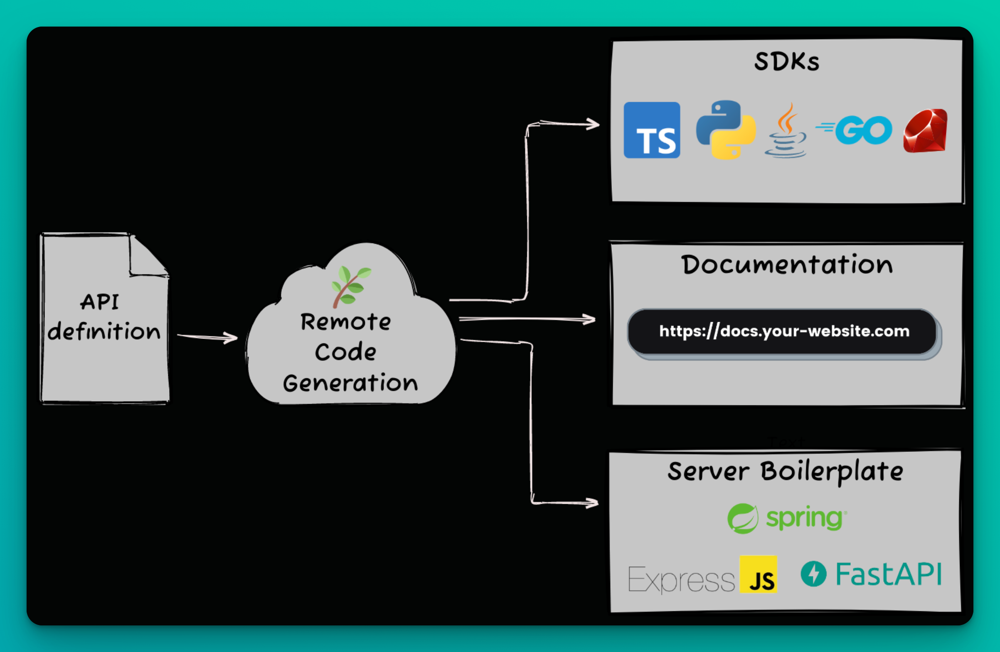

 

  
 

# Fern

Fern is an open-source toolkit that simplifies the design, build, and consumption of REST APIs. It allows you to effortlessly generate SDKs, API documentation, and backend server boilerplate.

 

  
 

## Quickstart

--> [**Generate an SDK with just 3 commands.**](https://docs.buildwithfern.com/overview/welcome/quickstart)

--> [**Get beautiful documentation in 5 minutes.**](https://github.com/fern-api/docs-starter)

## Motivation

REST APIs underpin the internet but are still painful to work with. They are often untyped, unstandardized, and out-of-sync across multiple sources of truth. With Fern, we aim to bring great developer experiences to REST APIs.

Fern is fully compatible with OpenAPI, allowing the use of existing OpenAPI specifications. It's designed to augment, not replace, your current OpenAPI toolchains and workflows.

## Capabilities

The Fern CLI can generate the following types of artifacts:

### 🌿 SDKs

Generate idiomatic SDKs (client libraries). Fern keeps your SDKs synchronized with your backend, eliminating the need to manually maintain your SDKs as your API changes. Fern can publish your SDKs to registries, like npm, Maven, and PyPI.

Currently, the following languages are supported:

- [TypeScript](https://github.com/fern-api/fern-typescript)
- [Java](https://github.com/fern-api/fern-java)
- [Python](https://github.com/fern-api/fern-python)
- [Go](https://github.com/fern-api/fern-go)

For additional language support, visit [the Fern issues](https://github.com/fern-api/fern/issues) and let us know!

### 🌿 API Documentation

Fern builds and hosts a fully-featured documentation website. The API reference is auto-generated from your API definition. You can write additional pages -- such as `quickstart` or `how authentication works`) -- in markdown and Fern takes care of the rest. Search, SEO, dark mode, and popular components are provided out-of-the-box. Customize your "theme" to match your brand colors, font, and logo.

Get started with Fern Docs for free. Pay when you want to host your docs at a custom domain (`docs.your-website.com`).

### 🌿 Server boilerplate

Define your API, and Fern will generate models, networking code and boilerplate application code. The generated code adds type safety to your API implementation - if your backend doesn't implement the API correctly, it won't compile.

Fern currently supports:

- [Express](https://github.com/fern-api/fern-typescript)
- [Spring Boot](https://github.com/fern-api/fern-java)
- [FastAPI](https://github.com/fern-api/fern-python)

For a walkthrough, check out the [Fern + Express video](https://docs.buildwithfern.com/server-boilerplate/server-boilerplate/express-js#demo-video).

## Customer Showcase

See how developer-focused companies benefit from Fern.

## Community

[Join our Discord!](https://discord.com/invite/JkkXumPzcG) We are here to answer questions and help you get the most out of Fern.

## Contributing

We welcome community contributions. For guidelines, refer to our [CONTRIBUTING.md](/CONTRIBUTING.md).

## Attribution

Thanks to the folks at [Twemoji](https://twemoji.twitter.com/), an open source project, who created the graphic that we use as our logo.
