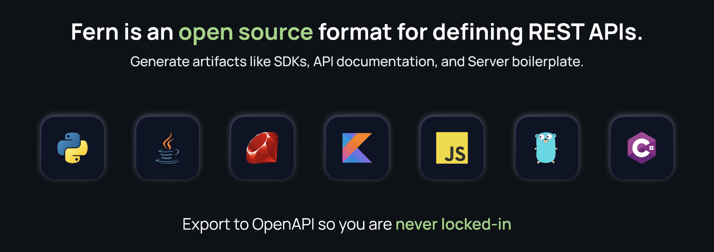

<a href="https://www.buildwithfern.com/">
  
</a>

<div align="center">
  <a href="https://www.buildwithfern.com/docs/intro" alt="documentation">Documentation</a>
  <span>&nbsp;&nbsp;•&nbsp;&nbsp;</span>
  <a href="https://discord.com/invite/JkkXumPzcG" alt="discord">Join the Discord</a>
</div>

<br />

<div align="center">
Backed by Y Combinator
</div>

---

**Fern is an open source format for defining REST APIs.**
You can think of it like a programming language to describe
your API: your endpoints, types, errors, and examples.

This repository contains the **Fern compiler.** The compiler transforms the API description into useful outputs, like:

### 🌿 SDKs

Client libraries speed up internal development, and help acquire customers who use your API. Our auto-generated SDKs are idiomatic and feel handwritten.

### 🌿 Server-side code generation

We automatically generate lots of boilerplate on the server side, like Pydantic models for FastAPI and Jersey interfaces for Spring Boot. We also add compile-time validation that all your endpoints are being served correctly.

### 🌿 Postman Collection

Complete with examples of successful and unsuccessful requests!

### 🌿 An OpenAPI spec

You can feed the generated OpenAPI into the endless list of tools that support OpenAPI.

# Comparison with OpenAPI

OpenAPI is a great tool for documenting APIs, but falls short for code generation use cases.

Read [Fern vs. OpenAPI](https://buildwithfern.com/docs/comparison-with-openapi)
for an in-depth comparison. **TL;DR: we differ from OpenAPI in these areas:**

- [Simplicity](https://www.buildwithfern.com/docs/comparison-with-openapi#simplicity)
- [New features in specification](https://www.buildwithfern.com/docs/comparison-with-openapi#new-features-in-specification)
- [Quality of code generation](https://www.buildwithfern.com/docs/comparison-with-openapi#quality-of-code-generation)
- [Focus on server-side API development](https://www.buildwithfern.com/docs/comparison-with-openapi#focus-on-server-side-api-development)
- [Change management](https://www.buildwithfern.com/docs/comparison-with-openapi#change-management)
- [Cloud-based code generation and publishing](https://www.buildwithfern.com/docs/comparison-with-openapi#cloud-based-code-generation-and-publishing)

# Plant Store example

Plant Store is full example of an API defined in Fern.

- [API Definition](https://github.com/fern-api/plantstore-api)
- [Generated TypeScript SDK](https://github.com/fern-api/plantstore-node)
- [Generated Java SDK](https://github.com/fern-api/plantstore-java)
- [Generated Postman Collection](https://github.com/fern-api/plantstore-postman)
- [Generated OpenAPI spec](https://github.com/fern-api/plantstore-openapi)

# Get started

```bash
npm install -g fern-api
```

### The `fern/` directory

The `fern/` directory contains your API definition. This generally lives in your
backend repo, but you can also have an independent repo dedicated to your API (like [Raven's](https://github.com/ravenappdev/raven-api)).

In the root of your repo, run:

```bash
fern init
```

This will create the following folder structure in your project:

```yaml
fern/
├─ fern.config.json # root-level configuration
└─ api/ # your API
  ├─ generators.yml # generators you're using
  └─ definition/
    ├─ api.yml  # API-level configuration
    └─ imdb.yml # endpoints, types, and errors
```

Here's what the `imdb.yml` starter file looks like:

```yaml
types:
  MovieId: string

  Movie:
    properties:
      id: MovieId
      title: string
      rating:
        type: double
        docs: The rating scale is one to five stars

  CreateMovieRequest:
    properties:
      title: string
      rating: double

service:
  auth: false
  base-path: /movies
  endpoints:
    createMovie:
      docs: Add a movie to the database
      method: POST
      path: /create-movie
      request: CreateMovieRequest
      response: MovieId

    getMovie:
      method: GET
      path: /{movieId}
      path-parameters:
        movieId: MovieId
      response: Movie
      errors:
        - MovieDoesNotExistError

errors:
  MovieDoesNotExistError:
    status-code: 404
    type: MovieId
```

### Generating an SDK

To generate SDKs, you can log in with GitHub from the CLI:

```bash
fern login
```

You can add [generators](compiler/generators) using `fern add`. By default, this
will publish your SDK to the Fern npm registry (npm.buildwithfern.com).

```bash
fern add fern-typescript-sdk
```

To generate the TypeScript SDK, run:

```bash
fern generate
```

And voila! You just built and published a TypeScript SDK.

**Next step:** define _your_ API in Fern. Check out our [docs](https://www.buildwithfern.com/docs/definition) to learn more.

# CLI reference

### `fern generate [--group <group>] [--version <version>]`

`fern generate` runs the compiler. It will validate your API and run the
generators specified in `generators.yml`.

If you don't have a `default-group` specified in `generators.yml`, then you must
specify a group using the `--group` option.

You can specify a version using the `--version` option. This version string is
used when publishing SDKs to registries (e.g. npm).

#### Running locally

By default, the generation runs in the cloud. If you want to run it on your local machine, you can use the `--local` option. This will run each generator in a Docker container.

By default, Fern will delete the container after running. To keep the container around (e.g. to look at the generator's logs), use the `--keepDocker` option.

---

### `fern check`

`fern check` will validate that your API is valid.

---

### `fern upgrade`

`fern upgrade` will upgrade your compiler version in `fern.config.json` to the
latest version.

---

### `fern add <generator>`

`fern add` adds a new generator to your `generators.yml`. You can view the full
list of supported generators in our [docs](https://www.buildwithfern.com/docs/compiler/generators).

---

### `fern init`

`fern init` adds a new API to your repo.

---

### `fern register`

_Advanced feature._ You can register your API so it can be depended on by other
APIs. Read more in our [docs](https://www.buildwithfern.com/docs/advanced/depending-on-other-apis).

# Documentation

You can view our documentation [here](https://www.buildwithfern.com/docs).

# Community

[Join our Discord!](https://discord.com/invite/JkkXumPzcG)

# Contributing

Check out [CONTRIBUTING.md](CONTRIBUTING.md)!

# Attribution

Thanks to the folks at [Twemoji](https://twemoji.twitter.com), an open source project, who created the graphic that we use as our logo.
