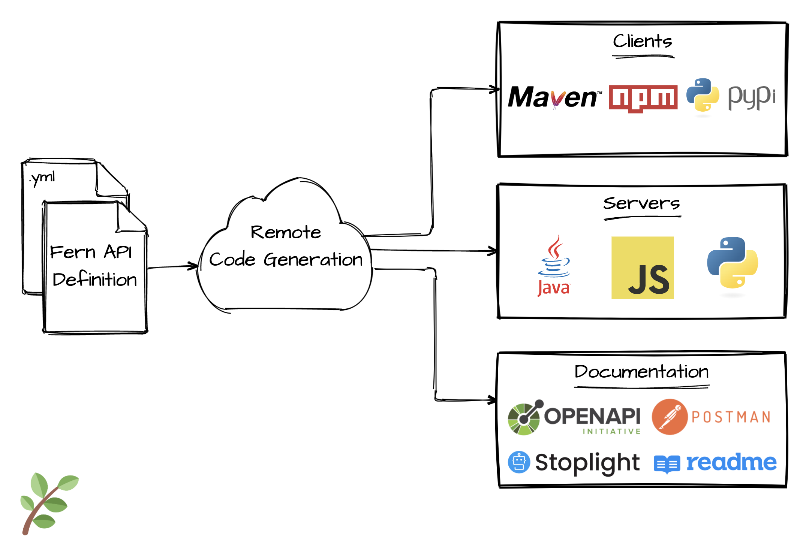

# Fern

> **Fern is a framework for building APIs.** You can think of it as an alternative to OpenAPI/Swagger.

<a href="https://www.loom.com/share/410f13c725ab4403aac77b237f9fe1f1" target="_blank">
    <p>Demo: building an API with Fern</p>
    
  </a>

## How does it work?



Fern reads in your [Fern API Definition](#what-is-a-fern-api-definition), invokes remote [generators](#fern-generators), and creates clients, server stubs, and documentation for your API.

## Goals

**1. High-quality code generation.**

Generators can be written in any language, for any language. Generated servers and clients are idiomatic and easy to use.

**2. Plugin support.**

Generators can define plugin points to expand their functionality. For example, a plugin may add support for gRPC or could add Auth0 authorization checks for each endpoint.

**3. Protocol flexibility.**

Use HTTP when you want RESTful calls. Use WebSockets when you want subscriptions. Use TCP when you care about performance. Fern manages the transport layer and provides similar interfaces so you can use the best protocol for the job.

**4. Errors as a first-class concept.**

Every request can result in success or failure. Errors are strongly typed so it's easy for consumers to handle them.

## What is a Fern API Definition?

A **Fern API Definition** is a set of YAML files that describe your API. Each file may define:

- **[Types](types.md)**: data model
- **[Services](services.md)**: endpoints
- **[Errors](errors.md)**: error handling
- **[IDs](ids.md)**: unique identifiers
- **[Imports](imports.md)**: share types, errors, and ids across YAML files

### An example of a Fern API Definition

```yml
# This is a sample IMDb API to get you more familiar with defining APIs in Fern.

ids:
  - MovieId
types:
  Movie:
    properties:
      id: MovieId
      title: string
      rating: double
services:
  http:
    MoviesService:
      auth: none
      base-path: /movies
      endpoints:
        createMovie:
          method: POST
          path: /
          request:
            type:
              properties:
                title: string
                rating: double
          response: MovieId
        getMovie:
          method: GET
          path: /{movieId}
          path-parameters:
            movieId: MovieId
          response:
            ok: Movie
            failed:
              errors:
                - NotFoundError
errors:
  NotFoundError:
    http:
      statusCode: 404
```

## Fern Generators

| **Generator** |                                       **Description**                                        |   **CLI Command**   |                                      **Library**                                       |
| :-----------: | :------------------------------------------------------------------------------------------: | :-----------------: | :------------------------------------------------------------------------------------: |
|               |                                                                                              |
|  TypeScript   |               converts a Fern API Definition to a TypeScript client and server               | fern add typescript | [fern-typescript](https://github.com/fern-api/fern/tree/main/packages/fern-typescript) |
|               |                                                                                              |
|     Java      |                  converts a Fern API Definition to a Java client and server                  |    fern add java    |                   [fern-java](https://github.com/fern-api/fern-java)                   |
|               |                                                                                              |
|    Python     |                 converts a Fern API Definition to a Python client and server                 |   fern add python   |                                         _WIP_                                          |
|               |                                                                                              |
|    Postman    | converts a Fern API Definition to a [Postman Collection](https://www.postman.com/collection) |  fern add postman   |                [fern-postman](https://github.com/fern-api/fern-postman)                |
|               |                                                                                              |
|    OpenAPI    |   converts a Fern Definition to an [OpenAPI Spec](https://swagger.io/resources/open-api/)    |  fern add openapi   |                [fern-openapi](https://github.com/fern-api/fern-openapi)                |
|               |                                                                                              |
