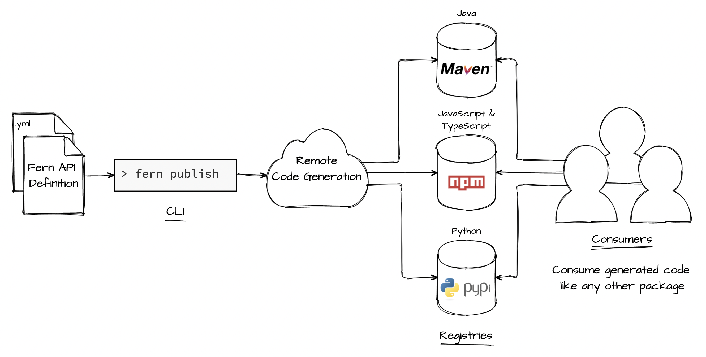
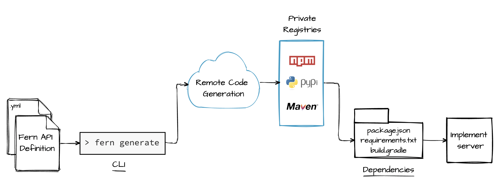

# Fern Generators

|  **Name**  |                                       **Description**                                        |   **CLI Command**   |                                            **Library**                                             |
| :--------: | :------------------------------------------------------------------------------------------: | :-----------------: | :------------------------------------------------------------------------------------------------: |
|            |                                                                                              |
| TypeScript |               converts a Fern API Definition to a TypeScript client and server               | fern add typescript |       [fern-typescript](https://github.com/fern-api/fern/tree/main/packages/fern-typescript)       |
|            |                                                                                              |
|    Java    |                  converts a Fern API Definition to a Java client and server                  |    fern add java    |                         [fern-java](https://github.com/fern-api/fern-java)                         |
|            |                                                                                              |
|   Python   |                 converts a Fern API Definition to a Python client and server                 |   fern add python   |  <!-- markdown-link-check-disable-line --> [fern-python](https://github.com/fern-api/fern-python)  |
|            |                                                                                              |
|  Postman   | converts a Fern API Definition to a [Postman Collection](https://www.postman.com/collection) |  fern add postman   |                      [fern-postman](https://github.com/fern-api/fern-postman)                      |
|            |                                                                                              |
|  OpenAPI   |   converts a Fern Definition to an [OpenAPI Spec](https://swagger.io/resources/open-api/)    |  fern add openapi   | <!-- markdown-link-check-disable-line --> [fern-openapi](https://github.com/fern-api/fern-openapi) |
|            |                                                                                              |

## How does remote code generation work?

Code generators run remotely in the cloud. They take a set of Fern API Definition YAML files, run the generators listed in `.fernrc.yml, and produce generated files as an output. Files can output locally (i.e., seen in the file system of your IDE) or remotely (i.e., in a package manager like NPM, Maven, or PyPI).

### Generating clients

### Generating servers

