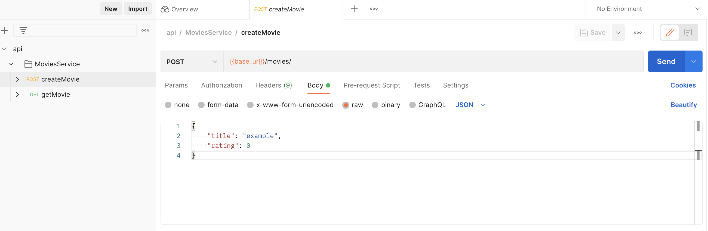

<!-- markdownlint-disable MD033 -->

# Tutorial: IMDb

This guide uses an example API for IMDb (the International Movie Database) that introduces you to using Fern. We'll generate a TypeScript server and a Postman Collection to implement and test our API.

## Step 0: Prerequisites

- Install [npm](https://docs.npmjs.com/downloading-and-installing-node-js-and-npm)
- Install [Postman](https://www.postman.com/downloads/)

## Step 1: Set up

Create a new folder for this tutorial and `cd` into it. Let's create a new npm project.

```bash
npm init -y
npm install typescript express @types/express ts-node
```

This will set us up for a new TypeScript backend repo. We'll also install fern:

```bash
npm install -g fern-api
```

## Step 2: Initialize

In the root of your backend repo, run:

```bash
fern init
```

<br>
<details>
<summary>What happens:</summary>

This adds the following content:

```yml
api/
├── src
│   ├── api.yml
└── .fernrc.yml
fern.config.json
```

- [`api.yml`](definition.md#an-example-of-a-fern-api-definition) is an example Fern API Definition for IMDb.
- [`.fernrc.yml`](fernrc.md) is a configuration file local to a single API in your repo.
- [`fern.config.json`](fern-config-json.md) is a configuration file that applies to all APIs in your repo.

</details>

## Step 3: Add TypeScript generator

```bash
fern add typescript
```

<br>
<details>
<summary>What happens:</summary>

`.fernrc.yml` will now list two generators:

```diff
 name: api
 definition: src
-generators: []
+generators:
+  - name: fernapi/fern-typescript
+    version: x.x.xxx
+    generate: true
+    config:
+      mode: server
```

</details>

## Step 4: Run the generator

In the terminal, you'll see `Published @imdb-fern/imdb-api-server@x.x.x` which we'll add as a dependency. By default, Fern publishes dependencies to a private registry.

```bash
# Teach npm about the Fern private registry
npm config set --location project @imdb-fern:registry https://npm-dev.buildwithfern.com/

npm install @imdb-fern/api-server@x.x.x
```

## Step 5: Implement the server

We'll create a new file `server.ts` at the root of our project. This will be a simple express server that serves our IMDb API.

```ts
// server.ts
import { GetMovieErrorBody, MovieId } from "@imdb-fern/api-server/model";
import { MoviesService } from "@imdb-fern/api-server/services";
import express from "express";

const app = express();

app.use(
  MoviesService.expressMiddleware({
    // TODO
  })
);

console.log("Listening for requests...");
app.listen(8080);
```

Our IDE will give us red lines indicating that we need to add missing properties.


You can implement the missing methods, for example:

```diff
 // server.ts
 import express from "express";
 const app = express();

 app.use(MoviesService.expressMiddleware({
+  createMovie: (request) => {
+    console.log(request);
+    return {
+      ok: true,
+      body: MovieId.of("iron-man-3")
+    }
+  },

+  getMovie: () => {
+    return {
+      ok: false,
+      error: GetMovieErrorBody.NotFoundError()
+    }
+  }
 }))

 console.log("Listening for requests...");
 app.listen(8080);
```

## Step 6: Run the server

```bash
npx ts-node server.ts
```

In the terminal, you should see `Listening for requests...`

## Step 6: Add the Postman generator

```bash
fern add postman
fern generate
```

In the `api/` folder you'll see `collection.json` that we'll import to Postman.

## Step 7: Hit the server from Postman

Open Postman and File -> Import `api/generated-postman/collection.json`.

Select the `createMovie` endpoint and hit `Send`. You should get a response back from your server **`iron-man-3`**.



## Step 8: Celebrate

You've successfully implemented a simple IMDb server using Fern. You're invited to join our [Discord](https://discord.gg/JkkXumPzcG).
