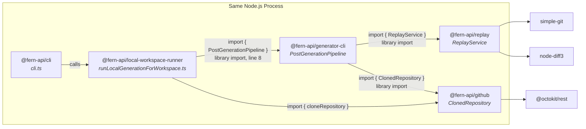
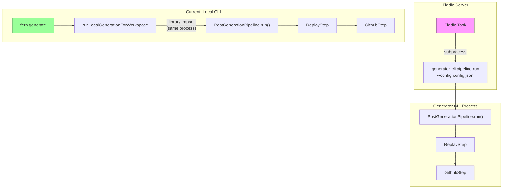
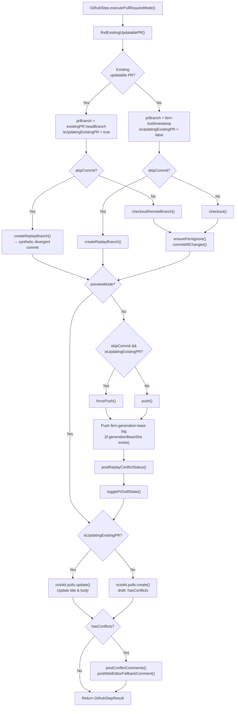

# Replay Bi-weekly Sync Follow-up: Feb 24, 2026

Branch: `tanmay/generator-cli-replay`
Participants: Alex McKinney, Tanmay Singh

---

## Part 1: Meeting Notes Verification

Cross-referencing Gemini's meeting summary against the actual codebase.

### Claim 1: "Local workspace runner changes — essentially a safe code move, not changing behavior"

**Verdict: Mostly Accurate**

The local workspace runner (`packages/cli/generation/local-generation/local-workspace-runner/src/runLocalGenerationForWorkspace.ts`) had its inline GitHub logic extracted into `PostGenerationPipeline` from `@fern-api/generator-cli`. The file went from ~900+ lines to 611 lines. What remains is:

- Repository cloning (lines 180-240)
- IR generation and configuration
- Generator invocation (Docker)
- Pipeline construction and delegation (lines 287-335)

The behavioral contract is the same (clone, generate, commit, push/PR), but the execution path now goes through the pipeline's step-based architecture. This means:
- **Same**: Cloning, branch checkout, commit, push, PR creation
- **Different**: Replay integration is now injected as a step, conflict handling is new, PR body enrichment is new, draft state toggling is new

So the "safe code move" characterization is accurate for the GitHub logic, but the pipeline adds NEW capabilities (replay, conflict comments, web editor fallback) that didn't exist before.

---

### Claim 2: "The `replay: { enabled: true }` setting in generators.yml is only temporary for testing with customers like Hume"

**Verdict: Accurate**

The schema exists at:
- **Schema definition**: `fern/apis/generators-yml/definition/replay.yml` (6 lines)
  ```yaml
  types:
    ReplayConfigSchema:
      properties:
        enabled:
          type: boolean
          docs: Whether to enable replay for this SDK
  ```

- **Consumed by**: `runLocalGenerationForWorkspace.ts:298`
  ```typescript
  replay: { enabled: replay?.enabled === true, skipApplication: noReplay, stageOnly: false }
  ```

- **Wired from**: `generateAPIWorkspace.ts:87` reads `workspace.generatorsConfiguration.replay`

The setting is indeed a top-level generators.yml config that gates whether `ReplayStep` is instantiated in the pipeline (`PostGenerationPipeline.ts:21`).

---

### Claim 3: "The `fern replay init` command exists and allows execution"

**Verdict: Accurate**

The CLI registers replay commands at `packages/cli/cli/src/cli.ts:2050-2481`:
- `fern replay init` — Initialize replay for an existing SDK repo (line 2119)
- `fern replay status` — Show lockfile state (line 2222)
- `fern replay forget` — Remove patches by pattern (line 2301)
- `fern replay reset` — Delete all replay state (line 2368)

These commands delegate to `@fern-api/generator-cli` functions:
```
fern replay init  →  replayInit()  →  @fern-api/replay bootstrap
fern replay status  →  replayStatusRemote()  →  clones repo, reads lockfile
fern replay forget  →  replayForget()  →  removes patches from lockfile
fern replay reset  →  replayReset/replayResetRemote()  →  deletes lockfile
```

The commands are NOT hidden — they are registered as normal yargs commands. The meeting decision was to hide these commands during beta and remove the `replay: { enabled: true }` config flag.

---

### Claim 4: "Force push flag is only used for faster testing, not needed for final implementation"

**Verdict: Partially Inaccurate — Needs Clarification**

Force push usage in `GithubStep.ts`:

| Location | Mode | Condition | Purpose |
|----------|------|-----------|---------|
| Line 156 | pull-request | `skipCommit && isUpdatingExistingPR` | Overwrite existing PR branch after replay rewrites history |
| Line 288 | push | `skipCommit` | Push replay-created commits (rewrites history) |

`skipCommit` is true when replay ran and created its own commits (meaning the commit graph was rewritten). In this case, force push is **required** because:
1. Replay creates synthetic commits (via `createReplayBranch.ts`) with divergent parent SHAs
2. These commits are not descendants of the remote branch HEAD
3. A normal push would fail with "non-fast-forward"

**So force push in the production replay conflict flow is NOT just for testing — it's required.** There may be a separate force push flag used for testing convenience that Tanmay referred to in the meeting, but the two `forcePush()` calls in `GithubStep.ts` are architecturally necessary for replay's divergent branch strategy.

**Clarification needed**: The meeting may have been about a separate `--force` testing flag (e.g., on the CLI command), not the `forcePush()` calls in the pipeline.

---

### Claim 5: "Replay commands in CLI delegate to the generator CLI"

**Verdict: Accurate**

The CLI at `packages/cli/cli/src/cli.ts` imports:
```typescript
import { replayForget, replayInit, replayReset, replayResetRemote, replayStatusRemote } from "@fern-api/generator-cli";
```

Each `fern replay <subcommand>` calls the corresponding function from `@fern-api/generator-cli/src/api/`. This is a direct library import (same Node.js process), not a subprocess.

---

### Claim 6: "Plan to add generator CLI binary to Docker image for Fiddle"

**Verdict: Not Yet Implemented**

The generator-cli has a standalone CLI entry point at `packages/generator-cli/src/cli.ts` with a `pipeline run --config <json>` command. However:
- No Dockerfile changes exist on this branch for Fiddle
- The pipeline is currently only invoked from the workspace runner as a library import
- The standalone CLI exists but is not wired to any Docker image

This is a future integration point, not current state.

---

### Claim 7: "Much of the GitHub code was copied directly from the CLI's local workspace runner into the generator CLI"

**Verdict: Accurate — Copy-Paste Then Moved**

The functions were copy-pasted from `local-workspace-runner` into `generator-cli/pipeline/`, then the originals were deleted. The core scaffolding is ~80% identical (see Action Item 4 side-by-side comparison for exact differences). The workspace runner no longer contains this logic. Specifically:

**Moved from workspace runner**:
- `parseCommitMessageForPR()` → `pipeline/github/parseCommitMessage.ts`
- `findExistingUpdatablePR()` → `pipeline/github/findExistingUpdatablePR.ts`
- `FERN_BOT_NAME`, `FERN_BOT_EMAIL`, `FERN_BOT_LOGIN` → `pipeline/github/constants.ts`
- Commit/push/PR creation logic → `GithubStep.ts` methods

**NEW in generator-cli (not from workspace runner)**:
- `createReplayBranch.ts` — Synthetic divergent commit creation (105 lines)
- `postConflictComments.ts` — Per-file conflict resolution guidance
- `replay-summary.ts` — PR body enrichment with replay results
- `GithubStep` methods: `togglePrDraftState`, `postReplayConflictStatus`, `postWebEditorFallbackComment`, `isWebEditorLikelyDisabled`, `pollMergeableState`

The workspace runner now imports `PostGenerationPipeline` from `@fern-api/generator-cli` (line 8) — no duplication exists.

---

### Claim 8: "Duplicated hundreds of lines of complex logic"

**Verdict: Accurate Description of the Approach, but No Live Duplication Exists**

The approach was indeed to copy ~300 lines of GitHub logic from the workspace runner into `generator-cli/pipeline/`, with small replay-motivated modifications (see Action Item 4 for exact diff). The originals were then deleted, so there's no live duplication — only one copy exists now.

Alex's concern is valid in that:
1. The copied code is complex (PR management, commit validation, push logic)
2. It now lives in `@fern-api/generator-cli` instead of a shared library
3. If the old workspace runner ever needs its own GitHub logic again, it would need to import from generator-cli (which it currently does)

---

## Part 2: Action Item Deep Dives

---

### Action Item 1: Remove `replay: { enabled: true }` config from generators.yml

#### Current State

**Schema**: `fern/apis/generators-yml/definition/replay.yml`
```yaml
types:
  ReplayConfigSchema:
    properties:
      enabled:
        type: boolean
        docs: Whether to enable replay for this SDK
```

**Usage chain**:
```
generators.yml (user config)
  → packages/cli/configuration/  (parsed into ReplayConfigSchema)
    → packages/cli/cli/src/commands/generate/generateAPIWorkspace.ts:87
      (reads workspace.generatorsConfiguration.replay)
        → runLocalGenerationForWorkspace.ts:298
          (replay: { enabled: replay?.enabled === true })
            → PostGenerationPipeline constructor
              (if config.replay?.enabled → new ReplayStep())
```

**Also**: The `--replay` / `--no-replay` flag on `fern generate` (cli.ts:700-703) provides runtime override regardless of config.

#### What Needs to Change

1. **Remove**: `fern/apis/generators-yml/definition/replay.yml`
2. **Remove**: `replay` property from `GeneratorsConfigurationSchema`
3. **Update**: `generateAPIWorkspace.ts` — stop reading `workspace.generatorsConfiguration.replay`
4. **Update**: `runLocalGenerationForWorkspace.ts` — change how replay enablement is determined
5. **Keep**: `--replay` / `--no-replay` CLI flags (these become the sole activation mechanism)
6. **Keep**: `fern replay init` command (but hide it from `--help` output)

#### Alternative: Automatic Enablement

Per the meeting, the long-term plan is:
- Replay activates automatically when `.fern/replay.lock` exists in the SDK repo
- `fern replay init` creates the lockfile (bootstraps)
- Users opt out with `replay: { enabled: false }` in generators.yml or `--no-replay` flag

This means the `enabled` config evolves from "opt-in" to "opt-out" — but for the beta phase, removing the config entirely and relying on the hidden command + lockfile detection is cleaner.

---

### Action Item 2: Flow Diagrams — CLI to Generator-CLI

#### Mermaid Diagrams

**Main Flow: `fern generate` with Self-Hosted GitHub**

```mermaid
flowchart TD
    A["fern generate --group my-sdk"] --> B["CLI Entry<br/><i>cli.ts</i>"]
    B --> C["generateAPIWorkspace<br/><i>generateAPIWorkspace.ts</i>"]
    C -->|"Read generators.yml<br/>Extract replay & github config"| D["runLocalGenerationForWorkspace<br/><i>runLocalGenerationForWorkspace.ts</i>"]

    D --> D1["Detect self-hosted GitHub config"]
    D1 --> D2["Clone repo to temp dir"]
    D2 --> D3["Checkout target branch"]
    D3 --> D4["Run generator via Docker"]
    D4 --> D5{"Self-hosted GitHub<br/>& shouldCommit?"}
    D5 -->|No| DONE["Done — files written locally"]
    D5 -->|Yes| PIPE["Construct PostGenerationPipeline<br/><i>PostGenerationPipeline.ts</i>"]

    PIPE --> REPLAY{"Replay<br/>enabled?"}
    REPLAY -->|Yes| RS["ReplayStep"]
    REPLAY -->|No| GH

    RS --> RS1["replayRun()<br/><i>api/replay-run.ts</i>"]
    RS1 --> RS2["Check .fern/replay.lock"]
    RS2 --> RS3["Detect & apply patches<br/>3-way merge"]
    RS3 --> RS4["Create [fern-replay] commit"]
    RS4 --> RSR["ReplayStepResult<br/>flow, patchesApplied,<br/>patchesWithConflicts, SHAs"]
    RSR -->|"stored in<br/>pipelineContext"| GH

    GH{"GitHub<br/>enabled?"} -->|No| RESULT
    GH -->|Yes| GS["GithubStep<br/><i>GithubStep.ts</i>"]
    GS --> GS1["Derive skipCommit &<br/>replayConflictInfo<br/>from replay result"]
    GS1 --> MODE{"Mode?"}

    MODE -->|pull-request| PR["PR Flow"]
    MODE -->|push| PUSH["Push Flow"]

    PR --> PR1["findExistingUpdatablePR()"]
    PR1 --> PR2{"skipCommit?"}
    PR2 -->|Yes| PR3["createReplayBranch()<br/>synthetic divergent commit"]
    PR2 -->|No| PR4["checkout branch<br/>+ commitAllChanges()"]
    PR3 --> PR5["forcePush()"]
    PR4 --> PR5B["push()"]
    PR5 --> PR6["Create/update PR<br/>with replay body"]
    PR5B --> PR6
    PR6 --> PR7["togglePrDraftState()<br/>postConflictStatus()<br/>postConflictComments()"]
    PR7 --> RESULT

    PUSH --> PUSH1{"skipCommit?"}
    PUSH1 -->|Yes| PUSH2["forcePush()"]
    PUSH1 -->|No| PUSH3["commitAllChanges()<br/>pushWithRebasingRemote()"]
    PUSH2 --> RESULT
    PUSH3 --> RESULT

    RESULT["PipelineResult<br/>{ success, steps, errors }"]
    RESULT --> LOG["Log replay summary"]
    LOG --> CHECK{"success?"}
    CHECK -->|Yes| FINISH["Generation complete"]
    CHECK -->|No| FAIL["failAndThrow()"]
```



**Package Dependency & Invocation Pattern**



**Future: Fiddle Integration**



**GithubStep: Pull-Request Mode Decision Tree**



---

#### ASCII Diagrams (fallback for non-Mermaid renderers)

##### Main Flow: `fern generate` with Self-Hosted GitHub

```
User runs: fern generate --group my-sdk
                │
                ▼
┌─────────────────────────────────────┐
│  CLI Entry (cli.ts)                 │
│  Parse args, load workspace         │
│  Resolve generator group            │
└─────────────┬───────────────────────┘
              │
              ▼
┌─────────────────────────────────────┐
│  generateAPIWorkspace.ts            │
│  Read generators.yml config         │
│  Extract replay config, ai config   │
│  For each generator invocation:     │
└─────────────┬───────────────────────┘
              │
              ▼
┌─────────────────────────────────────────────────────────┐
│  runLocalGenerationForWorkspace.ts                       │
│                                                          │
│  1. Detect self-hosted GitHub config (line 156)          │
│  2. Clone repo to temp dir (line 206)                    │
│  3. Checkout target branch if specified (line 218)       │
│  4. Run generator via Docker (line 257)                  │
│  5. ─── POST-GENERATION PIPELINE ───                     │
│     Construct PostGenerationPipeline (line 295)          │
│     with:                                                │
│       - replay: { enabled, skipApplication, stageOnly }  │
│       - github: { uri, token, mode, branch, ... }        │
│       - cliVersion, generatorVersions, generatorName     │
│  6. pipeline.run() (line 318)                            │
│  7. Log replay summary (line 321)                        │
│  8. Check pipeline result (line 330)                     │
└─────────────┬───────────────────────────────────────────┘
              │
              ▼
┌─────────────────────────────────────────────────────────┐
│  PostGenerationPipeline.run()                            │
│  (packages/generator-cli/src/pipeline/                   │
│   PostGenerationPipeline.ts)                             │
│                                                          │
│  Executes steps sequentially:                            │
│                                                          │
│  Step 1: ReplayStep (if enabled)                         │
│  ┌────────────────────────────────────────────────┐      │
│  │  Calls replayRun() from api/replay-run.ts      │      │
│  │  - Checks for .fern/replay.lock                │      │
│  │  - Detects patches (3-way merge)               │      │
│  │  - Applies patches or marks conflicts          │      │
│  │  - Creates [fern-replay] commit                │      │
│  │  Returns: ReplayStepResult                     │      │
│  │    { flow, patchesApplied,                     │      │
│  │      patchesWithConflicts,                     │      │
│  │      previousGenerationSha,                    │      │
│  │      currentGenerationSha, ... }               │      │
│  └────────────────────────────────────────────────┘      │
│           │                                              │
│           ▼ (result stored in pipelineContext)            │
│                                                          │
│  Step 2: GithubStep (if enabled)                         │
│  ┌────────────────────────────────────────────────┐      │
│  │  Reads replay result from context              │      │
│  │  Derives: skipCommit, replayConflictInfo       │      │
│  │                                                │      │
│  │  Mode: pull-request                            │      │
│  │  ├─ findExistingUpdatablePR()                  │      │
│  │  ├─ createReplayBranch() [if skipCommit]       │      │
│  │  ├─ commit [if !skipCommit]                    │      │
│  │  ├─ push or forcePush                          │      │
│  │  ├─ Create/update PR with replay body          │      │
│  │  ├─ Toggle draft state (conflicts → draft)     │      │
│  │  ├─ Post commit status                         │      │
│  │  ├─ Post conflict comments                     │      │
│  │  └─ Post web editor fallback comment           │      │
│  │                                                │      │
│  │  Mode: push                                    │      │
│  │  ├─ commit [if !skipCommit]                    │      │
│  │  └─ push or forcePush                          │      │
│  │                                                │      │
│  │  Returns: GithubStepResult                     │      │
│  │    { prUrl, prNumber, branchUrl,               │      │
│  │      updatedExistingPr, ... }                  │      │
│  └────────────────────────────────────────────────┘      │
│                                                          │
│  Returns: PipelineResult { success, steps, errors }      │
└─────────────────────────────────────────────────────────┘
```

#### Invocation Pattern: Library Import (NOT Subprocess)

```
@fern-api/local-workspace-runner
  │
  │  import { PostGenerationPipeline } from "@fern-api/generator-cli"
  │  (runLocalGenerationForWorkspace.ts:8)
  │
  ▼
@fern-api/generator-cli
  │
  │  import { ReplayService } from "@fern-api/replay"
  │  (api/replay-run.ts)
  │
  ▼
@fern-api/replay (fern-replay repo)
  │
  │  Core replay logic: detect, apply, commit
  │
  ▼
  simple-git, node-diff3 (NPM packages)
```

All three packages run in the **same Node.js process**. No subprocess, no Docker, no IPC.

#### Future: Fiddle Integration Point

```
Fiddle Task (server-side)
  │
  │  Subprocess: generator-cli pipeline run --config <json>
  │  (packages/generator-cli/src/cli.ts)
  │
  ▼
PostGenerationPipeline.run()
  │
  │  Same pipeline, same steps
  │  But invoked via CLI (subprocess) instead of library import
  │
  ▼
ReplayStep → GithubStep
```

The standalone CLI at `packages/generator-cli/src/cli.ts` already supports this:
```
generator-cli pipeline run --config '{ "outputDir": "...", "replay": {...}, "github": {...} }'
```

This is not yet wired to a Docker image or Fiddle task.

---

### Action Item 3: Force Push Analysis

#### Inventory of Force Push Usage

| Location | File | Line | Condition | Necessary? |
|----------|------|------|-----------|------------|
| PR mode | `GithubStep.ts` | 156 | `skipCommit && isUpdatingExistingPR` | **Yes** — Replay rewrites branch history with synthetic commits |
| Push mode | `GithubStep.ts` | 288 | `skipCommit` | **Needs review** — Push mode may not need force push |

#### Why Force Push is Required for PR Mode Conflicts

When replay detects conflicts, `createReplayBranch.ts` creates a **synthetic divergent commit**:

```
  main:    A ─── B ─── C ─── D (main HEAD)
                  │
  PR branch:      └─── S (synthetic: gen tree, parent=B)

  Where:
    B = previousGenerationSha (last time Fern generated)
    D = main HEAD (includes user edits since B)
    S = new generation tree, parented off B (NOT off D)
```

This creates a fork in git history. GitHub computes a 3-way merge:
- Base: commit B (previous generation)
- Ours: D (main HEAD with user edits)
- Theirs: S (new generation)

When updating an **existing PR** with this synthetic commit, the old branch head is not an ancestor of S. A normal push would fail with `non-fast-forward`. Force push is the only option.

#### What Might Be Testing-Only

The meeting mentioned "a force push flag." This likely refers to one of:
1. A `--force` CLI flag on `fern generate` or `fern replay` — **not found in the current code**
2. Force push in **push mode** (line 288) — this is questionable because push mode targets `main` directly, and force-pushing to main is dangerous
3. An internal development flag used during testing — possibly removed already

**Recommendation**:
- **Keep**: Force push at line 156 (PR mode + existing PR + skipCommit) — architecturally required
- **Review**: Force push at line 288 (push mode + skipCommit) — push mode targets main branch; force push to main is risky. Consider whether push mode should even support replay-committed flows, or if replay should only work with pull-request mode
- **Remove**: Any separate testing-only force flags if they exist elsewhere

---

### Action Item 4: Code Inventory — What Moved Where

#### Functions Moved from Workspace Runner to Generator-CLI

The GitHub functions in the pipeline are direct copy-pastes of the old `postProcessGithubSelfHosted` function that was deleted from `runLocalGenerationForWorkspace.ts` (300 lines removed in the diff). The core scaffolding — list PRs, check commits, branch/checkout/commit/push/create PR — is structurally identical.

| Function | Old Location | New Location | Lines |
|----------|-------------|--------------|-------|
| `parseCommitMessageForPR()` | workspace-runner (inline) | `pipeline/github/parseCommitMessage.ts` | ~6 |
| `findExistingUpdatablePR()` | workspace-runner (inline) | `pipeline/github/findExistingUpdatablePR.ts` | ~119 |
| `FERN_BOT_NAME/EMAIL/LOGIN` | workspace-runner (inline) | `pipeline/github/constants.ts` | ~3 |
| Branch creation logic | workspace-runner (inline) | `GithubStep.executePullRequestMode()` | ~180 |
| Commit + push logic | workspace-runner (inline) | `GithubStep.executePushMode()` | ~33 |
| `.fernignore` creation | workspace-runner (inline) | `GithubStep.ensureFernignore()` | ~10 |
| **Total moved** | | | **~351 lines** |

#### Side-by-Side: What Changed in the Copied Functions

While the core structure is a direct copy, each function has small replay-motivated differences:

**`parseCommitMessageForPR()`** — Identical. Exact copy, no changes.

**`findExistingUpdatablePR()`** — 3 differences:
| Aspect | Old (workspace runner) | New (pipeline) |
|--------|----------------------|----------------|
| Non-fern-bot author | Hard skip: `if (prAuthor !== FERN_BOT_LOGIN) { continue; }` | Logs debug, does NOT skip — lets commit check decide. Enables self-hosted mode where PRs are authored by the token owner |
| Branch prefix param | Generator-name-specific: `fern-bot/${sanitizedName}/` | Simplified to just `fern-bot/` |
| Return type | `{ number, headBranch, htmlUrl }` | Adds `isDraft: boolean`, `nodeId: string` (needed for GraphQL draft toggling) |

**`checkPRHasOnlyGenerationCommits()`** — 1 difference:
| Aspect | Old | New |
|--------|-----|-----|
| Commit recognition | Author identity only: `authorLogin === FERN_BOT_LOGIN \|\| authorEmail === FERN_BOT_EMAIL \|\| name === FERN_BOT_NAME` | Also checks message prefix: `commitMessage.startsWith("[fern-generated]") \|\| commitMessage.startsWith("[fern-replay]")` |

**`postProcessGithubSelfHosted()` → `GithubStep.executePullRequestMode()` + `executePushMode()`** — 4 differences:
| Aspect | Old | New |
|--------|-----|-----|
| Branch prefix | `fern-bot/${sanitizedName}/` | `fern-bot/` (no generator-name nesting) |
| Push strategy | Always `push()` | `forcePush()` when `skipCommit && isUpdatingExistingPR` |
| PR draft state | Always `draft: false` | `draft: hasConflicts` (conflicts → draft PR) |
| Post-push operations | None | Tag push, commit status, draft toggle, conflict comments, web editor fallback |

**Summary**: The copy-pasted scaffolding is ~80% identical. The 4 differences in the main function and 4 in the helper functions are all replay additions that only activate when `replayResult != null` (i.e., when replay actually ran). When replay is disabled, the new code follows the exact same path as the old code.

#### NEW Functions in Generator-CLI (Not From Workspace Runner)

| Function | File | Lines | Purpose |
|----------|------|-------|---------|
| `createReplayBranch()` | `pipeline/github/createReplayBranch.ts` | 105 | Synthetic divergent commit creation |
| `postConflictComments()` | `pipeline/github/postConflictComments.ts` | ~130 | Per-file conflict guidance |
| `formatReplayPrBody()` | `pipeline/replay-summary.ts` | ~162 | PR body enrichment |
| `logReplaySummary()` | `pipeline/replay-summary.ts` | (in above) | CLI logging of replay results |
| `togglePrDraftState()` | `GithubStep.ts` | ~19 | Auto-draft on conflicts |
| `postReplayConflictStatus()` | `GithubStep.ts` | ~31 | Commit status for conflicts |
| `postWebEditorFallbackComment()` | `GithubStep.ts` | ~37 | Fallback guidance |
| `isWebEditorLikelyDisabled()` | `GithubStep.ts` | ~48 | Heuristics for web editor |
| `pollMergeableState()` | `GithubStep.ts` | ~21 | GitHub mergeability polling |
| `PostGenerationPipeline` | `PostGenerationPipeline.ts` | ~82 | Orchestrator |
| `BaseStep` | `steps/BaseStep.ts` | ~15 | Abstract step base |
| `ReplayStep` | `steps/ReplayStep.ts` | ~30 | Replay wrapper |
| `GithubStep` class | `steps/GithubStep.ts` | ~594 | GitHub orchestration |
| **Total new** | | | **~1,274 lines** |

#### Net Impact

| Package | Before | After | Delta |
|---------|--------|-------|-------|
| `local-workspace-runner` | ~900+ lines | 611 lines | -300+ lines |
| `generator-cli/pipeline/` | 0 lines | ~1,625 lines | +1,625 lines |
| **Net new code** | | | **~1,325 lines** |

The net new code is overwhelmingly from replay-specific features (conflict handling, PR enrichment, divergent branches) that didn't exist before.

---

### Action Item 5: Shared Imports Strategy

#### Current State

```
@fern-api/local-workspace-runner
  └── imports from @fern-api/generator-cli
        └── PostGenerationPipeline, logReplaySummary, PipelineLogger

@fern-api/generator-cli
  └── imports from @fern-api/replay (external npm package)
  └── imports from @fern-api/github (monorepo package)
```

There is **no duplication**. The workspace runner imports directly from `@fern-api/generator-cli`. The concern is about **abstraction boundaries**, not duplication.

#### Alex's Concern

Alex was concerned about `@fern-api/generator-cli` owning all PR/push logic because:
1. **Abstraction boundary**: The generator-cli was originally a tool for running generators, not for GitHub operations
2. **Blast radius**: Moving complex GitHub logic to a new location increases rollout risk
3. **Maintenance**: If bugs are found, developers need to look in generator-cli instead of the workspace runner
4. **Fiddle integration**: The long-term plan to use generator-cli from Fiddle means this code path needs to be very stable

#### Options

**Option A: Keep as-is** (`@fern-api/generator-cli` owns the pipeline)
- Pros: Already implemented, no code movement needed, single source of truth
- Cons: Blurs the generator-cli's purpose, large package responsibility

**Option B: Create `@fern-api/post-generation-pipeline`**
- Extract `pipeline/` directory into its own monorepo package
- Both `@fern-api/generator-cli` and `@fern-api/local-workspace-runner` import from it
- Pros: Clean abstraction, clear ownership, reusable
- Cons: More packages to maintain, need to set up build/test infrastructure

**Option C: Create `@fern-api/github-pipeline`**
- Only extract GitHub-related logic (commit, push, PR)
- Keep replay orchestration in generator-cli
- Pros: Narrower scope, addresses the specific concern
- Cons: Splits tightly coupled code (replay results feed into GitHub step)

**Option D: Import shared utilities from `@fern-api/github`**
- Move the shared functions (`findExistingUpdatablePR`, `parseCommitMessage`, constants) to `@fern-api/github`
- Keep pipeline orchestration in generator-cli
- Pros: Minimal change, leverages existing package, functions are GitHub-related
- Cons: Doesn't address the broader concern about pipeline ownership

#### Recommendation

**Option D (short-term) + Option B (long-term)**

Short-term: Move shared GitHub utility functions (`findExistingUpdatablePR`, `parseCommitMessage`, constants) to `@fern-api/github` since they're GitHub-specific and already imported by both the workspace runner (indirectly via pipeline) and could be useful elsewhere.

Long-term: Once the pipeline is battle-tested and the Fiddle integration is implemented, extract `PostGenerationPipeline` into `@fern-api/post-generation-pipeline` as a standalone package with clear interfaces.

---

## Summary: Meeting Notes Accuracy

| Claim | Accuracy | Notes |
|-------|----------|-------|
| Workspace runner changes are safe | Mostly accurate | Logic moved + new replay features added |
| `replay: { enabled: true }` is temporary | Accurate | Schema exists, gates ReplayStep |
| `fern replay init` command exists | Accurate | Registered at cli.ts:2119, delegates to generator-cli |
| Force push only for testing | **Partially inaccurate** | PR mode force push is architecturally required for divergent branches |
| Commands delegate to generator CLI | Accurate | Library import, same process |
| Fiddle Docker integration planned | Accurate but not yet implemented | Standalone CLI exists, no Docker changes |
| Code copied from workspace runner | **Accurate** | Copy-pasted with small replay diffs, then originals deleted |
| Hundreds of lines duplicated | **Accurate description, no live duplication** | ~300 lines copy-pasted from old code (~80% identical), originals removed |
