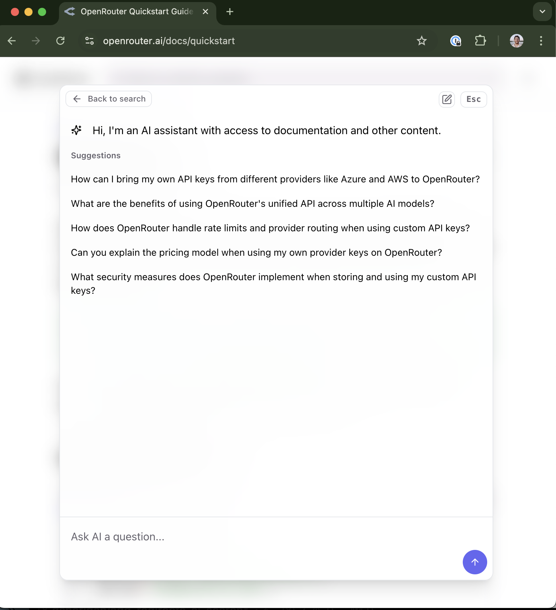

## Overview

<Frame caption="AI Search is accessed via the search bar, alongside keyword search.">

</Frame>

Fern AI Search indexes your documentation and provides an interface for your users to ask questions and get answers. We've found that it helps our customers:

- **Decrease the time to find needed information** - Help users quickly locate crucial documentation without navigating through a maze of tabs and endpoints.
- **Integrate your product faster** - Accelerate implementation with ready-to-use code samples that demonstrate practical applications.
- **Surface where your docs have gaps** - Identify documentation weaknesses through user feedback and search patterns.

<Frame>

</Frame>

## Features 

<CardGroup cols={2}>
  <Card 
    title="Custom prompting"
    icon="regular book-open"
    href="/learn/ai-search/custom-prompting"
  >
    Tailor AI Search results to your users' needs. 
  </Card>

  <Card 
    title="Citations" 
    icon="regular quote-right"
    href="/learn/ai-search/citations" 
    >
    Point users to the exact source of the answer. 
  </Card>

  <Card 
    title="Integration with Algolia" 
    icon="regular plug"
    href="/learn/docs/building-and-customizing-your-docs/search" 
    >
    Offer flexibility to have users 'Ask AI' or search your docs directly with Algolia. 
  </Card>

  <Card 
    title="All-in-one platform" 
    icon="regular fa-layer-group"
    href="/learn/docs/getting-started/overview"
  >
    Create seamless UX by offering a 'one-stop-shop' for all docs questions. 
  </Card>

</CardGroup>

## Pricing

AI Search is available on the [Pro plan](https://buildwithfern.com/pricing#Docs) of Fern Docs. Billing is by usage.
