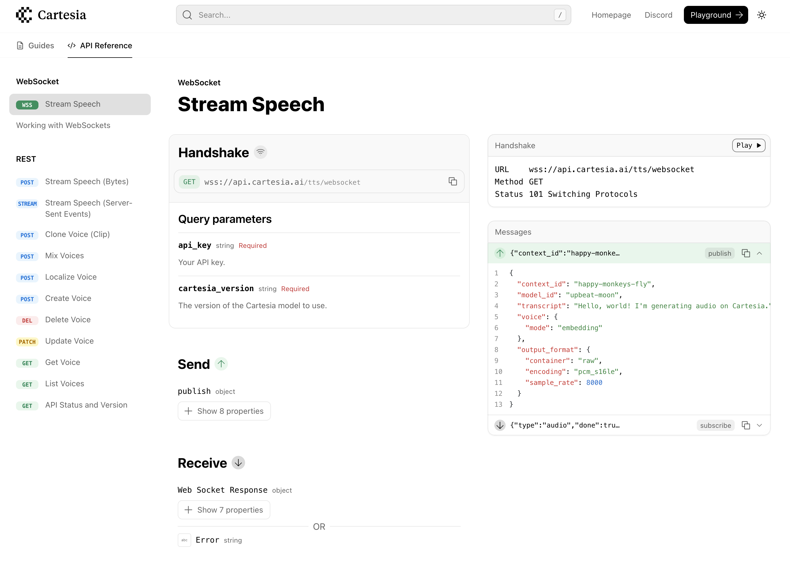

WebSockets enable a user to create a connection with a server, over which bidirectional communication can be sent. 

In Fern, you can specify WebSockets in your API definition. The WebSockets will be included in both the generated SDKs and the API documentation. 

## WebSocket definition
Each WebSocket is defined in its own file, where it is described by the `channel` object. 

### The channel object

A `channel` is defined by the following fields:

- `auth`: The authentication scheme for the WebSocket
- `path`: The path of the WebSocket 
- `headers` _(Optional)_: Any headers the WebSocket will send
- `path-parameters` _(Optional)_: Any path parameters in the WebSocket path
- `query-parameters` _(Optional)_: Any query parameters used in the initial request of the WebSocket
- `messages` _(Optional)_: The schemas of the messages the WebSocket can send and receive once connected
    - `origin`: The entity that sent the message (e.g. `client` or `server`)
    - `body`: The schema of the message
- `examples`: Example WebSocket connection _(Optional)_

### WebSocket example 

<CodeBlock title='chat.yml'>
  ```yaml
  channel:
    path: /chat
    auth: false
    query-parameters:
      model_id:
        type: optional<string>
        docs: The unique identifier of the model.
      model_version:
        type: optional<integer>
        docs: The version number of the model.
    messages:
      publish:
        origin: client
        body: PublishEvent
      subscribe:
        origin: server
        body: SubscribeEvent
    examples: 
      - query-parameters: 
          model_id: "123"
        messages: 
          - type: publish
            body:
              text: "Hello, world."
          - type: subscribe
            body: 
              id: "23823049"
              message: "Hello there, how are you?"
  types:
    PublishEvent:
      docs: The input from the user to send through the WebSocket. 
      properties: 
        text: 
          type: string
          docs: The user text to send into the conversation. 
    SubscribeEvent:
      docs: The response from the server sent through the WebSocket.
      properties: 
        id: 
          type: string
          docs: The id of the message. 
        message:
          type: string
          docs: The message sent through the socket. 
  ```
</CodeBlock>

## WebSocket API Reference

### WebSocket Reference

Fern renders a unique reference page for WebSockets. The **Handshake** section outlines the protocol for connecting with the server, while the **Send** and **Receive** sections outline the message schemas that can be sent between the client and server. 

<Frame caption="Cartesia's WebSocket Reference page">

</Frame>

### WebSocket Playground

<Markdown src="/snippets/pro-callout.mdx" />

Users can connect to and use WebSockets from right within the API Reference (check one of Hume's WebSockets [here](https://dev.hume.ai/reference/empathic-voice-interface-evi/chat/chat)). 

<Frame caption="Click 'Play' to open the WebSocket Playground">

</Frame>