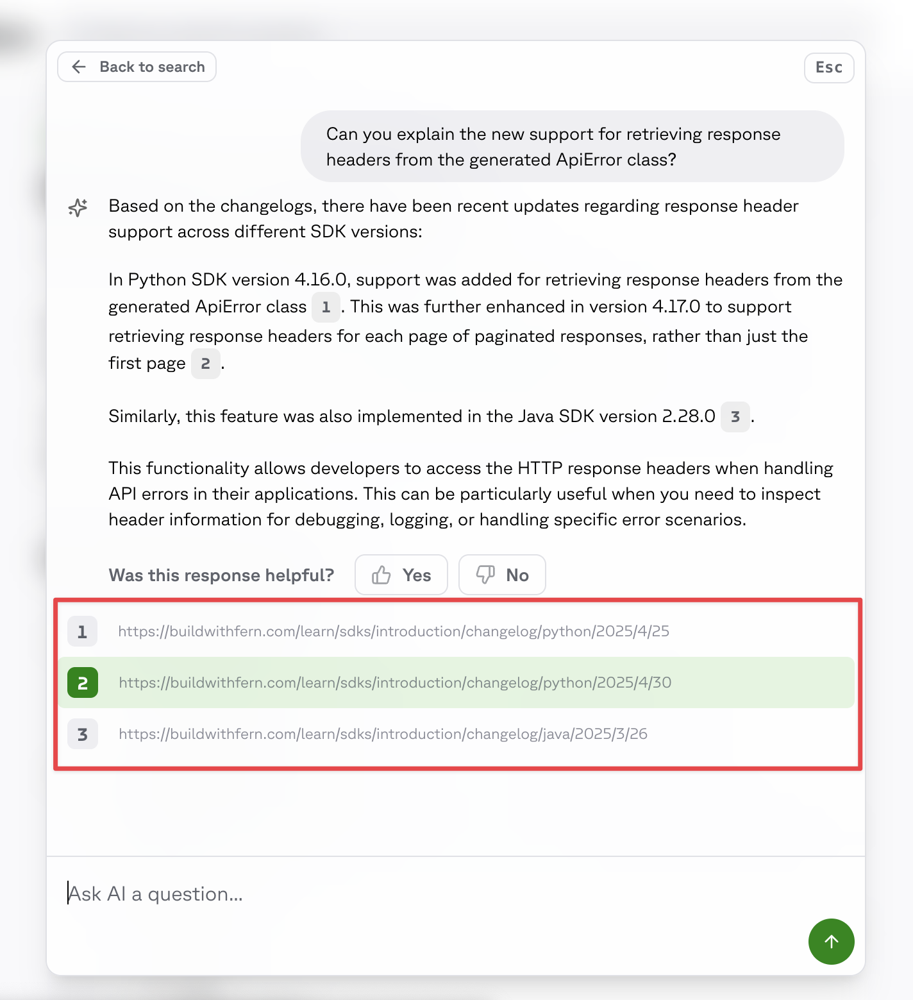

Ask Fern includes citations that link directly to source documentation, showing users where information comes from and providing immediate context. By referencing specific documentation sections, citations verify answer sources while enabling users to easily explore topics in greater depth.

<Frame>

</Frame>

