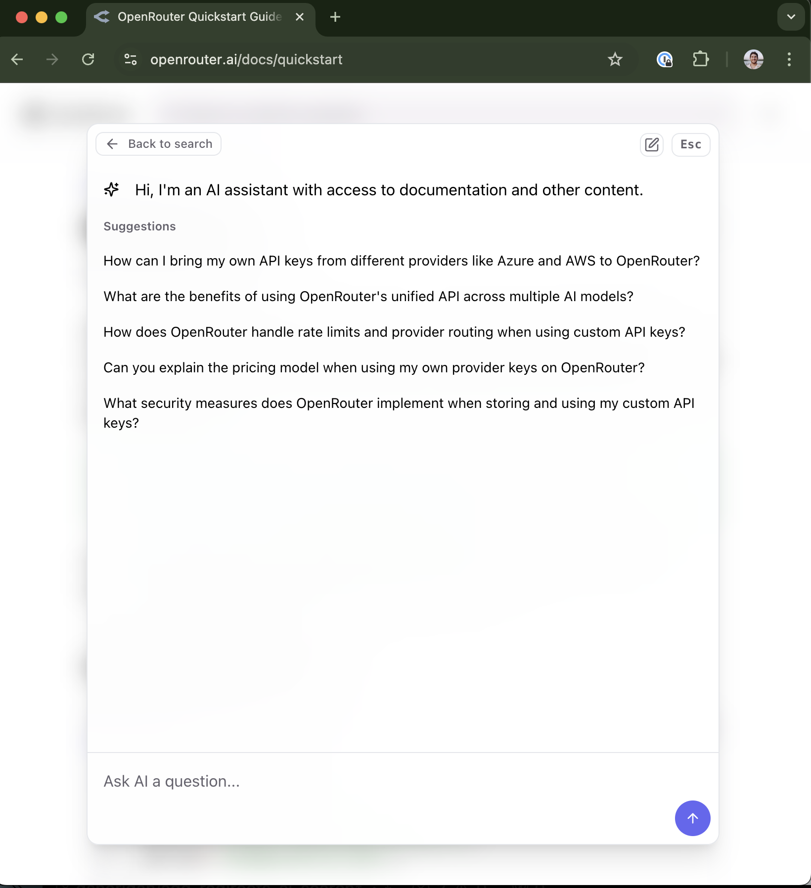

<Frame>
  <video 
    style={{ aspectRatio: '16 / 9', width: '100%' }}
    autoPlay
    muted
    loop
  >
    <source src="https://fern-docs.s3.us-east-2.amazonaws.com/ask-fern.mp4" type="video/mp4" />
  </video>
</Frame>

Ask Fern indexes your documentation, FAQs, and support threads to enable your users to get precise, tailored answers to their API questions. Here at Fern, we've found that it helps our customers:

- **Reduce onboarding time** - Users can quickly identify key information without navigating through a maze of tabs and endpoints.
- **Accelerate implementation** - Users can generate ready-to-use code samples that integrate seamlessly with their existing apps. 
- **Surface where your docs have gaps** - Technical writers can easily identify missing content through Ask Fern's analytics.

<Frame>

</Frame>

## Features 

<CardGroup cols={2}>
  <Card 
    title="Custom prompting"
    icon="regular book-open"
    href="/learn/ask-fern/custom-prompting"
  >
    Tailor Ask Fern's responses to your specific API needs.
  </Card>

  <Card 
    title="Citations" 
    icon="regular quote-right"
    href="/learn/ask-fern/citations" 
    >
    Guarantee that your users are getting accurate answers. 
  </Card>

  <Card 
    title="Integration with Algolia" 
    icon="regular plug"
    href="/learn/docs/building-and-customizing-your-docs/search" 
    >
    Ask Fern works great alongside Keyword Search.
  </Card>

  <Card 
    title="All-in-one platform" 
    icon="regular fa-layer-group"
    href="/learn/docs/getting-started/overview"
  >
    Ask Fern integrates seamlessly with Fern's 'one-stop-shop' Docs platform. 
  </Card>

</CardGroup>

## Pricing

Ask Fern is available on the [Pro plan](https://buildwithfern.com/pricing#Docs) of Fern Docs. Billing is by usage.
