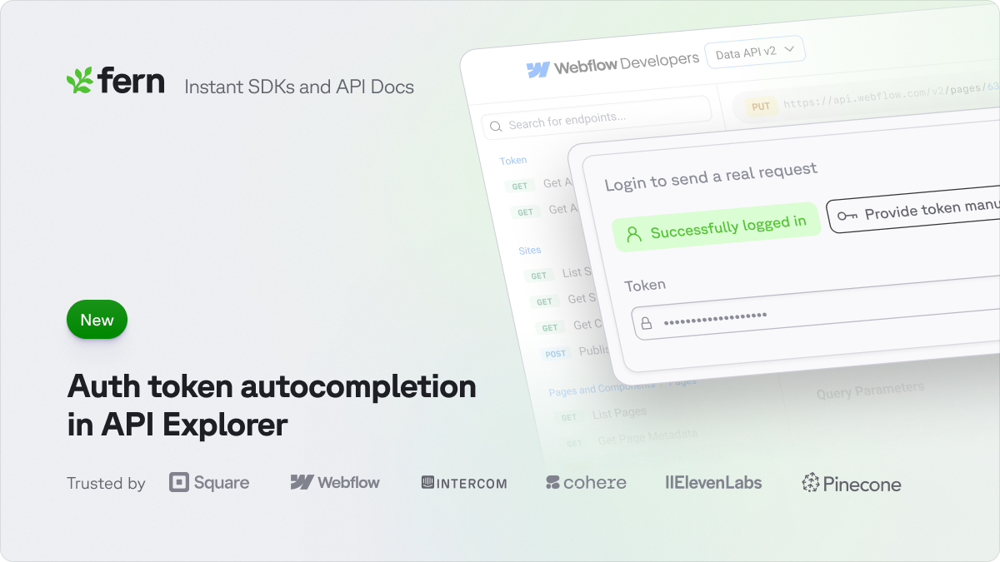

## Auto-Populate Credentials in API Explorer

Save developers the hassle of finding and copying their API key. When authenticated, their API credentials will be automatically filled into the API Playground. This way, they can make their first API call even faster.



Check it out live in [Webflow's API Explorer](https://developers.webflow.com/data/reference/sites/list?playground=/data/reference/sites/list).

## Domain Management
Implemented comprehensive domain cleanup and management system. Documentation now handles multiple domains and environments more effectively.

```typescript
const domainConfig = {
  cleanup: {
    frequency: 'daily',
    retainDays: 30,
    backupBeforeClean: true
  },
  routing: {
    primary: 'docs.example.com',
    aliases: ['api-docs.example.com'],
    forcePrimary: true
  }
}
```

## Card Component System
Enhanced documentation card components for better visual organization. Information can now be presented in a more structured and appealing way.

```typescript
interface CardProps {
  title: string;
  description: string;
  icon?: IconName;
  variant?: 'default' | 'bordered' | 'filled';
  actions?: CardAction[];
}

interface CardAction {
  label: string;
  href?: string;
  onClick?: () => void;
}
```

## OpenAPI Group Extensions
Added support for OpenAPI documentation grouping extensions. API endpoints can now be organized into logical groups for better navigation.

```yaml
openapi: 3.0.0
paths:
  /users:
    get:
      x-fern-group: User Management
      x-group-order: 1
    post:
      x-fern-group: User Management
      x-group-order: 2
```

## Parser Improvements
Enhanced documentation parser with better support for complex data structures. Documentation now handles nested elements and special characters more reliably.

```typescript
const parserConfig = {
  extensions: ['mdx', 'md'],
  plugins: ['remark-gfm', 'remark-math'],
  handlers: {
    codeBlock: (node) => customCodeBlockRenderer(node),
    table: (node) => responsiveTableRenderer(node)
  }
}
```

_Image suggestions:
1. Domain management interface
2. Card component variations
3. API grouping visualization
4. Parser configuration tool_