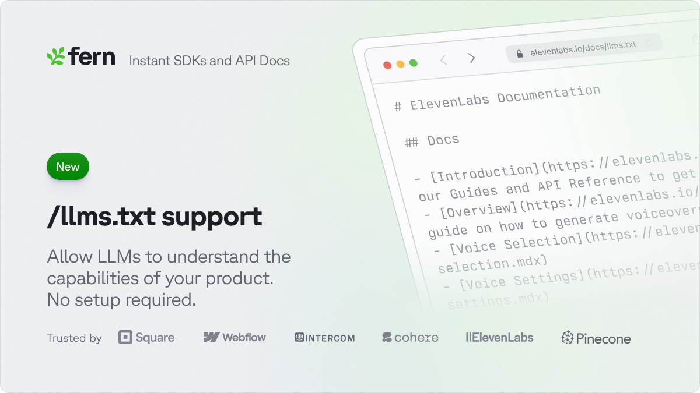

## Support for /llms.txt

API Docs should be for LLMs and Agents too, not just people!

We're excited to announce compatibility with the `/llms.txt` [emerging standard](https://llmstxt.org/), making your documentation accessible and optimized for AI developer tools such as Cursor, Github Copilot, ChatGPT, Perplexity, and Anthropic's Claude.

Both `/llms.txt` and `/llms-full.txt` are designed to be token-efficient, ensuring faster processing and cost-effective LLM interactions without sacrificing valuable info.

If you use Fern Docs, this feature is auto-enabled like /robots.txt and /sitemap.xml. [Learn more](https://buildwithfern.com/learn/docs/developer-tools/llms-txt)

Check out ElevenLabs:

<CardGroup cols={2}>
  <Card
    title="/llms.txt"
    variant="bordered"
    href="https://elevenlabs.io/docs/llms.txt"
  >
    *loads in < 1 sec*
  </Card>

  <Card
    title="/llms-full.txt"
    variant="bordered"
    href="https://elevenlabs.io/docs/llms-full.txt"
  >
    *loads in 5+ sec*
  </Card>
</CardGroup>
