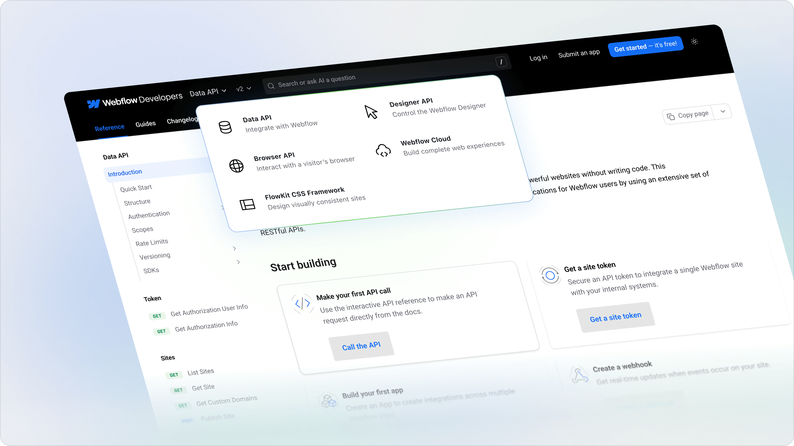

## Introducing The Product Switcher

Organize your docs by product so developers can find what they need quickly. Perfect for companies with multiple APIs, each with their own references, guides, versions, and changelogs.

Features:

- **Optimized for Search**  with SEO-friendly structure.
- **Keyword and AI Search** functionality works both within and across products.
- **Customizable** to your products with versions and unique icons to reflect your brand identity.

<Frame>

</Frame>

To add products to your docs, visit the [product switcher docs](/learn/docs/building-and-customizing-your-docs/product-switching) page to get started.
