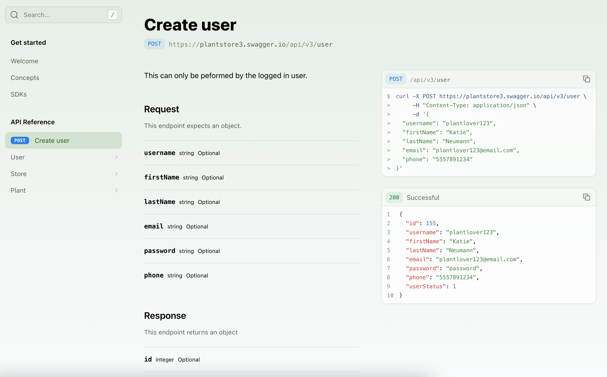
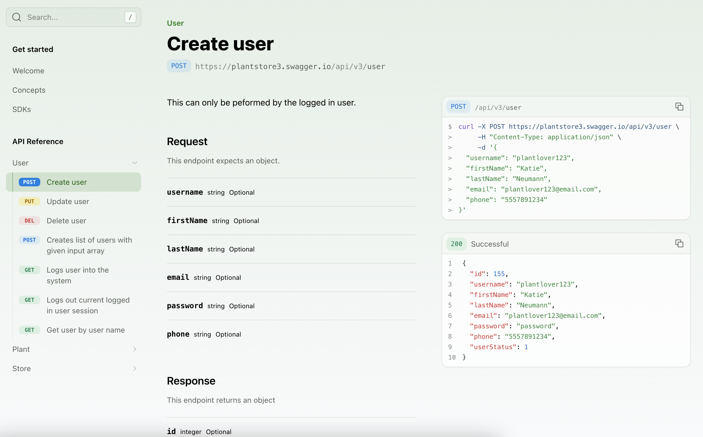
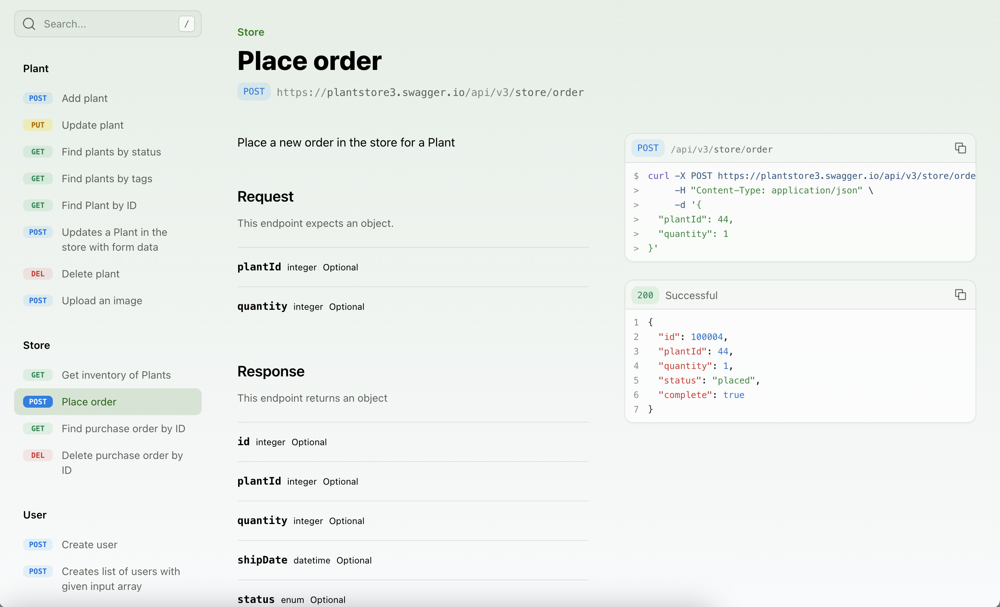
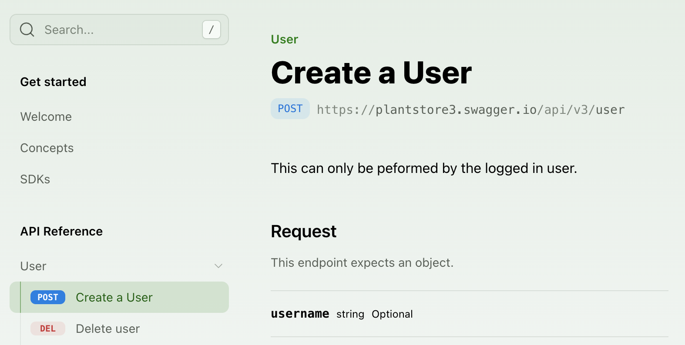
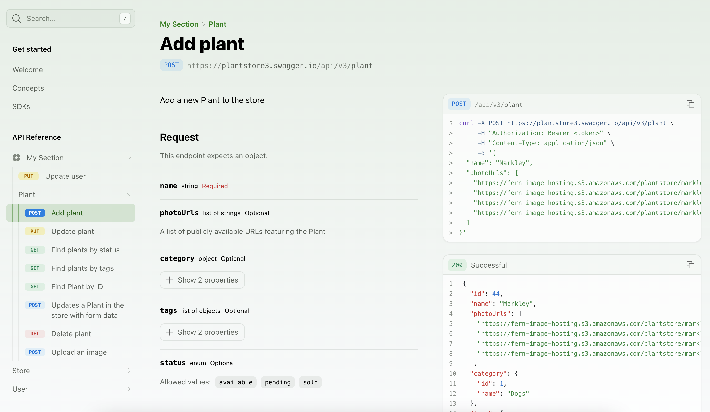
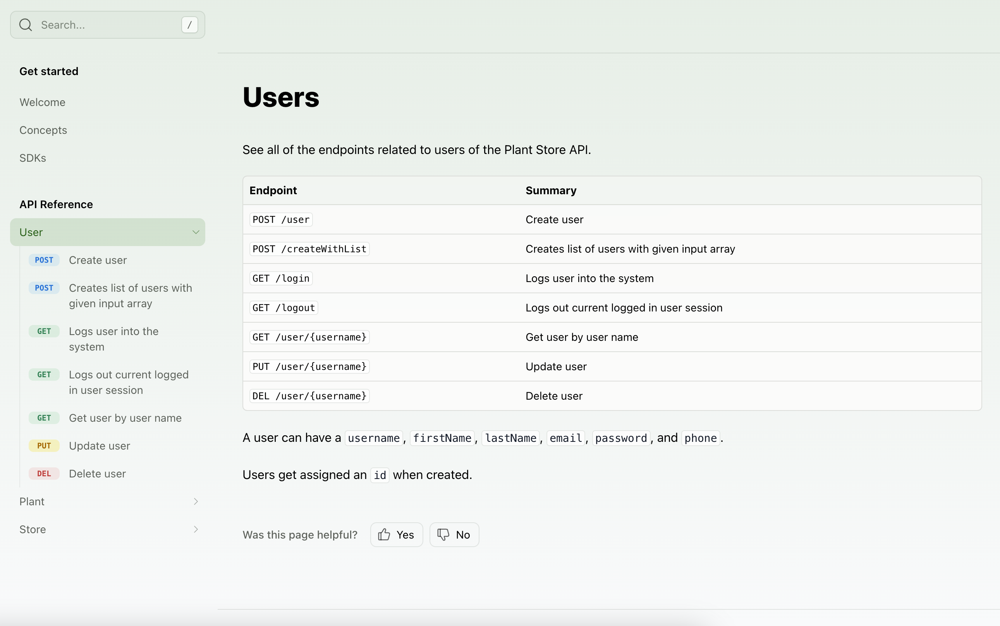

When you [include an API in your `docs.yml` file](/learn/docs/api-references/generate-api-ref), you can customize how the endpoints and sections are displayed in the sidebar navigation. By default, the reference will generate a navigation hierarchy based on the structure of the API spec, but several customizations can be configured.

<Note title="API Sections">
If you are using an OpenAPI Specification, sections are created based on the `tags` property, converted to `lowerCamelCase` convention (e.g., createUser). If you are using a Fern Definition, sections are created based on the [`service`](/learn/api-definition/fern/endpoints#service-definition) file names.
</Note>

If you would like to only display a subset of endpoints, read more about the Audiences property for [OpenAPI Specifications](/learn/api-definition/openapi/audiences) or [Fern Definitions](/learn/api-definition/fern/audiences).

## Ordering the API Reference

### Alphabetizing endpoints and sections
To sort all sections and endpoints alphabetically, unless explicitly ordered in `layout`, set `alphabetized` to `true`.

```yaml title="docs.yml"
navigation: 
  - api: API Reference
    alphabetized: true
```

### Ordering top-level sections
The `layout` option allows you to specify the order of sub-packages, sections, endpoints, and pages at the top level of your API Reference.

<Tabs>
  <Tab title="OpenAPI Specification">
  ```yaml title="docs.yml"
  navigation: 
    - api: API Reference
      layout: 
        - POST /user
        - user
        - store
        - plant
  ```
  </Tab>
  <Tab title="Fern Definition">
  ```yaml title="docs.yml"
  navigation: 
    - api: API Reference
      layout: 
        - user.create
        - user
        - store
        - plant
  ```
  </Tab>
</Tabs>

<Frame>

</Frame>

### Ordering section contents
Adding a `:` after the section name allows you to specify the order of its nested sub-packages and endpoints. 

<Note title="Referencing Endpoints">
To reference an endpoint, you can use either:
- `METHOD /path/name` (best for OpenAPI Specification)
- `serviceName.endpointName` (best for Fern Definition)
</Note>

<Tabs>
  <Tab title="OpenAPI Specification">
  You can reference an endpoint using the format `METHOD /path`. 
  ```yaml title="docs.yml"
  navigation: 
    - api: API Reference
      layout: 
        - user: 
            - POST /user
            - PUT /user/{username}
            - DELETE /user/{username}
  ```
  </Tab>
  <Tab title="Fern Definition">
  You can reference an endpoint using the format `serviceName.endpointName`.
  ```yaml title="docs.yml"
  navigation: 
    - api: API Reference
      layout: 
        - user: 
            - user.create
            - user.update
            - user.delete        
  ```
  </Tab>
</Tabs>

<Frame>

</Frame>

## Customizing the API Reference

### Flattening sections
To remove the API Reference title and display the section contents, set `flattened` to `true`.

```yaml title="docs.yml"
navigation: 
  - api: API Reference
    flattened: true
```

<Frame>

</Frame>

### Styling endpoints
To customize the display of an endpoint, you can add a `title`. You can also use `slug` to customize the endpoint URL.

<Tabs>
  <Tab title="OpenAPI Specification">
  ```yaml title="docs.yml" {6-7}
  navigation: 
    - api: API Reference
      layout: 
        - user: 
            - endpoint: POST /user
              title: Create a User
              slug: user-creation
            - DELETE /user/{username}
  ```
  </Tab>
  <Tab title="Fern Definition">
  ```yaml title="docs.yml" {6-7}
  navigation: 
    - api: API Reference
      layout: 
        - user: 
            - endpoint: user.create
              title: Create a User
              slug: user-creation
            - user.delete
  ```
  </Tab>
</Tabs>

<Frame>

</Frame>

### Hiding endpoints
You can hide an endpoint from the API reference by setting `hidden` to `true`. The endpoint will still be accessible at its URL.

<Tabs>
  <Tab title="OpenAPI Specification">
  ```yaml title="docs.yml" {10}
  navigation: 
    - api: API Reference
      paginated: true
      layout: 
        - user: 
            - endpoint: POST /user
              title: Create a User
              slug: user-creation
            - endpoint: DELETE /user/{username}
              hidden: true
  ```
  </Tab>
  <Tab title="Fern Definition">
  ```yaml title="docs.yml" {10}
  navigation: 
    - api: API Reference
      paginated: true
      layout: 
        - user: 
            - endpoint: user.create
              title: Create a User
              slug: user-creation
            - endpoint: user.delete
              hidden: true
  ```
  </Tab>
</Tabs>

<Tip title="Fully hidden endpoints">
For best results, API References with hidden endpoints should use the `paginated: true` configuration to avoid discovering endpoints from long-scrolling.
</Tip>

### Adding custom sections
You can add arbitrary folders in the sidebar by adding a `section` to your API Reference layout. A section can comprise entire groups of endpoints, individual endpoints, or even just Markdown pages. Sections can be customized by adding properties like a `icon`, `summary`, `slug` (or `skip-slug`), and `contents`. 

<Tabs>
  <Tab title="OpenAPI Specification">
  ```yaml title="docs.yml"
  navigation: 
    - api: API Reference
      layout: 
        - section: My Section
          icon: flower
          contents: 
            - PUT /user/{username}
            - plant
            - plantInfo # tag names are converted to camelCase convention
  ```
  </Tab>
  <Tab title="Fern Definition">
  ```yaml title="docs.yml"
  navigation: 
    - api: API Reference
      layout: 
        - section: My Section
          icon: flower
          contents: 
            - user.update
            - plant
  ```
  </Tab>
</Tabs>

<Frame>

</Frame>

### Adding a section overview
The `summary` property allows you to add an `.md` or `.mdx` page as an overview of the API Reference or a section. 

```yaml title="docs.yml"
navigation: 
  - api: API Reference
    summary: pages/api-overview.mdx
    layout: 
      - user: 
          summary: pages/user-overview.mdx
```

<Frame>

</Frame>

### Adding pages and links
You can add regular pages and external links within your API Reference. 

```yaml title="docs.yml"
navigation: 
  - api: API Reference
    layout: 
      - user: 
          contents: 
            - page: User Guide
              path: ./docs/pages/user-guide.mdx
            - link: Link Title
              href: http://google.com
```

### Disable long-scrolling
By default, the API Reference renders all endpoints on a single page (long-scrolling). To create separate pages for each endpoint, set `paginated: true`. 

```yaml title="docs.yml"
navigation: 
  - api: API Reference
    paginated: true
```
