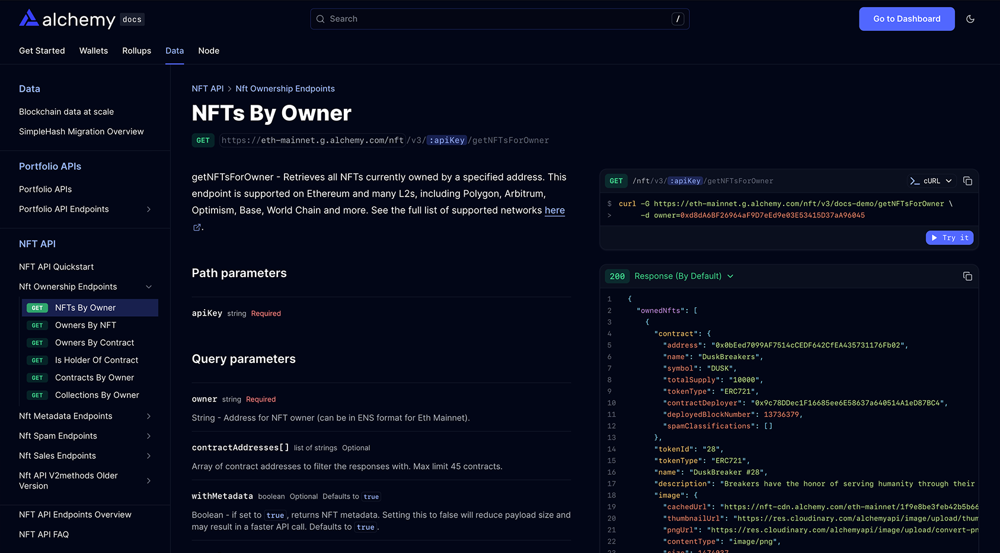

Fern enables you to generate professional, interactive API reference documentation for your JSON-RPC APIs using the [OpenRPC](https://open-rpc.org/) specification. OpenRPC provides a standardized, machine-readable format for describing JSON-RPC 2.0 APIs, unlocking powerful documentation and code generation workflows.

<Frame caption={<a href="https://www.alchemy.com/docs/data/nft-api/api-reference/nft-ownership-endpoints/get-nf-ts-for-owner-v-3">Example of Alchemy's docs site</a>}>
  
</Frame>

## How to Add an OpenRPC Endpoint

1. Add your OpenRPC specification file (e.g., `openrpc.yaml`) to your `/fern` directory.
2. Configure your `generators.yml` to point to your OpenRPC spec:

<CodeBlock title='generators.yml'>
  ```yaml
  api:
    specs:
      - openrpc: ../../api-specs/openrpc/wallet.yml
  ```
</CodeBlock>

### Configuration Properties

<ParamField path="api.specs[].openrpc" required>
  Path to your OpenRPC specification file. You can include multiple OpenRPC specs if your project exposes more than one JSON-RPC API.
</ParamField>

## Common Use Cases

JSON-RPC APIs are widely used for:
- **Blockchain & Crypto**: Node RPC endpoints, wallet APIs
- **FinTech**: Trading platforms, market data feeds
- **Developer Tools**: Language servers, debuggers, automation
- **Distributed Systems**: Remote procedure calls between services

Leverage Fern and OpenRPC to deliver world-class developer experiences for your JSON-RPC APIs.
