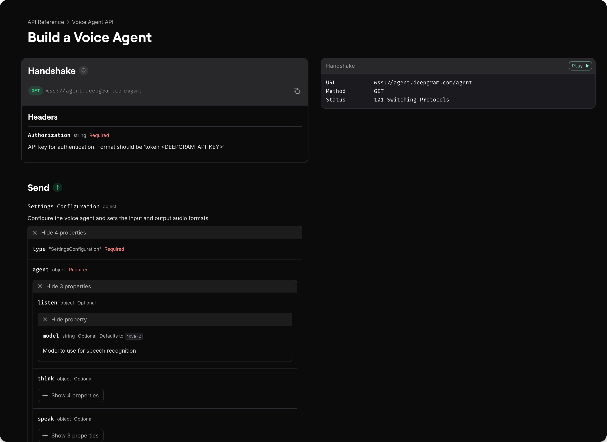

Fern generates WebSocket API reference documentation from your AsyncAPI specification or Fern Definition. The AsyncAPI specification describes message-driven APIs in a machine-readable format. Fern supports the [v2](https://www.asyncapi.com/docs/reference/specification/v2.x) and [v3](https://www.asyncapi.com/docs/reference/specification/v3.0.0) specifications.

See [Deepgram's configuration](https://github.com/deepgram/deepgram-fern-config/blob/9a3d281d87963165df7cbb89c4883d5058abaf2e/fern/generators.yml#L5-L7) for a complete example.

<Frame caption={<a href="https://developers.deepgram.com/reference/text-to-speech-api/speak-streaming">Example of how a WebSocket API Reference renders in Fern</a>}>
  
</Frame>

## Configuration

1. Add your AsyncAPI specification file (e.g., `asyncapi.yml`) to your `/fern` directory
1. Configure your `generators.yml`

<CodeBlock title='generators.yml'>
  ```yaml
api:
  specs:
    - openapi: asyncapi.yml
      origin: https://github.com/your-org/your-repo/blob/main/asyncapi.yml
  ```
</CodeBlock>

### Properties

<ParamField path="path" required>
    Location of your AsyncAPI specification file
</ParamField>

<ParamField path="origin">
    URL where the specification file is hosted if you want Fern to fetch it from a remote location
</ParamField>

## Common use cases

WebSockets enable real-time, bidirectional communication, making them essential for:

- **FinTech**: Market data streams, trading updates, live pricing
- **Voice AI**: Live transcription, real-time voice processing
- **Gaming**: Multiplayer interactions, live state updates
- **Communications**: Chat applications, collaboration tools