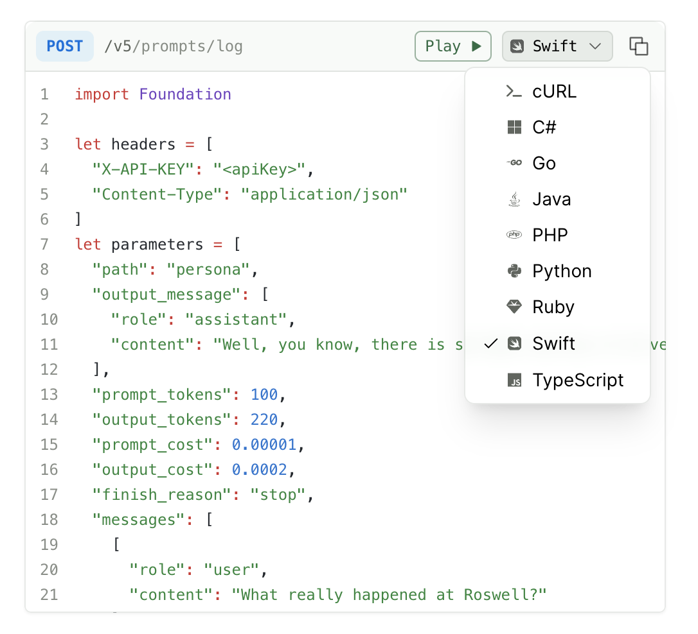

<Frame>

</Frame>

## Setup

1. Ensure you have a paid Fern subscription
2. Contact support to request HTTP snippets activation
3. Once enabled, build your production docs

<Note>
Currently, HTTP snippets are provided as an all-or-nothing set. You cannot configure which languages are displayed. If you would like this feature, please [open a GitHub issue](https://github.com/fern-api/fern/issues/new?template=docs-feature.yml).
</Note>

## How It Works

### Request Examples

To generate HTTP snippets, add request examples to your API definition:
- For Fern Definition: Follow the [examples documentation](/learn/api-definition/fern/examples)
- For OpenAPI: Follow the [request/response examples documentation](/learn/api-definition/openapi/extensions/others#request--response-examples)

### Set Default Snippet Language

HTTP snippets support several languages. Our development work is driven by customer requests, so please request support for languages not listed here by [opening an issue](https://github.com/fern-api/fern/issues/new/choose).

* csharp
* curl
* dotnet
* go
* java
* python
* ruby
* typescript

To set the default snippet language, use the `default-language` key at the top indentation level of `docs.yml`.

<CodeBlock title="docs.yml">
    ```yaml {1}
    default-language: typescript

    navigation:
    - api: API Reference
    snippets:
    python: your-package-name
    typescript: your-package-name
    ```
</CodeBlock>

### Generated Features

HTTP snippets automatically include:
- Authentication headers with placeholders (e.g., `<apiKey>`)
- Query parameters and request body formatting
- Content-Type headers
- Error handling patterns
- SSL/TLS configuration where applicable

### Display Behavior

- If your API has SDK snippets, those will be shown by default
- If no SDK snippets exist, HTTP snippets will display automatically
- User language preferences are saved client-side

To see HTTP snippets in action, check out [Humanloop's API documentation](https://humanloop.com/docs/api-reference/prompts/log) for a live example of how they appear in production documentation.