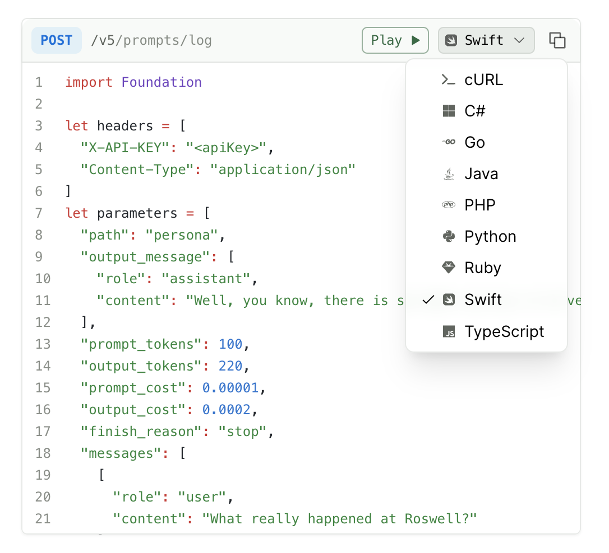

<Frame>

</Frame>

## Setup

HTTP snippets are enabled by default for all Fern documentation sites. If you wish to disable them, you can do so in your `docs.yml` configuration file:

<CodeBlock title="docs.yml">
```yaml 
navigation:
  - api: API Reference
    snippets:
      sdk:
        typescript: your-package-name
        python: your-package-name
      http:
        - language: python    # default: requests
        - language: php
          library: guzzle   # override default library
        - language: curl
        - language: javascript
        - language: javascript # can have the same language multiple times with different libraries
          library: axios
        - language: java
        - language: go
        - language: ruby
        - language: csharp
        
        # Or disable HTTP snippets entirely
        enabled: false    # defaults to true

default-language: typescript
```
</CodeBlock>

## How It Works

### Request Examples

To generate HTTP snippets, add request examples to your API definition:
- For Fern Definition: Follow the [examples documentation](/learn/api-definition/fern/examples)
- For OpenAPI: Follow the [request/response examples documentation](/learn/api-definition/openapi/extensions/others#request--response-examples)

### Set Default Snippet Language

HTTP snippets support several languages. Our development work is driven by customer requests, so please request support for languages not listed here by [opening an issue](https://github.com/fern-api/fern/issues/new/choose).

* csharp
* curl
* dotnet
* go
* java
* python
* ruby
* typescript

To set the default snippet language, use the `default-language` key at the top indentation level of `docs.yml`.

<CodeBlock title="docs.yml">
    ```yaml {1}
    default-language: typescript

    navigation:
    - api: API Reference
    snippets:
    python: your-package-name
    typescript: your-package-name
    ```
</CodeBlock>

### Generated Features

HTTP snippets automatically include:
- Authentication headers with placeholders (e.g., `<apiKey>`)
- Query parameters and request body formatting
- Content-Type headers
- Error handling patterns
- SSL/TLS configuration where applicable

### Display Behavior

- If your API has SDK snippets, those will be shown by default
- If no SDK snippets exist, HTTP snippets will display automatically
- User language preferences are saved client-side