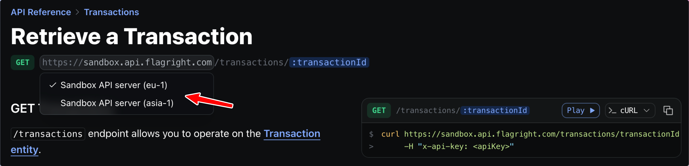
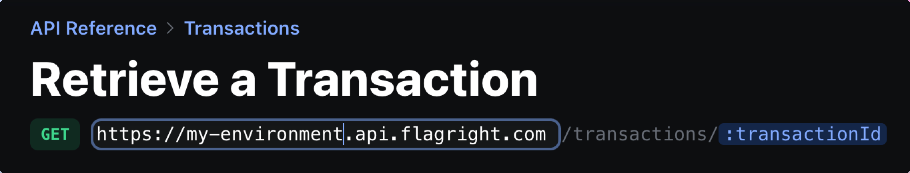

You can configure multiple server URLs in your API Reference to allow users to switch between different environments (e.g., production and sandbox). This is particularly useful when users need to test their integration before going live.

## Configuration

You can configure multiple server URLs in your API definition using either Fern Definition or OpenAPI:

- [Configure servers in OpenAPI](/learn/api-definition/openapi/extensions/others#server-names)
- [Configure environments in Fern Definition](/learn/api-definition/fern/api-yml/environments)

## User Interface

When multiple servers are configured, users will see a dropdown menu in the API Reference that allows them to switch between environments:

<Frame>
  
</Frame>

Here's an example of the [Flagright docs site](https://docs.flagright.com/framl-api/api-reference/api-reference/transactions/get) with multiple server names configured.

<Tabs>
  <Tab title="OpenAPI">
    <CodeBlock>
    ```yaml
    openapi: 3.0.0
    servers:
      - url: https://sandbox.api.flagright.com
        x-fern-server-name: Sandbox API server (eu-1)
      - url: https://sandbox-asia-1.api.flagright.com
        x-fern-server-name: Sandbox API server (asia-1)
    ```
    </CodeBlock>
  </Tab>
  <Tab title="Fern Definition">
    <CodeBlock>
    ```yaml
    environments:
      Sandbox API server (eu-1): https://sandbox.api.flagright.com
      Sandbox API server (asia-1): https://sandbox-asia-1.api.flagright.com
    ```
    </CodeBlock>
  </Tab>
</Tabs>

## Environment Persistence

When you select an environment, it's reflected across the entire API Reference - both in the displayed URLs and in the [API Explorer](/learn/docs/api-references/api-explorer). This selection persists as you navigate between different pages.

You can also double-click the server URL to manually edit it, allowing for quick testing against custom environments or endpoints.

<Frame>
  
</Frame>
