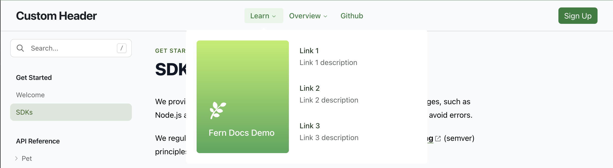
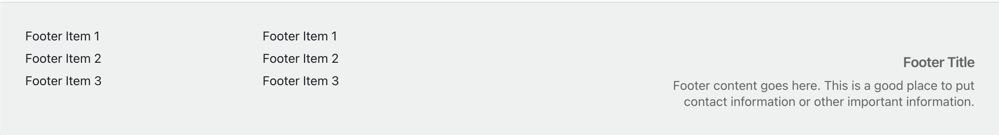

<Note>
Custom CSS & JS are available on the Basic plan. 
Adding Custom Components is available on the Pro plan.
</Note>

## Custom CSS

You can add custom CSS to your docs to further customize the look and feel. The defined class names are applied across all MDX files.

Here's an example of what you can do with custom CSS:

<CodeBlock title="styles.css">
```css maxLines=10

.petstore-table {
    background-color: white;
    border: 1px solid #DEDEE1;
    border-radius: 4px;
}

.dark .petstore-table { 
    background-color: #1e1e1e;
    border: 1px solid #2e2e2e;
}

.petstore-table thead {
    position: sticky;
    top: 0;
}

.petstore-table thead tr {
    background-color: #edecee;
    border: 1px solid #DEDEE1;
    border-radius: 4px 4px 0px 0px;
}

.dark .petstore-table thead tr {
    background-color: #2e2e2e;
    border: 1px solid #2e2e2e;
}

.petstore-table th {
    padding: 6px;
}

.petstore-table tbody td {
    padding: 6px;
}

.petstore-table tbody tr:nth-child(odd) {
    border: 1px solid #DEDEE1;
}
.petstore-table tbody tr:nth-child(even) {
    border: 1px solid #DEDEE1;
    background-color: #f7f6f8;
}

.dark .petstore-table tbody tr:nth-child(odd) {
    border: 1px solid #2e2e2e;
}

.dark .petstore-table tbody tr:nth-child(even) {
    border: 1px solid #2e2e2e;
    background-color: #2e2e2e;
}
```
</CodeBlock>

<Steps>
### Create `styles.css`

Add a `styles.css` file and include it in your `fern/` project:

<CodeBlock title="Add the styles.css file">
```bash {5}
  fern/
  ├─ openapi/
  ├─ pages/
  ├─ images/
  ├─ styles.css
  ├─ docs.yml
  └─ fern.config.json
```
</CodeBlock>

### Edit `docs.yml`

In `docs.yml`, specify the path to the `styles.css` file:

<CodeBlock title="docs.yml">
```yaml
css: ./styles.css
```
</CodeBlock>

### Add multiple custom CSS files (optional)

You can specify any number of custom CSS files:

<CodeBlock title="docs.yml">
```yaml
css:
  - ./css/header-styles.css
  - ./css/footer-styles.css
```
</CodeBlock>

</Steps>

<Note>
For customizing the background, logo, font, and layout of your Docs via Fern's built-in styling, 
check out the [Global Configuration](/learn/docs/getting-started/global-configuration). 
</Note>

## Custom JavaScript

Customize the behavior of your Docs site by injecting custom JavaScript globally. Add a `custom.js` file and include it in your `fern/` project:

<CodeBlock title="Add the custom.js file">
```bash {5}
  fern/
  ├─ openapi/
  ├─ pages/
  ├─ images/
  ├─ custom.js
  ├─ docs.yml
  └─ fern.config.json
```
</CodeBlock>

In `docs.yml`, specify the path to the `custom.js` file:

<CodeBlock title="docs.yml">
```yaml
js: ./custom.js
```
</CodeBlock>

You can also specify multiple custom JS files stored locally and remote:

<CodeBlock title="docs.yml">
```yaml
js:
    - path/to/js/file.js
    - path: path/to/another/js/file.js
        strategy: beforeInteractive
    - url: https://example.com/path/to/js/file.js
```
</CodeBlock>

### Strategy

Optionally, specify the strategy for each custom JavaScript file. Choose from `beforeInteractive`, `afterInteractive` (default), and `lazyOnload`. 

<CodeBlock title="docs.yml">
```yaml
js:
    - path: path/to/another/js/file.js
        strategy: beforeInteractive
```
</CodeBlock>

## Custom components

You can use custom CSS and JS to replace Fern's default UI components with your own. The `header` and `footer` 
are the most commonly replaced components. You can replace any component in the docs, 
including the sidebar, tabs, search bar, and more.

To implement your own components in Fern Docs, write JavaScript to render your 
custom components in the DOM. Build to CSS and JavaScript files that 
are stored in `fern/` and referenced in `docs.yml`:

<CodeBlocks>
<CodeBlock title="fern/">
```bash {5-7}
  fern/
  ├─ openapi/
  ├─ pages/
  ├─ images/
  ├─ dist/
    └─ output.css
    └─ output.js
  ├─ docs.yml
  └─ fern.config.json
```
</CodeBlock>
<CodeBlock title="docs.yml">
```yaml
css: ./dist/output.css
js: ./dist/output.js
```
</CodeBlock>
</CodeBlocks>

### Example custom components

See this [GitHub repo](https://github.com/fern-api/docs-custom-js-example) 
and its [generated docs page](https://custom-js-example.docs.buildwithfern.com/get-started/welcome) 
for an example of how to replace the Fern `header` and `footer` with custom React components. 

#### Example custom header

<Frame>
   
</Frame>

```JavaScript
ReactDOM.render(
  React.createElement(NavHeader),
  document.getElementById('fern-header'),
)
```

#### Example custom footer

<Frame>
   
</Frame>

```JavaScript
ReactDOM.render(
  React.createElement(NavFooter),
  document.getElementById('fern-footer'),
)
```

### Important notes

- `ReactDOM.render()` may need to be called multiple times to prevent it from unmounting (this side-effect will be removed in the future).
- `yarn build` or `npm build` must generate files with deterministic names to be referenced in `docs.yml`. The above example uses a [`vite` config](https://github.com/fern-api/docs-custom-js-example/blob/main/custom-app/vite.config.ts) to accomplish this.
- For your hosted Docs site, you may need to update your CD steps to include building the react-app.
- Custom components are not supported in local development. They are supported in preview links.

<Info>
This approach is subject to change, with notice, as we make improvements to the plugin architecture.
</Info>
