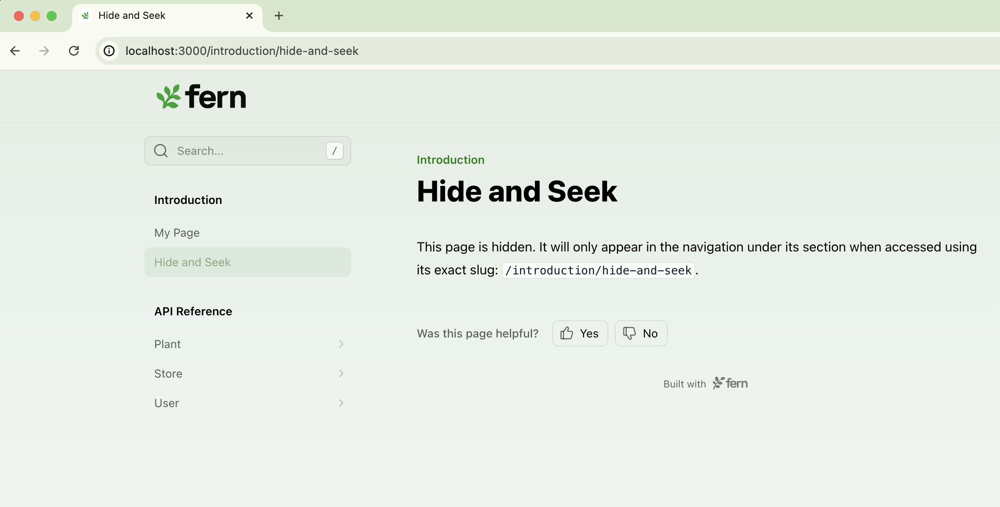
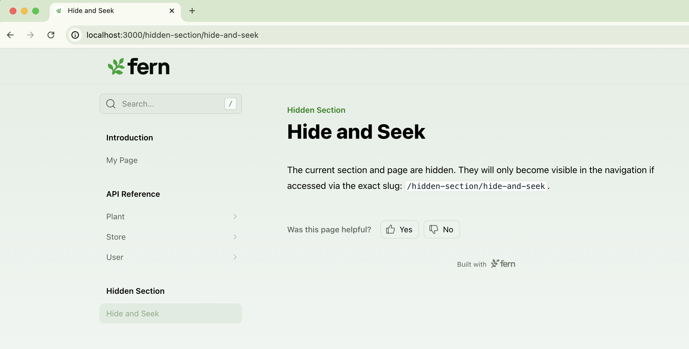

--- 
title: Hiding content in your site
---

If you would like to _hide_ a section or a page, you can add `hidden: true` to its configuration. Hidden sections and pages are accessible by URL only. 

<Tabs>
<Tab title="Hidden page">
```yaml title="docs.yml"
navigation: 
  - section: Introduction
    contents: 
      - page: My Page
        path: ./pages/my-page.mdx
      - page: Hide and Seek
        hidden: true
        path: ./pages/hide-and-seek.mdx
  - api: API Reference
```

<Frame>

</Frame>
</Tab>
<Tab title="Hidden section">
```yaml title="docs.yml"
navigation: 
  - section: Introduction
    contents: 
      - page: My Page
        path: ./pages/my-page.mdx
  - api: API Reference
  - section: Hidden Section
    hidden: true
    contents: 
      - page: Hide and Seek
        path: ./pages/hide-and-seek.mdx
```

<Frame>

</Frame>
</Tab>
</Tabs>