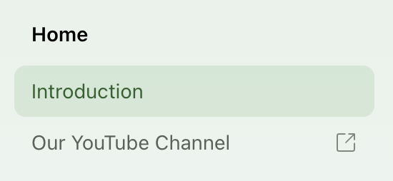

## Redirects
The `redirects` object allows you to redirect traffic from one path to another. You can also use [`regex`](https://www.npmjs.com/package/path-to-regexp) within redirects. 

<Tabs>
<Tab title="Redirect exact paths">
```yml title="docs.yml"
redirects:
  - source: "/old-path"
    destination: "/new-path"
  - source: "/incorrect/path"
    destination: "/correct/path"
```
</Tab>
<Tab title="Redirect with regex">
```yml title="docs.yml"
  - source: "/old-folder/:slug" # <- /old-folder/foo, /old-folder/bar, etc.
    destination: "/new-folder/:slug"
  - source: "/incorrect/:slug*" # <- /incorrect, /incorrect/foo/bar/baz, etc.
    destination: "/correct/:slug*" 
```
<Info>
Parameters suffixed with an asterisk (`*`) denote a match with zero or more.
</Info>
</Tab>
</Tabs>

By default, the redirects implement temporary (302) redirects. If you would like to implement permanent (301) redirects, you can set `permanent: true`.

<CodeBlock title="docs.yml">
```yml
redirects:
  - source: "/old-subdomain"
    destination: "/new-subdomain"
    permanent: true
```
</CodeBlock>

<Note title="Subpaths">
If your docs are hosted on a subpath (like `buildwithfern.com/learn`), be sure to include the subpath in the redirect. 
</Note>

## Links

You can add a link to an external page within your sidebar navigation with the following configuration: 

```yaml title="docs.yml"
navigation: 
  - section: Home
    contents:
      - page: Introduction
        path: ./intro.mdx
      - link: Our YouTube Channel
        href: https://www.youtube.com/
```

<Frame>

</Frame>
