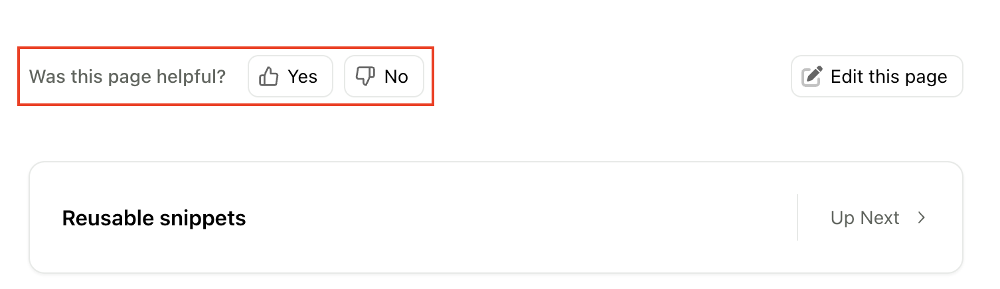
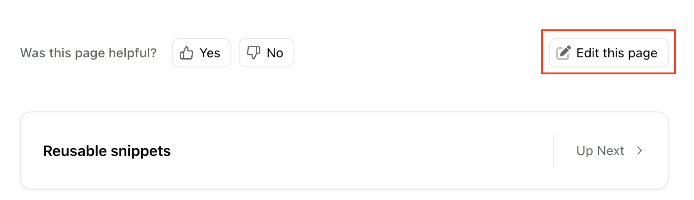

Fern offers a variety of ways to track feedback and suggested improvements from users. 

## On-page feedback
By default, every Markdown page of your docs contains a feedback component at the bottom of the page: 

<Frame>

</Frame>

<Tip>This feature is available on the Basic plan and above. [Contact us](https://buildwithfern.com/contact) to get set up.</Tip>

The feedback can be sent to you in real-time via the method of your choosing (e.g. Slack, email). 

To disable this feature on a page, set `hide-feedback: true` in the frontmatter of that page. You can read more about the frontmatter configuration [here](/learn/docs/content/frontmatter#on-page-feedback). 

## Edit this page
Allow users to open directly to the current page in your GitHub repository and suggest changes. 

<Frame>

</Frame>

You can configure this feature for the entire site in the [global configuration](/learn/docs/getting-started/global-configuration#instances-configuration), or for an individual page in the [frontmatter of that page](/learn/docs/content/frontmatter#edit-this-page). 

<Note>
This feature works in preview links but does not work in local development.
</Note>
