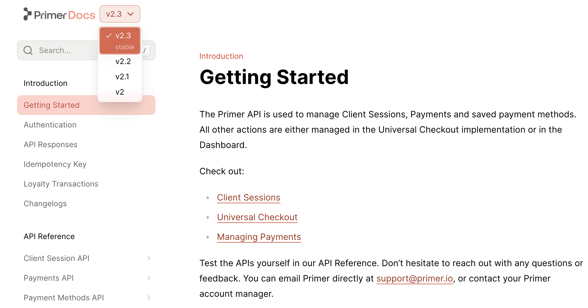

<Frame>

</Frame>

Each version of your docs can contain its own distinct tabs, sections, pages, and API references. Versions can share content, as well. 

**To add versions to your docs:**

<Steps>
### Define your versions

Create a `versions` folder inside of your `fern` folder. TO specify the contents of each version, add a `.yml` file to the `versions` folder to define the navigational structure of that version. Make sure to include the `navigation` and `tabs` properties, if applicable. 

```bash
fern/
  ├─ fern.config.json
  ├─ generators.yml
  ├─ docs.yml
  ├─ pages/
    ├─ ...
  └─ versions/
    ├─ v2-1/pages/...
    ├─ v2-1.yml
    ├─ v2-2/pages/...
    └─ v2-2.yml
```

<CodeBlocks>
<CodeBlock title="versions/v2-1.yml">
```yaml
navigation: 
  - section: Introduction
    contents: 
      - page: My Page
        path: ./v2-1/pages/my-page.mdx  # relative path to the file
      - page: Shared Resource
        path: ../shared-pages/shared-resource.mdx
  - api: API Reference
```
</CodeBlock>
<CodeBlock title="versions/v2-2.yml">
```yaml
tabs: 
  api: 
    title: API Reference
    icon: puzzle
  help:
    title: Help Center
    icon: home
    
 navigation:
  - tab: api
     contents:
        - section: Introduction
           contents: 
              - page: My Page
                path: ./v2-2/pages/my-page.mdx # relative path to the file
              - page: Shared Resource
                path: ../shared-pages/shared-resource.mdx
        - api: API Reference
   - tab: help
      contents: 
         - section: Help Center
           contents: 
              - page: Contact Us
                 path: contact-us.mdx
```
</CodeBlock>
</CodeBlocks>

### Add your version configuration

To define a version, in `docs.yml`, add an item to the `versions` list, specifying the `display-name` and `path`. 

```bash
fern/
  ├─ fern.config.json
  ├─ generators.yml
  ├─ docs.yml
  └─ versions/
    ├─ ...
    ├─ v2-1.yml
    └─ v2-2.yml
```

<CodeBlock title="docs.yml">
```yaml
versions: 
  - display-name: v2.2          # shown in the dropdown
    path: ./versions/v2-2.yml   # relative path to the version file
  - display-name: v2.1
    path: ./versions/v2-1.yml
```
</CodeBlock>

### Remove extra `navigation` from `docs.yml`
If your `docs.yml` file includes a `navigation` field or a `tabs` field, be sure to remove. Those fields should now belong in the version-specific `.yml` files. 
</Steps>