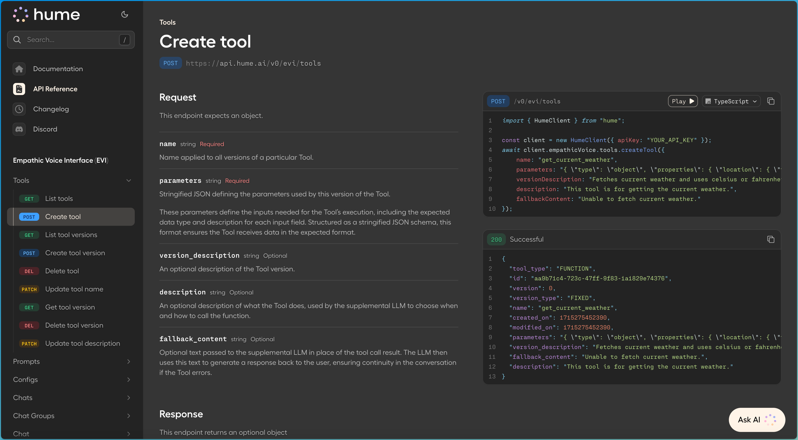
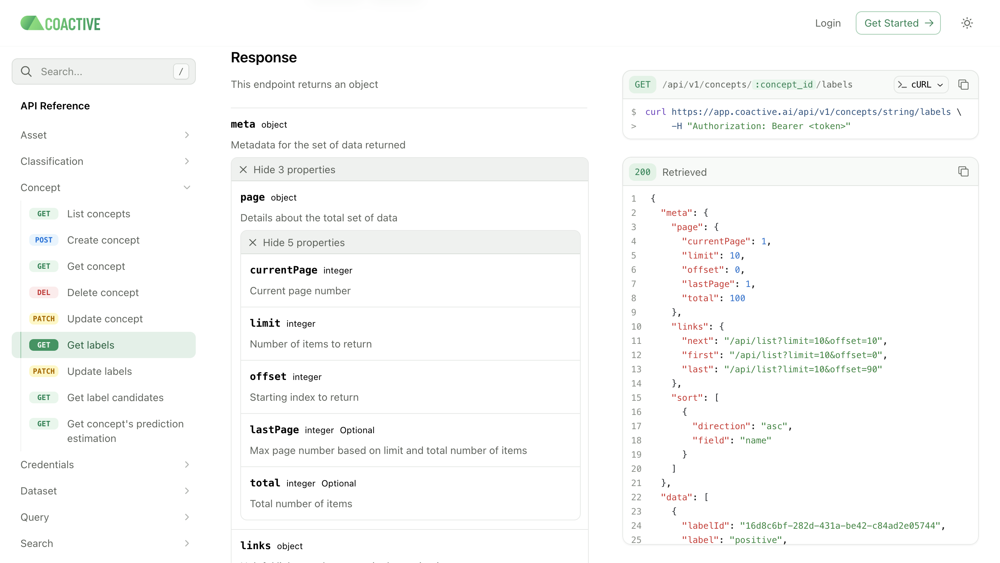

[ReadMe](https://www.readme.com/), similar to Fern, supports generating docs for APIs. Below, we walk through the different capabilities of Fern and ReadMe.

### 1. Fern offers docs as code
Fern leverages your git version control provider (e.g., GitHub) as a content management system (CMS). You commit markdown files (MDX) & your OpenAPI specification to benefit from branching, pull requests, and approval workflows. Generating docs takes place in CI/CD (e.g., GitHub Actions) and is done automatically when your content changes.

ReadMe has a built-in content management system backed by markdown, but not accessible in your code repository.

### 2. Fern offers more levels of customization
Fern's docs allow you to completely customize your docs to match your brand's needs. 

| Feature | Fern | ReadMe |
| ------- | ---- | ------ |
| Custom CSS/HTML | ✅ | ✅ |
| Custom JS | ✅ | ✅ |
| Reusable content | ✅ | ✅ |
| Built-in translations | ❌ | ✅ |
| UI (React) components | ✅ | ❌ |
| Direct communication for feature requests | ✅ | ❌ |

### 3. Fern is an all-in-one: SDKs + Docs
When you generate SDKs with Fern, you automatically get the SDK code snippets embedded inside your API reference. Plus, you get an SDK reference that informs a developer about how to get started. In the API Playground, developers can try the API and see how to make a request using the SDK, allowing them to copy, paste, and go. 

<Frame caption="API Docs with SDK code snippets (generated by Fern)">
  
</Frame>

If you choose ReadMe, you would have to find a separate vendor for SDK generation and would need to manually maintain code examples using the SDK. You also do not have access to dynamic SDK snippets in the API Playground.

### 4. Fern offers full OpenAPI support
Fern is built with first-class support for nested objects and will give developers detailed information about what properties are required vs optional as well. Fern can also support the intuitive display of additional properties. 

<Frame caption="First-class support for nested objects (generated by Fern)">
  
</Frame>

### 5. Fern offers live editing experience
With Fern, you can iterate quickly by running a local development server, changing markdown, and then immediately seeing what the page looks like in your browser. Local development allows for real-time editing, where you can see what you get while writing documentation.

<Frame caption="Local development environment (generated by Fern)">
  <iframe src="https://drive.google.com/file/d/1hF7h3BD_6u-qlIKdZPhyTI96tWXV4ast/preview" width="640" height="480" allow="autoplay"></iframe>
</Frame>

ReadMe has an editor in the browser that allows you to edit guides without seeing the underlying markdown. This is appealing to non-technical teammates who aren’t familiar with git, terminal, VS Code, and CLI commands.

### 6. Universal search
When you have more than 1 API, Fern allows you to search between them all. ReadMe’s search is specific to the API you’re currently looking at. Fern's search extends to mobile versions, as well. 

