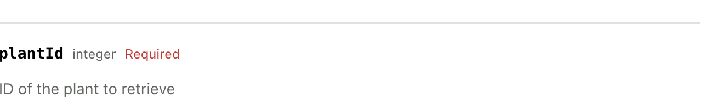
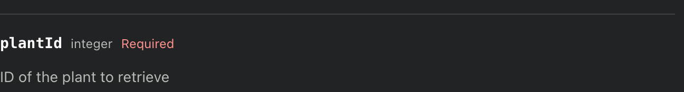

The `EndpointSchemaSnippet` component is used to reference an endpoint's schema from 
your API Reference. Below are examples of referencing the schema for the `POST /snippets` endpoint.

If you want to reference a particular piece of the schema, you can use the optional `selector` prop
to specify the path to the schema you want to reference. The available selectors are: `request`,
`request.path`, `request.query`, `request.body`, `response`, and `response.body`.

<Tabs>
  <Tab title="Request">
    <Tabs>
      <Tab title="Full">
        <Card>
          <h3 className="text-(color:--grayscale-a12)">Full Request</h3>
          <br/>
          Passing `request` as the selector will only render the request schema.
          
          The following markdown:
          ```jsx
          <EndpointSchemaSnippet endpoint="POST /snippets" selector="request" />
          ```
          will be rendered as:
          <br/>
          <EndpointSchemaSnippet endpoint="POST /snippets" selector="request" />
        </Card>
      </Tab>
      <Tab title="Path">
        <Card>
          <h3 className="text-(color:--grayscale-a12)">Request Path</h3>
          <br/>
          The following markdown:
          ```jsx
          <EndpointSchemaSnippet endpoint="GET /plant/{plantId}" selector="request.path" />
          ```
          will be rendered as:
          <br/>
          <h3>Path Parameters</h3>
          
          
        </Card>
      </Tab>
      <Tab title="Query">
        <Card>
          <h3 className="text-(color:--grayscale-a12)">Request Query</h3>
          <br/>
          The following markdown:
          ```jsx
          <EndpointSchemaSnippet endpoint="POST /snippets/load" selector="request.query" />
          ```
          will be rendered as:
          <br/>
          <EndpointSchemaSnippet endpoint="POST /snippets/load" selector="request.query" />
        </Card>
      </Tab>
      <Tab title="Body">
        <Card>
          <h3 className="text-(color:--grayscale-a12)">Request Body</h3>
          <br/>
          The following markdown:
          ```jsx
          <EndpointSchemaSnippet endpoint="POST /snippets/load" selector="request.body" />
          ```
          will be rendered as:
          <br/>
          <EndpointSchemaSnippet endpoint="POST /snippets/load" selector="request.body" />
        </Card>
      </Tab>
    </Tabs>
  </Tab>
  
  <Tab title="Response">
    <Tabs>
      <Tab title="Full">
        <Card>
          <h3 className="text-(color:--grayscale-a12)">Full Response</h3>
          <br/>
          Passing `response` as the selector will only render the response schema.
          
          The following markdown:
          ```jsx
          <EndpointSchemaSnippet endpoint="POST /snippets" selector="response" />
          ```
          will be rendered as:
          <br/>
          <EndpointSchemaSnippet endpoint="POST /snippets" selector="response" />
        </Card>
      </Tab>
      <Tab title="Body">
        <Card>
          <h3 className="text-(color:--grayscale-a12)">Response Body</h3>
          <br/>
          The following markdown:
          ```jsx
          <EndpointSchemaSnippet endpoint="POST /snippets" selector="response.body" />
          ```
          will be rendered as:
          <br/>
          <EndpointSchemaSnippet endpoint="POST /snippets" selector="response.body" />
        </Card>
      </Tab>
    </Tabs>
  </Tab>

  <Tab title="Full Schema">
    <Card>
      <h3 className="text-(color:--grayscale-a12)">Full Schema</h3>
      <br/>
      Passing no selector will render the entire schema. The following markdown:
      ```jsx
      <EndpointSchemaSnippet endpoint="POST /snippets" />
      ```
      will be rendered as:
      <br/>
      <EndpointSchemaSnippet endpoint="POST /snippets" />
    </Card>
  </Tab>
</Tabs>

<Warning>
  The EndpointSchemaSnippet component does not yet support rendering markdown-rich field descriptions.
  
  See [request.endpoint.path](/docs/content/components/schema-snippet#request.endpoint.path) above for an example of a markdown-rich description that does not yet render as markdown.
</Warning>