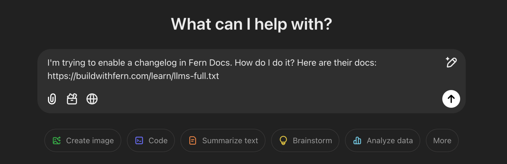

## What is llms.txt?
[LLMs.txt](https://llmstxt.org/) is an emerging standard so that websites can easily expose information to AI developer tools.
LLMs thrive on concise, structured information, and `llms.txt` help them locate and interpret key information in your developer documentation with ease.
No configuration required--your `llms.txt` files are automatically generated and maintained, just like a `sitemap.xml` or `robots.txt`.

### llms.txt
- **Small and fast**: Quick to load and easy to parse.
- **Summary-focused**: Each page distilled into a one-sentence description with its URL.
- **Structured for AI**: Helps tools understand the overall structure of your documentation.

See an example: [docs.cohere.com/llms.txt](https://docs.cohere.com/llms.txt)

### llms-full.txt
- **Comprehensive**: Includes the full content of your documentation.
- **API-Ready**: Automatically incorporates your full API reference and SDK snippets (if generated by Fern).
- **Token efficient**: Removes unnecessary formatting to be as token-efficient as possible.

See an example: [docs.cohere.com/llms-full.txt](https://docs.cohere.com/llms-full.txt)

## View in Action

Check out the llms.txt files for this site:
- `https://buildwithfern.com/learn/llms.txt`
- `https://buildwithfern.com/learn/llms-full.txt`

<Frame>
  
</Frame>