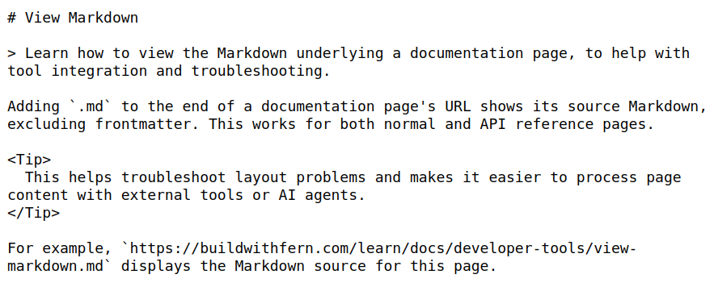

Adding `.md` to the end of a documentation page's URL shows its source Markdown, excluding frontmatter. This works for both normal and API reference pages.

<Tip>Displaying the page's Markdown helps with troubleshooting layout problems and makes it easier to process page content with external tools or AI agents.</Tip>

For example, `https://buildwithfern.com/learn/docs/developer-tools/view-markdown.md` displays the Markdown source for this page.

<Frame>
  
</Frame>
