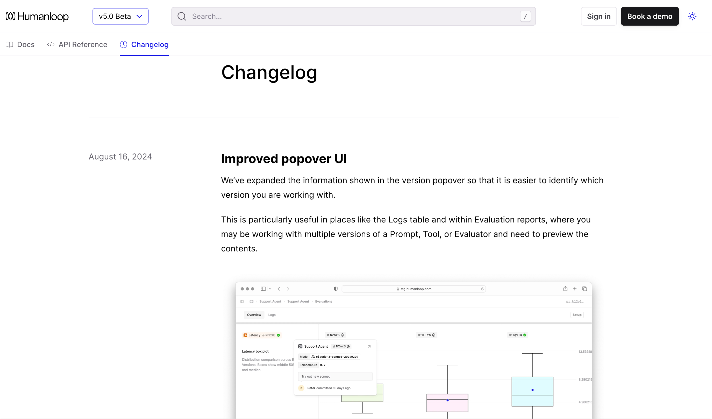

Keep a record of how your project has changed by writing changelog entries. The changelog will automatically populate with the files contained within the `changelog` folder.

<Frame
    caption="Keep your users updated as your project evolves"
    background="subtle"
  >
      
  </Frame>

## Configure your Changelog

<AccordionGroup>
<Accordion title='Top-level Changelog'>
Configure a changelog for your project by creating a changelog folder.

<CodeBlock title="Configure a Changelog">
```yaml {4-6}
fern/
├─ fern.config.json
├─ docs.yml
├─ changelog/
    ├─ 07-08-24.md
    └─ 08-21-24.mdx
```
</CodeBlock>

Once you've configured your changelog, specify where it should appear within your docs in your `docs.yml`.

<CodeBlock title="docs.yml">
```yaml {8-11,17}
tabs:
  guides:
    display-name: Guides
    icon: light book-open
  api:
    display-name: API Reference
    icon: light code
  changelog:
    display-name: Changelog
    icon: light clock
    changelog: ./changelog

navigation: 
  - tab: guides
    layout: 
      ...
  - tab: changelog
```
</CodeBlock>

[View an example](https://github.com/elevenlabs/elevenlabs-docs/blob/ab509a12b1c7e3db37b6414a76b502e71b580feb/fern/docs.yml#L45-L47) in GitHub of the ElevenLabs `docs.yml` which powers [their Changelog](https://elevenlabs.io/docs/changelog).

</Accordion>
<Accordion title="Section-level Changelog">
Configure a changelog for your project by creating a changelog folder.

<CodeBlock title="Configure a Changelog">
```yaml {4-6}
fern/
├─ fern.config.json
├─ docs.yml
├─ pages/
├─ changelog/
    ├─ 07-08-24.md
    └─ 08-21-24.mdx
```
</CodeBlock>

Once you've configured your changelog, specify where it should appear within your navigation in your `docs.yml`.

<CodeBlock title="docs.yml">
```yaml {9-11}
navigation:
  - section: Introduction
    contents: 
      - page: Authentication
        path: ./pages/authentication.mdx
      - page: Versioning
        path: ./pages/versioning.mdx
  - api: API Reference
  - changelog: ./changelog
    title: Release Notes
    slug: api-release-notes
```
</CodeBlock>

<Note>
Section-level changelogs **cannot** be nested within an `api` entry. See [API-level changelogs](#api-level-changelog) to add an API-level entry.
</Note>
</Accordion>
</AccordionGroup>

## Write a Changelog Entry

Create a new changelog entry by writing a Markdown file. You can use `.md` or `.mdx` files. The benefit of using `.mdx` is that you can leverage the built-in [component library](/learn/docs/content/components/overview) within an entry.

<CodeBlock title = "fern/openapi/changelog/2024-07-31.mdx">
```mdx
## Summary

In the latest release, we've added endpoints to create a new Plant.

### What's new?

New endpoints:

- `POST /plant` add a new plant to inventory.

New object schemas:

- `CreatePlantRequest`

<Note> Have questions? Reach out to your local botanist. </Note>
```
</CodeBlock>

### Entry date 

Changelog entries are automatically sorted chronologically by the date specific in the file name. Specify the date of your entry using one of the following formats:

- MM-DD-YYYY (e.g., 10-06-2024)
- MM-DD-YY (e.g., 10-06-24)
- YYYY-MM-DD (e.g., 2024-04-21)

### Linking to an Entry

Each changelog entry has a unique URL you can direct users to. For example, `https://elevenlabs.io/docs/changelog/2025/3/31`

### RSS Feed

Changelogs automatically come with a RSS feed so users can subscribe to updates. Navigate to the RSS feed by appending `.rss` to the changelog path. For example, `https://elevenlabs.io/docs/changelog.rss`
