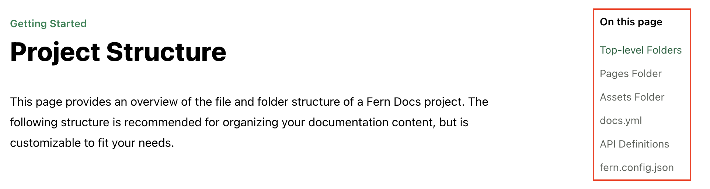
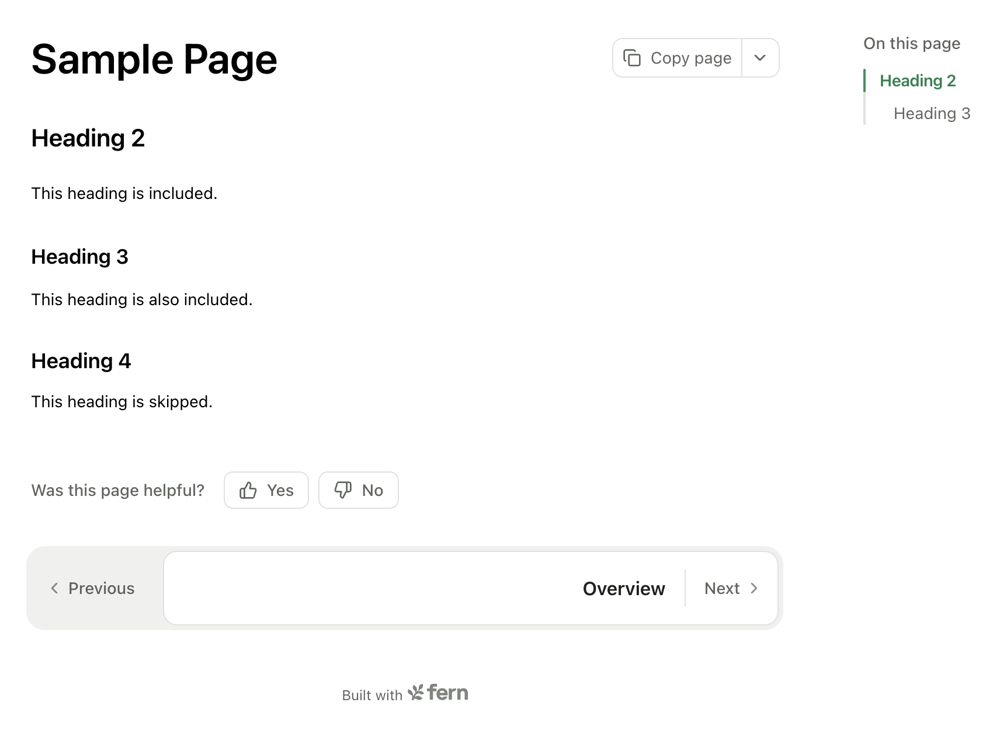
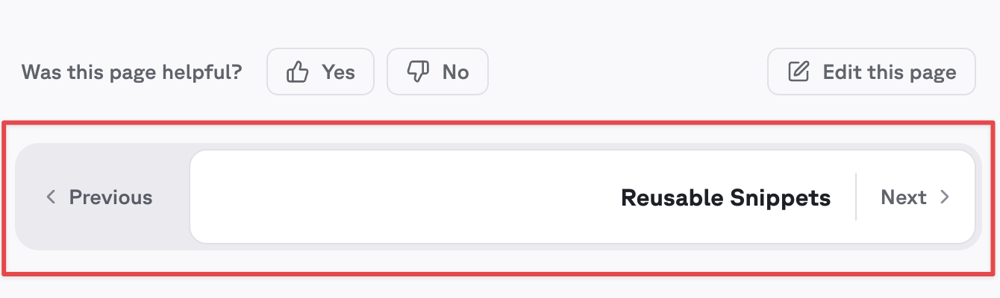
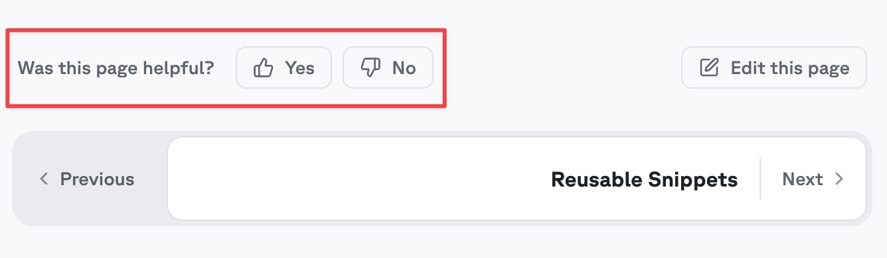

You can optionally use frontmatter to set each page's title, full slug override, meta description, a URL to suggest edits to the page, and its OpenGraph image. You can also use frontmatter to disable certain page elements like the table of contents and on-page feedback. 

Frontmatter must be added to the top of a `.md` or `.mdx` file, before the rest of the content. Use sets of three dashes to indicate the beginning and end of your frontmatter, as shown:

<CodeBlock title="Example frontmatter">
```mdx
---
title: Customize content using frontmatter
subtitle: Set titles, add meta descriptions, and more 
slug: frontmatter
description: Use frontmatter to set the page title, subtitle, slug, meta description, its OpenGraph image, and a URL to suggest edits.
og:sitename: Your Company Inc.
og:title: SEO Metadata Title
---
```
</CodeBlock>

## Title 

<ParamField path="title" type="string" required={false} default="Page name from docs.yml">
  Sets the page's [`<title>` element](https://web.dev/learn/html/document-structure#document_title). This appears in browser tabs, bookmarks, and search results.
</ParamField>

The page title can be set in two ways:

1. In the page's frontmatter:
```mdx title="welcome.mdx"
---
title: Welcome to our docs
---
```

2. From the page name in docs.yml (used if no frontmatter title is set):
```yaml title="docs.yml"
title: Fern | Documentation  # Site-wide title suffix
navigation:
  - page: Welcome          # This becomes the page title
    path: ./pages/welcome.mdx
```

The final title will include the site-wide suffix. For example:
- With frontmatter: "Welcome to our docs - Fern | Documentation"
- Without frontmatter: "Welcome - Fern | Documentation"

## Subtitle

<ParamField path="subtitle" type="string" required={false}>
  Renders as a subtitle on the page. If `description` is not set, `subtitle` is also used as the meta description tag.
</ParamField>

For example, scroll to the top of this page you're visiting now and you'll see the subtitle "Set titles, add meta descriptions, and more".

## Slug

<ParamField path="slug" type="string" required={false}>
  Overrides the full URL path for the page, starting from the root of your docs site. This takes precedence over any slug defined in docs.yml.
</ParamField>

For example, if you set `slug: email` in frontmatter, the page will be available at `/email` regardless of its location in the navigation structure.

There are two ways to set a page's URL slug:

1. Using `slug` in docs.yml, which is relative to the page's location in the navigation:
<CodeBlock title='docs.yml'>
```yaml
navigation:
  - tab: overview
    layout:
      - section: Support
        contents:
          - page: Email Us
            path: ./pages/email-us.mdx
            slug: email  # Results in /overview/support/email
```
</CodeBlock>

2. Using `slug` in frontmatter, which overrides everything and sets the absolute path from the root:
<CodeBlock title='email-us.mdx'>
```mdx
---
slug: email  # Results in /email (ignores navigation structure)
---
```
</CodeBlock>

The key difference is:
- A slug in docs.yml is relative to the page's location in the navigation structure
- A slug in frontmatter is absolute and ignores the navigation structure completely

## Meta description

<ParamField path="description" type="string" required={false}>
  Set the [meta description](https://web.dev/learn/html/metadata#description) for a page. Like the page title, the meta description is important for SEO. It impacts the text that search engines display about your page in search results snippets. It can also influence search engine indexing and ranking. For more information, see [Google's guidelines for meta descriptions](https://developers.google.com/search/docs/appearance/snippet#meta-descriptions).
</ParamField>

<CodeBlock title="Example meta description">
```mdx
---
title: API Authentication
description: Learn how to authenticate your API requests using API keys, OAuth 2.0, or JWT tokens. Includes code examples in multiple languages and security best practices.
---
```
</CodeBlock>

## Edit this page

<ParamField path="edit-this-page-url" type="string" required={false}>
  Provide the absolute link to the source `.md` or `.mdx` file in GitHub. Fern uses it to add an `Edit this page` link to the page, which users of your documentation can use to suggest corrections or additions. You can also configure this globally instead of page-by-page - see [global configuration](/learn/docs/getting-started/global-configuration#edit-this-page).
</ParamField>

<CodeBlock title="Example edit-this-page-url">
```mdx
---
title: API Reference
edit-this-page-url: https://github.com/your-org/docs/blob/main/content/api-reference.mdx
---
```
</CodeBlock>

<Frame>
  
</Frame>

## Meta image

<ParamField path="image" type="string" required={false}>
  Configure the OpenGraph image metadata for a page using an absolute URL to an image hosted online. This image appears when your documentation links are shared on social media platforms, using the [OpenGraph](https://ogp.me/) metadata protocol. For more information, see the [web.dev explanation of OpenGraph](https://web.dev/learn/html/metadata#open_graph).
</ParamField>

## Table of contents
### Hide table of contents
<ParamField path="hide-toc" type="boolean" required={false} default={false}>
  Controls the conditional rendering of the table of contents feature on the right-side of the page. Set to `true` to disable this feature.
</ParamField>

<CodeBlock title="Example hide-toc">
```mdx
---
title: Landing Page
hide-toc: true
---
```
</CodeBlock>

<Frame>
  
</Frame>

When the table of contents is hidden, Fern will center the contents of the page by default. To control the layout of the page, see the [layout documentation](#layout).

### Max depth
<ParamField path="max-toc-depth" type="number" required={false}>
  Sets the maximum depth of the table of contents. For example, a value of `3` will only show `<h1>`, `<h2>`, and `<h3>` headings in the table of contents.
</ParamField>

<CodeBlock title="Example max-toc-depth">
```mdx
---
title: Sample Page
max-toc-depth: 3
---
```
</CodeBlock>

<Frame>
  
</Frame>

## Navigation links
<ParamField path="hide-nav-links" type="boolean" required={false} default={false}>
  Controls the conditional rendering of the navigation links (previous, next) at the bottom of the page. Set to true to disable this feature.
</ParamField>

<CodeBlock title="Example hide-nav-links">
```mdx
---
title: Standalone Guide
hide-nav-links: true
---
```
</CodeBlock>

<Frame>
  
</Frame>

## On-page feedback
<ParamField path="hide-feedback" type="boolean" required={false} default={false}>
  Controls the conditional rendering of the on-page feedback form at the bottom of the page. Set to true to disable this feature.
</ParamField>

<CodeBlock title="Example hide-feedback">
```mdx
---
title: API Status Page
hide-feedback: true
---
```
</CodeBlock>

<Frame>
  
</Frame>

## Page logo
<ParamField path="logo" type="object" required={false}>
  Override the site-wide logo for a page. Specify different logos for light and dark modes using absolute URLs.
</ParamField>

<CodeBlock title='index.mdx logo example'>
```mdx
---
logo:
  light: https://link-to-image.com/image-light-mode.png
  dark: https://link-to-image.com/image-dark-mode.png
---
```
</CodeBlock>

<Info>
Currently, relative paths are _not_ supported for this field.
</Info>

## Layout
<ParamField path="layout" type="string" required={false} default="guide">
  Sets the page layout. Available options:
  
  - `overview`: A spacious, full-width layout without a table of contents. Perfect for landing pages, section overviews, and content that benefits from maximum horizontal space. Navigation sidebar remains visible.
  
  - `guide`: The default documentation layout featuring a table of contents on the right side. Ideal for tutorials, how-to guides, and any content that benefits from easy navigation through sections.
  
  - `reference`: A full-width layout optimized for an API or SDK reference. Removes the table of contents so you can add another column, such as code examples. Navigation sidebar remains visible.
  
  - `page`: A distraction-free, full-screen layout that hides both the table of contents and navigation sidebar. Best for standalone content that benefits from focused reading experiences.
  
  - `custom`: A blank canvas layout that removes all default styling constraints. Hides both the table of contents and navigation sidebar, allowing complete control over the page layout.
</ParamField>

## SEO metadata

<Note title="SEO Best Practices">
When configuring SEO metadata, ensure your titles and descriptions are unique, descriptive, and relevant to the page content. Keep descriptions between 150-160 characters for optimal display in search results.
</Note>

<CodeBlock title="Example SEO metadata">
```mdx
---
title: PlantStore API Quick Start
headline: "Gett Started with PlantStore API | Developer Documentation"
canonical-url: https://docs.plantstore.dev/welcome
og:site_name: PlantStore Developer Documentation
og:title: "PlantStore API Quick Start Guide"
og:description: "Learn how to integrate with PlantStore's API to manage plant inventory, process orders, and track shipments. Complete with code examples."
og:image: https://plantstore.dev/images/api-docs-banner.png
og:image:width: 1200
og:image:height: 630
twitter:card: summary_large_image
twitter:site: "@PlantStoreAPI"
noindex: false
nofollow: false
---
```
</CodeBlock>

### Document Properties
<ParamField path="headline" type="string" required={false}>
  When set, the `<title />` tag in the document head will use this value rather than the `title` property. This property changes the title that search engines see when crawling this page, and can be used to address Duplicate Title issues in your SEO report.
</ParamField>

<ParamField path="canonical-url" type="string" required={false}>
  Overrides the canonical URL for this page. Must be a full URL including the protocol (i.e. `https://buildwithfern.com/learn/docs/content/frontmatter`)
</ParamField>

### OpenGraph Properties
<ParamField path="og:site_name" type="string" required={false}>
  The name of your website as it should appear when your content is shared.
</ParamField>

<ParamField path="og:title" type="string" required={false}>
  The title of your page as it should appear when your content is shared.
</ParamField>

<ParamField path="og:description" type="string" required={false}>
  The description of your page as it should appear when your content is shared.
</ParamField>

<ParamField path="og:url" type="string" required={false}>
  The URL of your page.
</ParamField>

<ParamField path="og:image" type="string" required={false}>
  The absolute URL of the image that will be displayed when your content is shared.
</ParamField>

<ParamField path="og:image:width" type="number" required={false}>
  The width of the image in pixels.
</ParamField>

<ParamField path="og:image:height" type="number" required={false}>
  The height of the image in pixels.
</ParamField>

<ParamField path="og:locale" type="string" required={false}>
  The locale of the page, typically in the format `language_TERRITORY` (e.g., `en_US`).
</ParamField>

<ParamField path="og:logo" type="string" required={false}>
  The URL or identifier of the logo image of your website that will be displayed when your content is shared.
</ParamField>

### Twitter Properties
<ParamField path="twitter:title" type="string" required={false}>
  The title of your page as it should appear in a tweet.
</ParamField>

<ParamField path="twitter:description" type="string" required={false}>
  The description of your page as it should appear in a tweet.
</ParamField>

<ParamField path="twitter:handle" type="string" required={false}>
  The Twitter handle of the page creator or site.
</ParamField>

<ParamField path="twitter:image" type="string" required={false}>
  The URL or identifier of the image that will be displayed in a tweet.
</ParamField>

<ParamField path="twitter:site" type="string" required={false}>
  The name of your website as it should appear in a tweet.
</ParamField>

<ParamField path="twitter:url" type="string" required={false}>
  The URL of your page.
</ParamField>

<ParamField path="twitter:card" type="string" required={false}>
  The type of card to be used for sharing on Twitter. Options: `summary`, `summary_large_image`, `app`, `player`
</ParamField>

### Indexing Properties
<ParamField path="noindex" type="boolean" required={false} default={false}>
  If set to `true`, the page will not be indexed by search engines.
</ParamField>

<ParamField path="nofollow" type="boolean" required={false} default={false}>
  If set to `true`, a search engine will not follow any links present on the page.
</ParamField>
