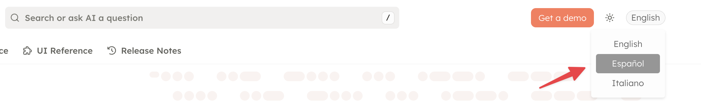
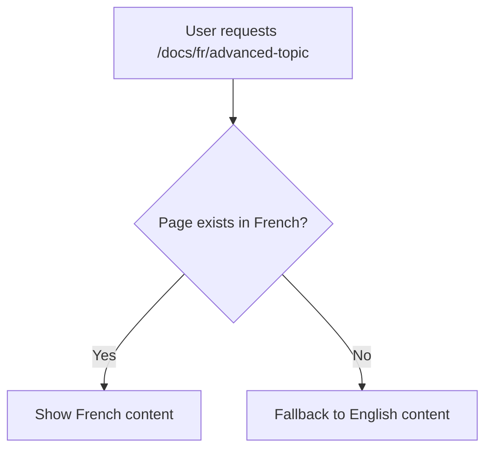

Make your documentation accessible to a global audience by providing content in multiple languages. Fern Docs provides a complete translation system with language-specific routing, a language selector, and intelligent fallback logic.

<Note>
This feature is in development and only available on the Enterprise plan. 
Watch this [GitHub Issue](https://github.com/fern-api/fern/issues/6490) to stay updated.
</Note>

## Internationalization vs. Localization

**Internationalization (i18n)** refers to the design and development of content that can be adapted to different languages and regions without engineering changes. It's the process of preparing your documentation structure to support multiple languages.

**Localization (l10n)** is the adaptation of content for a specific region or language, including translating text, adapting graphics, and ensuring cultural appropriateness. It's the actual process of creating language-specific versions of your documentation.

Fern Docs supports internationalization. The author of the content is responsible for localization.

## Configuring Translations

In `docs.yml`, you can add `default-language` to specify the default language for your documentation and `languages` to specify the languages you want to support.

```yaml title="docs.yml"
default-language: en
languages:
  - en
  - fr
  - es
  - zh

throw-if-languages-incomplete: true # fern generate --docs will throw an error if a translation doesn't exist
```

## Language Selector

A language dropdown menu is automatically added to your documentation, allowing users to switch between available languages:

<Frame>
  
</Frame>

The language selector:

- Displays all configured languages
- Maintains the user's position when switching languages (same page)
- Respects the user's language preference across sessions
- Can be styled to match your brand

## Fallback Logic

If a page is not available in the selected language, Fern automatically falls back to the default language (typically English). This ensures users always see content, even if a translation is incomplete.



The fallback system:

- Works page-by-page (partial translations are supported)
- Indicates to users when content is shown in the fallback language
- Maintains consistent navigation regardless of translation status

## Built-in Translations

Fern provides translations for all built-in UI components and strings in popular languages:

- Navigation elements
- Search placeholder text
- Pagination controls
- API Explorer labels
- Error messages

These translations are automatically applied based on the selected language.