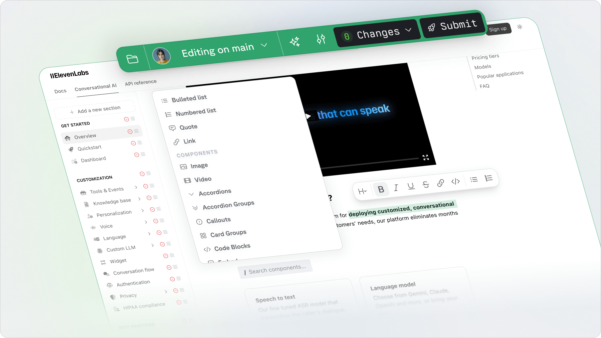

<Note>
The Visual Editor is in development. Interested in early access? Reach out via Slack or support@buildwithfern.com.
</Note>

The Fern Visual Editor lets you modify your documentation without touching code. Make changes directly in your browser while maintaining your Git-based workflow.

<Frame
    caption="Edit your docs visually with our WYSIWYG editor"
    background="subtle"
>
    
</Frame>

## Key Features

### No-Code Editing
Edit your documentation directly in the browser - no GitHub knowledge required. Every change you make is automatically synced with your repository.

### Component Library
You can directly edit or use the slash (`/`) menu to add Fern components to your documentation.

<Tabs>
  <Tab title="Layout Components">
    <Card>
      - [Tabs](/learn/docs/content/components/tabs) for organizing related content
      - [Accordion](/learn/docs/content/components/accordions) for expandable sections
      - [AccordionGroup](/learn/docs/content/components/accordion-groups) for grouped expandable content
      - [Card](/learn/docs/content/components/cards) for highlighting information
      - [Frame](/learn/docs/content/components/frames) for images and examples
      - [Steps](/learn/docs/content/components/steps) for sequential instructions
    </Card>
  </Tab>
  
  <Tab title="Content Components">
    <Card>
      - [Note](/learn/docs/content/components/callouts) for important callouts
      - [Warning](/learn/docs/content/components/callouts) for critical information
      - [Tip](/learn/docs/content/components/callouts) for helpful suggestions
      - [Info](/learn/docs/content/components/callouts) for additional context
      - [Code Groups](/learn/docs/content/components/code-blocks) for related code examples
      - [Code Blocks](/learn/docs/content/components/code-blocks) for code snippets
      - [Embed](/learn/docs/content/components/embed) for external content
    </Card>
  </Tab>

  <Tab title="API Components">
    <Card>
      - [Parameter Fields](/learn/docs/content/components/paramfield) for parameter details
      - [Endpoint Request Snippet](/learn/docs/content/components/request-snippet) for request documentation
      - [Endpoint Response Snippet](/learn/docs/content/components/response-snippet) for response documentation
    </Card>
  </Tab>
</Tabs>

## Getting Started

<Steps>
  <Step title="Access the Editor">
    Navigate to your Fern Dashboard (_coming soon_) and click the "Edit docs site" button in the top navigation bar.
  </Step>
  
  <Step title="Make Changes">
    - Select text to format it or add links
    - Use the `/` menu to add Fern components
    - Preview your changes in real-time
    - Add images and media
  </Step>
  
  <Step title="Submit Changes">
    Your changes are automatically saved as drafts. When ready:
    1. Review your changes
    2. Add a description of your updates
    3. Click "Publish" to create a pull request in Github
  </Step>
</Steps>

<Note>
All changes go through your normal GitHub workflow - maintaining your team's review process while making editing accessible to everyone.
</Note>

Ready to get started? Reach out to support@buildwithfern.com.
