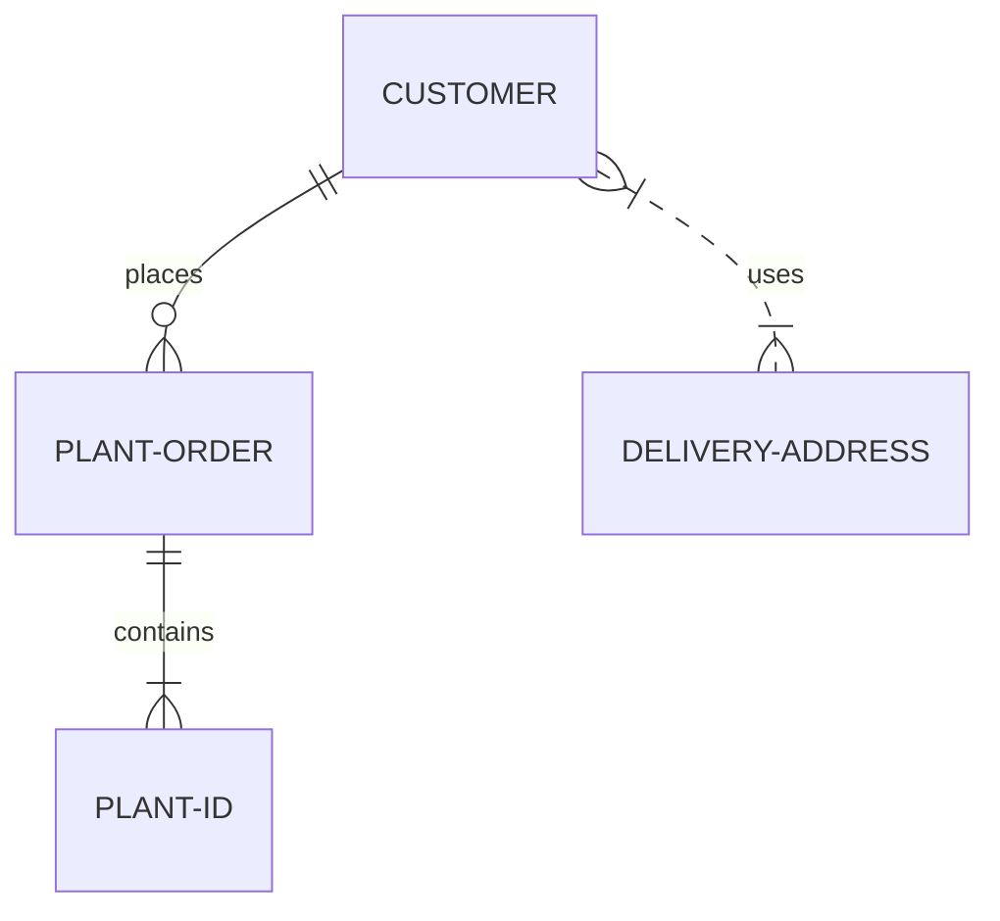

## Add Markdown or MDX pages

Add pages manually to your documentation by creating Markdown (`.md`) or MDX (`.mdx`) files. New to Markdown? See [Markdown Guide: Getting started](https://www.markdownguide.org/getting-started/). 

<Note>
NOTE: Throughout our documentation, we refer to both Markdown and MDX as Markdown. [MDX](https://mdxjs.com/) is a version of Markdown, extended to allow the use of JSX components.
</Note>

Place your pages inside your `fern/` folder and link to them from your [navigation settings](/learn/docs/building-your-docs/navigation) in the `docs.yml` file.

In the example below, the MDX files are inside a folder named `pages/`.

<CodeBlock title='Example folder structure'>
```bash
fern/
├─ fern.config.json
├─ docs.yml
└─ pages/
  ├─ welcome.mdx
  └─ quickstart.mdx
```
</CodeBlock>

<CodeBlock title='docs.yml'>
```yml
navigation:
  - section: Overview
    contents: 
      - page: Welcome 
        path: ./pages/welcome.mdx
      - page: Quickstart
        path: ./pages/quickstart.mdx
```
</CodeBlock>

## Page header

Fern automatically generates the `<h1>` page header for each page from `docs.yml`. For example, here's the `docs.yml` entry that maps the page you are reading now:
```yml
          - page: Write Markdown content
            path: ./docs/pages/fern-docs/content/write-markdown.mdx
```
The value for `page` is used as the content of the top `<h1>` element of this page. Thus, when adding content to your Markdown pages, begin with `<h2>` instead of `<h1>`.

## Fern components

Fern has a built-in component library you can use in Markdown. [Explore the components.](/learn/docs/content/components/overview)

## Links in Markdown

### Link target
When clicked, links to relative URLs open in the same tab, whereas links to absolute URLs open in a new browser tab. 

### Link format
Use a `/` character to begin a relative URL to another page on your docs site. This routes to the `url` defined in your `docs.yml` file, such as `example-docs.buildwithfern.com`. For example, if you want to link to `https://example-docs.buildwithfern.com/overview/introduction`, you can write the link in Markdown as follows:

<CodeBlock title='Relative link example'>
```mdx
Read the [Introduction](/learn/overview/introduction).
```
</CodeBlock>

## Images

You can use locally stored images or URLs to include images in your Markdown pages. Use either [Markdown syntax](https://www.markdownguide.org/basic-syntax/#images-1) or the [`` HTML tag](https://developer.mozilla.org/en-US/docs/Web/HTML/Element/img) to insert the image.

<Tabs>
  <Tab title="Markdown">
    ```markdown
    
    ```
  </Tab>
  <Tab title="HTML">
    ```html
    
    ```
  </Tab>
</Tabs>

Common image attributes:

| Attribute | Description |
| --------- | ----------- |
| `src` | URL or path to the image file |
| `alt` | Alternative text for accessibility |
| `title` | Tooltip text shown on hover |
| `width` and `height` | Dimensions of the image in pixels |

<Note>
For more details about the HTML image element and its attributes, see the [MDN documentation on the img element](https://developer.mozilla.org/en-US/docs/Web/HTML/Element/img).
</Note>

## Embedding local assets

You can embed local assets in your Markdown pages using the [`<embed>` component](/learn/docs/content/components/embed). This is useful for displaying PDFs, images, videos, OpenAPI files, and other assets into your docs.

For example, to embed a video, use the following Markdown:

```mdx
<embed src="./path/to/asset.mp4" type="video/mp4" />
```

<embed src="../../../../fern/assets/changelogs/docs/embed-fern-waving.mp4" type="video/mp4" width="640px" height="360px" />

### Local videos


You can embed videos in your documentation using the HTML `<video>` tag. This gives you control over video playback settings like autoplay, looping, and muting.

```html
<video 
    src="path/to/your/video.mp4"
    width="854"
    height="480"
    autoplay
    loop
    playsinline
    muted
>
</video>
```

You can also wrap the video in a container div for additional styling:

```html
<div class="card-video">
    <video 
        src="path/to/your/video.mp4"
        width="854"
        height="480"
        autoplay
        loop
        playsinline
        muted
    >
    </video>
</div>
```

Common video attributes:

| Attribute | Description |
| --------- | ----------- |
| `src` | URL or path to the video file |
| `width` and `height` | Dimensions of the video player |
| `autoplay` | Video starts playing automatically |
| `loop` | Video repeats when finished |
| `playsinline` | Video plays inline on mobile devices instead of fullscreen |
| `muted` | Video plays without sound |
| `controls` | Shows video player controls (play/pause, volume, etc.) |

<Note>
For more details about the HTML video element and its attributes, see the [MDN documentation on the video element](https://developer.mozilla.org/en-US/docs/Web/HTML/Element/video).
</Note>

## Embed YouTube or Loom videos

You can embed videos from YouTube, Loom, Vimeo, and other streaming platforms using an `<iframe>` element.

<Tabs>
  <Tab title="YouTube">
    ```mdx
    <iframe
      width="100%"
      height="450px"
      src="https://www.youtube.com/embed/jqBPmGWwt8c?si=3SNDLqnTDqOD-c1P"
      frameborder="0"
      allow="accelerometer; autoplay; clipboard-write; encrypted-media; gyroscope; picture-in-picture; web-share"
      referrerpolicy="strict-origin-when-cross-origin"
      allowfullscreen
    ></iframe>
    ```
  </Tab>
  <Tab title="Loom">
    ```mdx
    <iframe
      src="https://www.loom.com/embed/2e7f038de6894c69bf9c0d2525b0ad7f?sid=8bb327d2-8ba6-413c-a832-8d80282ad527"
      width="100%"
      height="450px"
      frameborder="0"
    ></iframe>
    ```
  </Tab>
</Tabs>

See an example of [Markdown](https://github.com/elevenlabs/elevenlabs-docs/blob/6dba2b35a68edd8285762e18b4c7684c04bdf1ca/fern/conversational-ai/pages/guides/zendesk.mdx?plain=1#L14-L23) used for embedding videos and [how it renders](https://elevenlabs.io/docs/conversational-ai/guides/integrations/zendesk#demo-video) on the corresponding docs page from the ElevenLabs documentation.

## LaTeX

Fern supports [LaTeX](https://www.latex-project.org/) math equations. To use LaTeX, wrap your inline math equations in `$`. For example, `$(x^2 + y^2 = z^2)$` will render $x^2 + y^2 = z^2$.

For display math equations, wrap the equation in `$$`. For example:

```latex
$$
% \f is defined as #1f(#2) using the macro
\f\relax{x} = \int_{-\infty}^\infty
    \f\hat\xi\,e^{2 \pi i \xi x}
    \,d\xi
$$
```

$$
% \f is defined as #1f(#2) using the macro
\f\relax{x} = \int_{-\infty}^\infty
    \f\hat\xi\,e^{2 \pi i \xi x}
    \,d\xi
$$

## Diagrams
Fern supports creating diagrams within your Markdown using [Mermaid](https://mermaid.js.org/). Mermaid offers a variety of diagrams, including flowcharts, entity-relationship models, and Gantt charts. To include a Mermaid diagram in your Markdown file, create a codeblock marked with `mermaid`. 

````markdown

````


