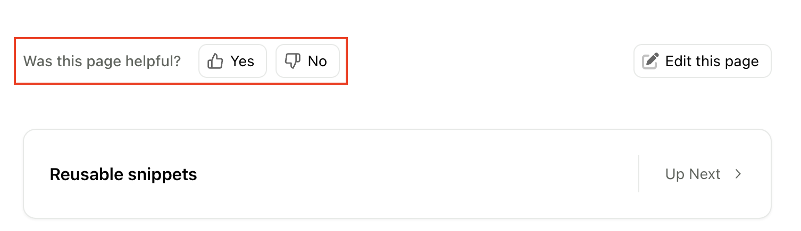

You can optionally use front matter to set each page's title, full slug override, meta description, a URL to suggest edits to the page, and its OpenGraph image. You can also use front matter to disable certain page element like the table of contents and on-page feedback. 

Front matter must be added to the top of a `.md` or `.mdx` file, before the rest of the content. Use sets of three dashes to indicate the beginning and end of your front matter, as shown:

<CodeBlock title="Example front matter">
```mdx
---
title: Customize content using frontmatter
subtitle: Set titles, add meta descriptions, and more 
slug: frontmatter
description: Use frontmatter to set the page title, subtitle, slug, meta description, its OpenGraph image, and a URL to suggest edits.
---
```

</CodeBlock>

## title

**Type**: string<br />
**Default**: The name of the page as specified in `docs.yml`

Set the content for the [`<title>` element](https://web.dev/learn/html/document-structure#document_title) for a page. This title is displayed in browser tabs, history, and bookmarks, as well as in search engine results. Having a unique and informative title for each page benefits your site's SEO (Search Engine Optimization).

<Tip title="Tip">
  For more information, see [Google's guidelines for useful
  titles](https://developers.google.com/search/docs/appearance/title-link#page-titles).
</Tip>

If no `title` is provided in the frontmatter of a page, Fern uses the value for that page in `docs.yml`.

For example, if a page is defined like this in `docs.yml`:

<CodeBlock title="docs.yml">

```yaml
- page: Overview
  path: ./docs/pages/api-overview.mdx
```

</CodeBlock>

Then, if Fern does not find a `title` in that page's frontmatter, `Overview` is used for the default title.

### Site-wide title text appended from docs.yml

You can set a field named `title` in `docs.yml` like this:

<CodeBlock title='docs.yml'>

```yaml
instances:
  - url: fern.docs.buildwithfern.com

title: Fern | Documentation # <-- set site-wide
```

</CodeBlock>

The value you enter for this field is appended to every page's title across your docs site, as ` - TITLE_VALUE`.

For example, with the above setting in `docs.yml`, the `Overview` page's title becomes `Overview - Fern | Documentation`.

## subtitle

**Type**: string<br />
**Default**: None

Renders as a subtitle on the page. If `description` is not set, `subtitle` is also used as the meta description tag.

## slug

**Type**: string<br />
**Default**: None

The `slug` you set in a page's front matter overrides the URL for that page derived from `docs.yml`. This slug begins from the root of your docs site, ignoring the tab or section that the page is under. This allows you to set a custom full slug for any page.

As an example, consider this navigation setup in `docs.yml`:

<CodeBlock title='docs.yml navigation example'>
```yaml
navigation:
  - tab: overview
    layout:
      - section: Support
        contents:
          - page: Email Us
            path: ./pages/emailus.mdx
            slug: email
```
</CodeBlock>

The `slug` set in `docs.yml` affects only the final part of the URL, so the `emailus.mdx` page is available at `/overview/support/email`.

In contrast, the `slug` that you set in front matter affects the full URL. For example, you can set the front matter `slug` to `email`, as shown:

<CodeBlock title='Front matter in emailus.mdx'>
```mdx
---
slug: email
---
```
</CodeBlock>

The page then becomes available at `/email`. 

## description
  
**Type**: string<br />
**Default**: None

Set the [meta description](https://web.dev/learn/html/metadata#description) for a page. Like the page title, the meta description is important for SEO. It impacts the text that search engines display about your page in search results snippets. It can also influence search engine indexing and ranking. For more information, see [Google's guidelines for meta descriptions](https://developers.google.com/search/docs/appearance/snippet#meta-descriptions).

## edit-this-page-url

**Type**: string (absolute URL)<br />
**Default**: None

Provide the absolute link to the source `.md` or `.mdx` file in GitHub. Fern uses it to add an `Edit this page` link to the page, which users of your documentation can use to suggest corrections or additions.

<Frame>
  
</Frame>

## image

**Type**: string (absolute URL)<br />
**Default**: None

Configure the `<meta property="og:image">` metadata for a page using an absolute path to an image hosted online. This provides an image to show next to a link to your documentation when the link is shared on social media, using a metadata protocol called [OpenGraph](https://ogp.me/). For more information, see the [web.dev explanation of OpenGraph](https://web.dev/learn/html/metadata#open_graph).

## hide-toc

**Type**: boolean<br />
**Default**: false

Controls the conditional rendering of the table of contents feature on the right-side of the page. Set to true to disable this feature. 

<Frame>
  
</Frame>

## hide-nav-links

**Type**: boolean<br />
**Default**: false

Controls the conditional rendering of the navigation links (previous, next) at the bottom of the page. Set to true to disable this feature. 

<Frame>
  
</Frame>

## hide-feedback

**Type**: boolean<br />
**Default**: false

Controls the conditional rendering of the on-page feedback form at the bottom of the page. Set to true to disable this feature. 

<Frame>
  
</Frame>

## SEO metadata

Fern also supports adding SEO-specific metadata in the frontmatter. 

| Property | Description | Type |
| -------- | ----------- | ---- | 
| `og:site_name` | The name of your website as it should appear when your content is shared. | string |
| `og:title` | The title of your page as it should appear when your content is shared. | string |
| `og:description` | The description of your page as it should appear when your content is shared. | string |
| `og:url` | The URL of your page. | string |
| `og:image` | The URL or identifier of the image that will be displayed when your content is shared. | URL or relative path to file |
| `og:image:width` | The width of the image in pixels. | number |
| `og:image:height` | The height of the image in pixels. | number |
| `og:locale` | The locale of the page, typically in the format `language_TERRITORY` (e.g., `en_US`). | string |
| `og:logo` | The URL or identifier of the logo image of your website that will be displayed when your content is shared. | URL or relative path to file |
| `twitter:title` | The title of your page as it should appear in a tweet. | string |
| `twitter:description` | The description of your page as it should appear in a tweet. | string |
| `twitter:handle`| The Twitter handle of the page creator or site. | string |
| `twitter:image` | The URL or identifier of the image that will be displayed in a tweet. | URL or relative path to file |
| `twitter:site` | The name of your website as it should appear in a tweet. | string |
| `twitter:url` | The URL of your page. | string |
| `twitter:card` | The type of card to be used for sharing on Twitter. | `summary`, `summary_large_image`, `app`, `player` |
| `noindex` | If set to `true`, the page will not be indexed by search engines. Defaults to `false`. | boolean |
| `nofollow` | If set to `true`, a search engine will not follow any links present on the page. Defaults to `false`. | boolean |