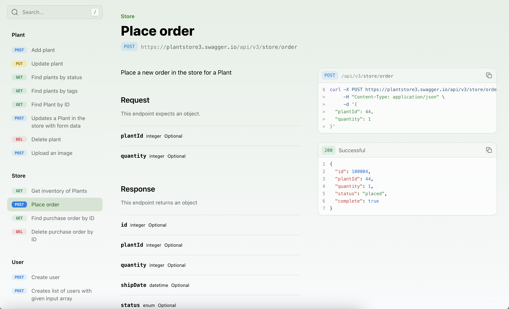
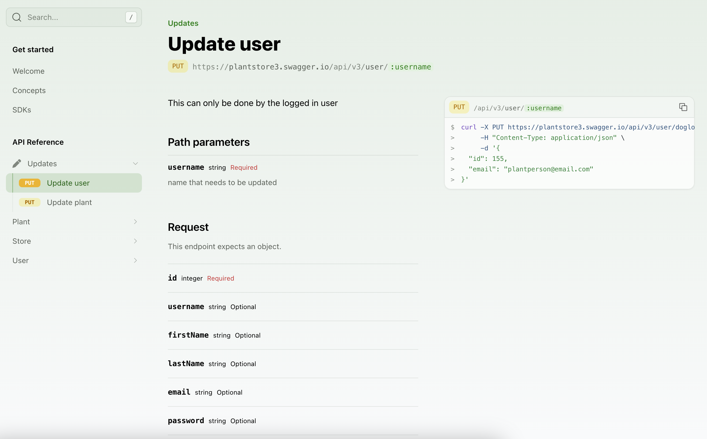
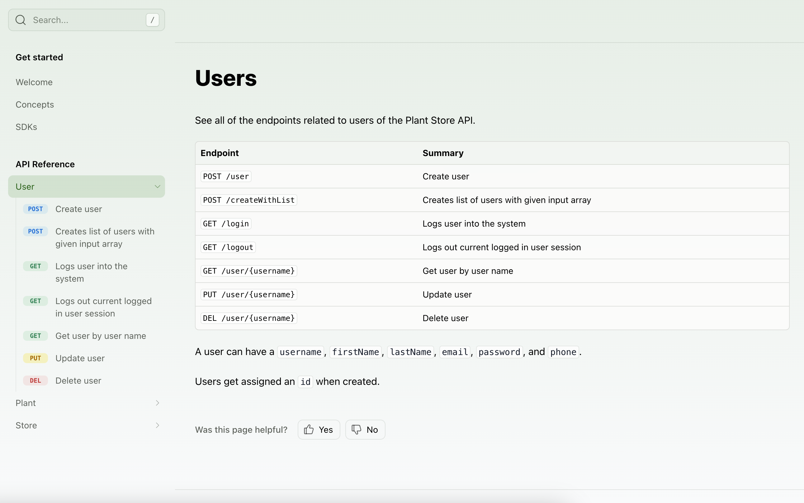

When you include an API (either the Fern or an OpenAPI definition) in your `docs.yml` file, you can customize how the endpoints and sub-packages are displayed in the sidebar navigation. By default, the reference will generate a navigation hierarchy based on the structure of the API spec, but several customizations can be configured.

## Ordering the API Reference

### Flattening sections
To remove the API Reference title and display the section contents, set `flattened` to `true`.

```yaml title="docs.yml"
navigation: 
  - api: API Reference
    flattened: true
```

<Frame>

</Frame>

### Alphabetizing endpoints and sections
To sort all sections and endpoints alphabetically, unless explicitly ordered in `layout`, set `alphabetized` to `true`.


```yaml title="docs.yml"
navigation: 
  - api: API Reference
    alphabetized: true
```

### Ordering top-level sections
The `layout` option allows you to specify the order of subpackages and endpoints at the top level of your API Reference.

<Tabs>
<Tab title="Ordering sections">
```yaml title="docs.yml"
navigation: 
  - api: API Reference
    layout: 
      - user
      - store
      - plant
```
</Tab>

<Tab title="Ordering sections and endpoints">
```yaml title="docs.yml"
navigation: 
  - api: API Reference
    layout: 
      - user.create
      - user
      - store
      - plant
```

<Frame>

</Frame>
</Tab>
</Tabs>

### Ordering section contents
Adding a `:` after the section name allows you to specify the order of its nested subpackages and endpoints. 

<Note title="Referencing Endpoints">
To reference an endpoint, you can use 
</Note>

```yaml title="docs.yml"
navigation: 
  - api: API Reference
    layout: 
      - user: 
          - user.create
          - user.update
          - user.delete        
```

<Frame>

</Frame>

## Customizing the API Reference

### Renaming the API Reference 
To customize the name of your API Reference, edit the value following `api` (`- api: Title Here`). 

### Adding custom sections
You can add arbitrary folders in the sidebar by adding a `section` to your API Reference layout. Sections can be customized by adding properties like a `icon`, `summary`, `slug` (or `skip-slug`), and `contents`. 

```yaml title="docs.yml"
navigation: 
  - api: API Reference
    layout: 
      - section: Updates
        icon: pen
        contents: 
          - user.update
          - plant.update
```

<Frame>

</Frame>

### Adding a section overview
The `summary` property allows you to add an `.md` or `.mdx` page as an overview of the API Reference or a custom section. 

```yaml title="docs.yml"
navigation: 
  - api: API Reference
    summary: pages/api-overview.mdx
    layout: 
      - user: 
          summary: pages/user-overview.mdx
```

<Frame>

</Frame>

### Adding pages and links
You can add regular pages and external links within your API Reference. 

```yaml title="docs.yml"
navigation: 
  - api: API Reference
    layout: 
      - user: 
          contents: 
            - page: User Guide
              path: ./docs/pages/user-guide.mdx
            - link: Link Title
              href: http://google.com
```
