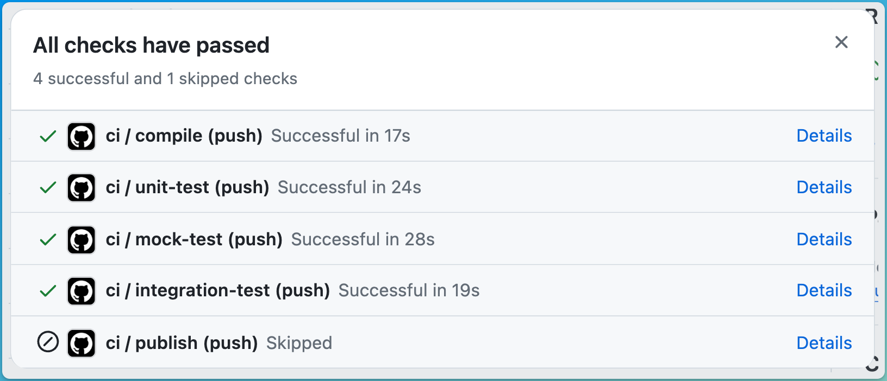
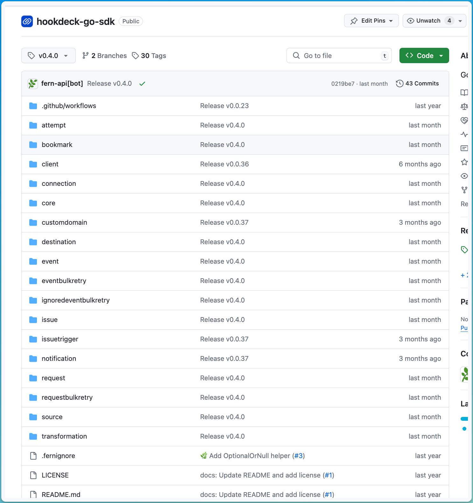
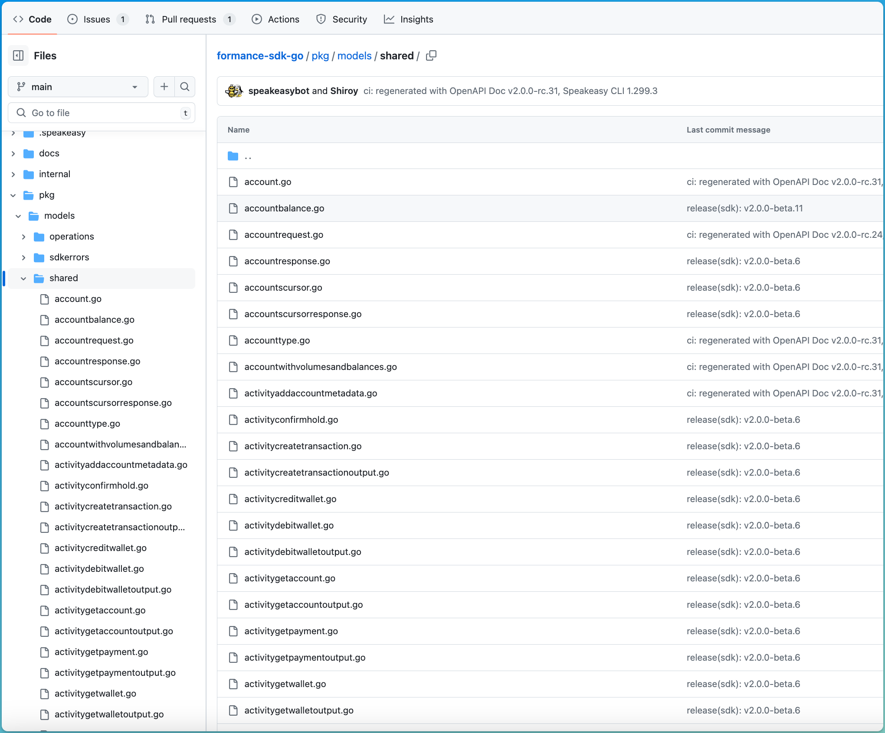

[Speakeasy](https://www.speakeasyapi.dev/), similar to Fern, supports generating SDKs for multiple languages. Below, we
walk through the different capabilities of Fern and Speakeasy.

### 1. Fern is an all-in-one: SDKs + Docs

If you choose Speakeasy, you'll have to find a separate docs vendor such as ReadMe. With Fern, you'll be able to generate SDKs and 
Docs with embedded code snippets. 

<Frame caption="API Docs with SDK code snippets (generated by Fern)">
  
</Frame>

### 2. Fern SDKs are more widely consumed.

Fern's SDKs are battle-tested and have been downloaded millions of times.

| Language   | Fern                                                                                             | Speakeasy                                                                                    |
| ---------- | ------------------------------------------------------------------------------------------------ | -------------------------------------------------------------------------------------------- |
| TypeScript | **93k** weekly downloads ([Cohere](https://www.npmjs.com/package/cohere-ai))                     | **5k** weekly downloads ([Unstructured](https://www.npmjs.com/package/unstructured-client))  |
| Python     | **5 million** lifetime downloads ([ElevenLabs](https://github.com/elevenlabs/elevenlabs-python)) | **194k** lifetime downloads ([Airbyte](https://github.com/airbytehq/airbyte-api-python-sdk)) |

### 3. Fern offers more Generally Available SDK languages.

| Language   | Fern | Speakeasy  |
| ---------- | ---- | ---------- |
| TypeScript | ✅   | ✅         |
| Python     | ✅   | ✅         |
| Java       | ✅   | ✅         |
| Go         | ✅   | ✅         |
| C#         | ✅   | ✅         |
| Ruby       | ✅   | ❌ (Alpha) |

### 4. Speakeasy generates Terraform providers.

Speakeasy supports generating Terraform Providers from your OpenAPI spec. In order to generate the terraform provider, a user must annotate their OpenAPI with several
[extensions](https://www.speakeasyapi.dev/docs/terraform-extensions). 

### 5. Fern SDKs come with generated tests.

Fern handles generating unit tests and integration tests that run against a mock server. Every SDK method is tested and publishing
is blocked if any failures are encountered.

<Frame caption="Fern SDK Test Workflows">
  
</Frame>

On the other hand, Speakeasy produces no tests in their SDKs ([example](https://github.com/airbytehq/airbyte-api-python-sdk)).

### 6. Fern supports OAuth + DPoP.

| Feature                    | Fern | Speakeasy  |
| -------------------------- | ---- | ---------- |
| `Bearer`                   | ✅   | ✅         |
| `Basic`                    | ✅   | ✅         |
| Custom Headers             | ✅   | ✅         |
| `OAuth` Client Credentials | ✅   | 🏗️ Partial |
| `OAuth` Refresh            | ✅   | 🏗️ Partial |
| DPop (Proof of possession) | ✅   | ❌         |

### 7. Fern's file structure is resource based.

Fern's SDKs are organized so that developers can easily find their way around your API.

<AccordionGroup>
  <Accordion title="Fern">
    <Frame caption="Fern's Resource based file structure">
      
    </Frame>
  </Accordion>
  <Accordion title="Speakeasy">
    <Frame caption="Speakeasy's flattened file structure">
      
    </Frame>
  </Accordion>
</AccordionGroup>

### 8. Speakeasy offers a management dashboard.

Speakeasy offers a management dashboard where you can visualize each SDK and understand the release process. On the
contrary, Fern is primarily GitHub + CLI focused.

### 9. Fern SDK methods support configuring timeouts, retries, auth, etc.

Fern's `RequestOptions` are documented and make it easy for developers to control retries, auth, abort, and timeout
behavior.

| Feature          | Fern | Speakeasy |
| ---------------- | ---- | --------- |
| Auth Override    | ✅   | ❌        |
| Timeout Override | ✅   | ❌        |
| Retry Override   | ✅   | ❌        |
