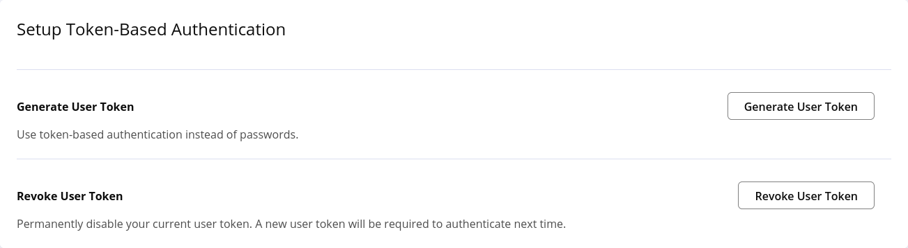
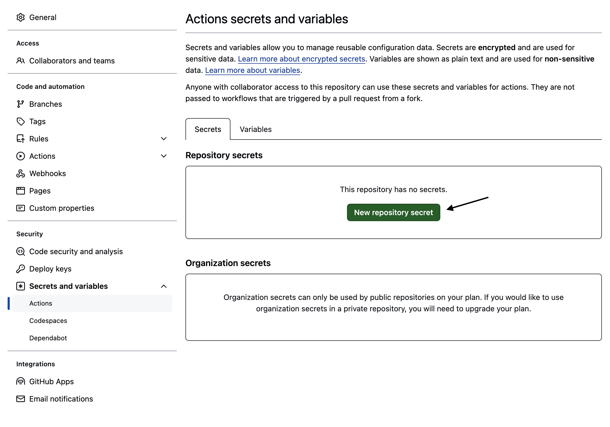
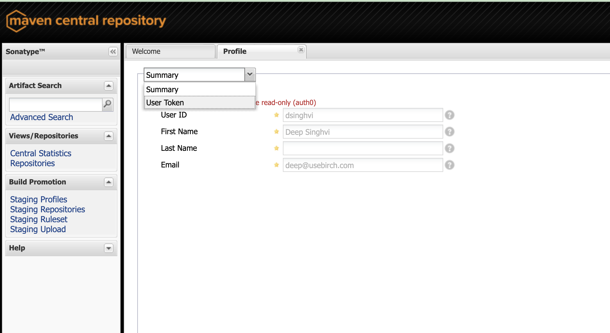
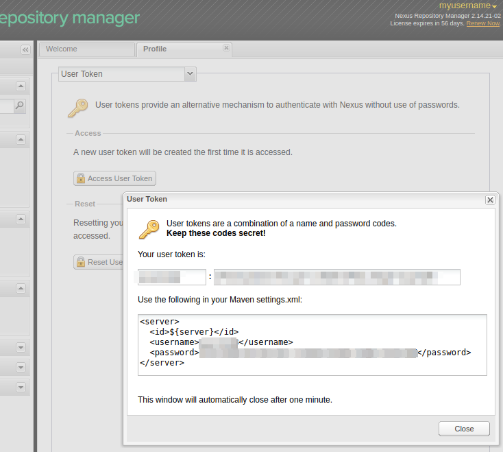

To make your Java SDK publicly accessible, publish to [Maven Central](https://central.sonatype.com/). Once you've followed the steps below to connect your Maven account to your SDK, Fern will automatically publish the latest version of your SDK.  

<Info>
For more information on the differences between the Central Portal and OSSRH, see the [Maven Central documentation](https://central.sonatype.org/faq/what-is-different-between-central-portal-and-legacy-ossrh/).
</Info>

## Publish via the Central Portal (recommended)
<Steps>
### Log In (or create account) and navigate to your profile
Log into [https://central.sonatype.com/account](https://central.sonatype.com/account).

### Click on `Generate User Token`

Click on `Generate User Token`.

<Frame>
  
</Frame>

### Confirm generation

You will be asked to confirm the generation of the token. This will invalidate any existing token. Click on `Ok`.

### Add Maven Central credentials to GitHub Secrets

You'll need to store two repository secrets in your **fern configuration repository** (**i.e. not the Java SDK repository**),
one for the username and one for the password.

<Frame>
  
</Frame>

<Info>
  For each, select **New repository secret**. Name your secret (we recommend `MAVEN_USERNAME` and `MAVEN_PASSWORD`,
  respectively), add the corresponding value, and click **Add secret**.
</Info>

### Sign with GPG

If you don't have gpg installed, you can download the binary from [https://gnupg.org/download/index.html](https://gnupg.org/download/index.html), or install it via package manager.

If you already have a GPG key, you can list your keys:

```sh
gpg --list-secret-keys --keyid-format LONG
```

If you don't have a GPG key, you can generate a new one:

```sh
gpg --gen-key
```

To export your secret key, run:

```sh
gpg --export-secret-keys --armor KEY_ID
```

Be sure to replace `KEY_ID` with the key ID of the key you want to export.

More information is available on [Maven Central's GPG validation page](https://central.sonatype.org/publish/requirements/gpg/).

### Add GPG Signature to GitHub Secrets

You'll need to store repository secrets in your **fern configuration repository**,
for the GPG key id, secret key, and password.

<Frame>
  
</Frame>

<Info>
  For each, select **New repository secret**. Name your secret (we recommend `MAVEN_CENTRAL_SECRET_KEY_KEY_ID`, `MAVEN_CENTRAL_SECRET_KEY`, and `MAVEN_CENTRAL_SECRET_KEY_PASSWORD`, respectively), add the corresponding value, and click **Add secret**.
</Info>


</Steps>

Once you regenerate your SDK, a GitHub action will run to publish directly to Maven!

## Publish via OSSRH (legacy)

<Steps>
### Log In (or create account)
Log into [s01.oss.sonatype.org](https://s01.oss.sonatype.org).

### Navigate to your profile

Click on your username in the top-right corner and select **Profile**.

<Frame>
  
</Frame>

### Click on `User Token`

Expand the dropdown and click on `User Token`.

<Frame>
  
</Frame>

### Click on `Access User Token`

There will be a lock icon followed by the text `Access User Token`. Click on `Access User Token`. You may
need to re-authenticate to see the user token.

<Frame>
  
</Frame>

### Add GitHub Secrets

You'll need to store two repository secrets in your **fern configuration repository** (**i.e. not the Java SDK repository**),
one for the username and one for the password.

<Frame>
  
</Frame>

<Info>
  For each, select **New repository secret**. Name your secret (we recommend `MAVEN_USERNAME` and `MAVEN_PASSWORD`,
  respectively), add the corresponding value, and click **Add secret**.
</Info>

</Steps>

Once you regenerate your SDK, a GitHub action will run to publish directly to Maven!

