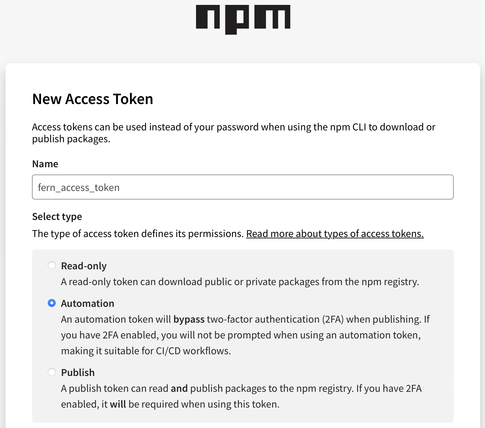

To make your TypeScript SDK publicly accessible, publish to [npm](https://www.npmjs.com/). Once you've followed the steps below to connect your npm account to your SDK, Fern will automatically publish the latest version of your SDK.  

## Creating an npm token
<Steps>
### Log In
Log into [npm](https://www.npmjs.com/). 
### Navigate to Access Tokens
Click on your profile picture and select **Access Tokens**. 
### Generate Token
Click on **Generate New Token** and select **Classic Token**. Name your token and select **Automation** as the token type. Once finished, click **Generate Token**.
<Frame>

</Frame>
<Note title='Save your token'>
Be sure to save the generated token - it won't be displayed after you leave the page. 
</Note>
</Steps>

## Adding tokens to your GitHub repository
<Info>
Using GitLab? Follow [these steps](/learn/docs/developer-tools/gitlab#add-a-token-to-gitlab). 
</Info>
<Steps>
### Open Repository
Open your Fern repository in GitHub.
### Navigate to Actions in Settings
Click on the **Settings** tab in your repository. Then, under the **Security** section, open **Secrets and variables** > **Actions**. 

<Frame>

</Frame>

You can also use the url `https://github.com/<your-repo>/settings/secrets/actions`.
### Add Secret
Select **New repository secret**. Name your secret (we recommend `NPM_TOKEN`), add the corresponding token, and click **Add secret**. 
</Steps>

Once you regenerate your SDK, a GitHub action will run to publish directly to npm!