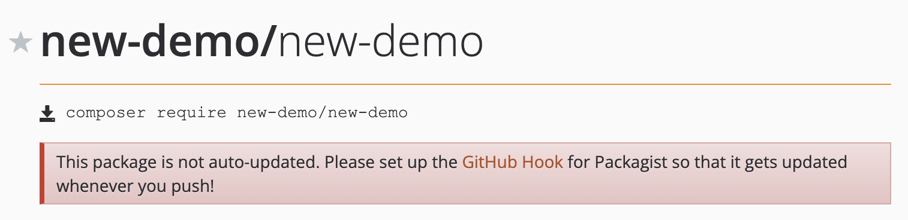
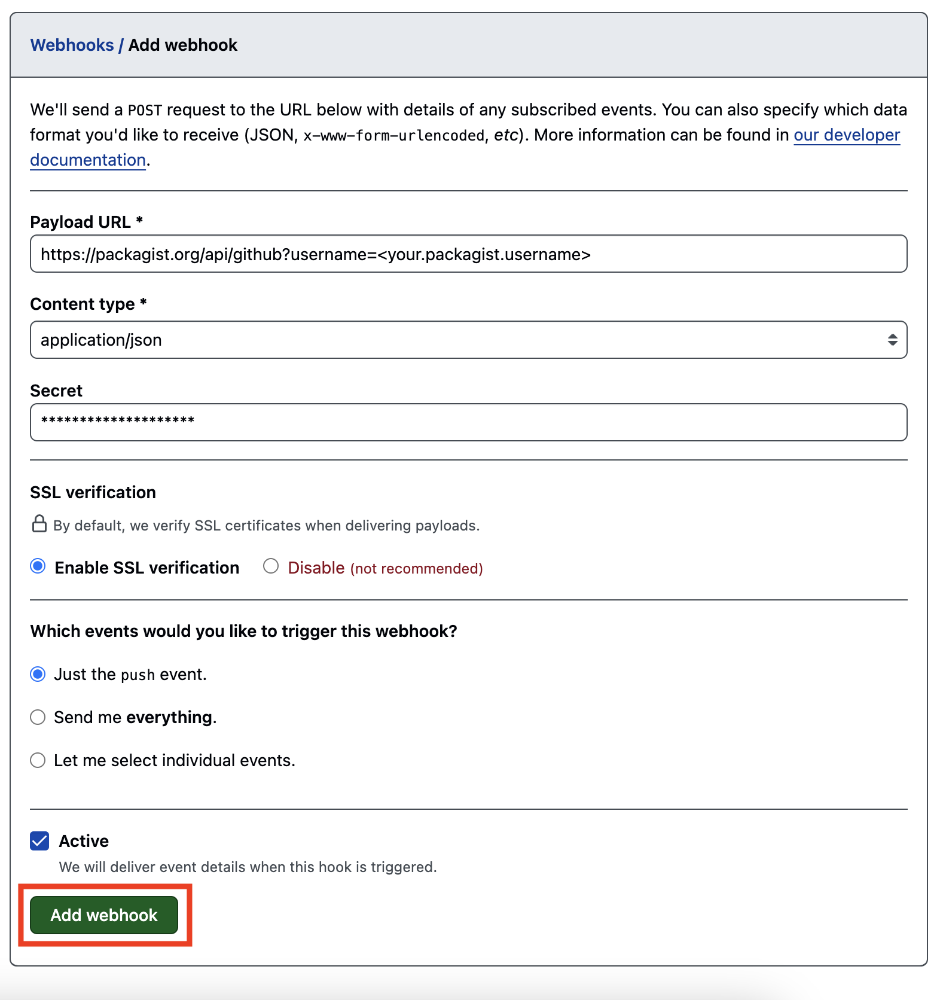

To make your PHP SDK publicly accessible, publish to [Packagist](https://packagist.org/). Follow the steps below to connect your GitHub repository to Packagist.

<Steps>
### Create a Packagist account
You'll first need to [create an account with Packagist](https://packagist.org/register/) to register your SDK. 

If you have an account already, [sign in](https://packagist.org/login/). 

### Submit the repository URL
When prompted, input the full URL of the repository where the PHP SDK was generated. 
<Tip>
Be sure your repository has **public** visibility. You can configure this in the repository settings. 
</Tip>

### Configure the GitHub Hook
Once you've submitted your URL, you'll be prompted to set up the GitHub Hook.

<Frame>

</Frame>

Follow the instructions to [set up your GitHub Hook](https://packagist.org/about#how-to-update-packages):
  1. In to your repository, go to **Settings > Webhooks**. 
  2. Select **"Add webhook"** 
  3. Set the Payload URL as `https://packagist.org/api/github?username=<your.packagist.username>`
  4. Set the content type as `application/json`
  5. Add your [Packagist API key](https://packagist.org/profile/). 
  6. Set the trigger events as **Just the `push` event**
  7. Click **"Add Webhook"**
    <Frame>
      
    </Frame>
</Steps>

Once you regenerate your SDK, you will see the publish occur! 