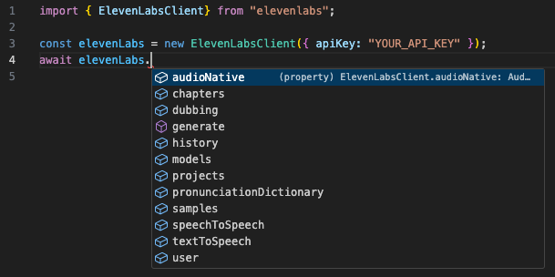
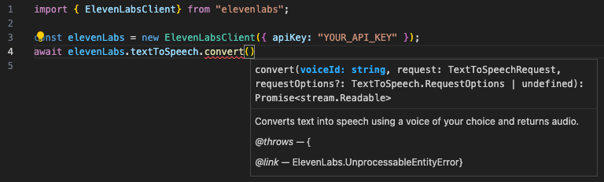
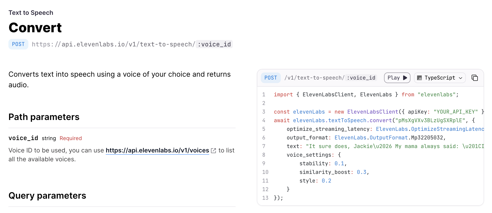

Fern generates robust, flexible, and automated SDKs, enabling developers to use
your API effectively in popular languages.

- **Extensible and customizable.** Enhance your Fern-generated SDK with
handwritten functions and customize your SDK method and group names.
- **Automatically generated.** When your API definition changes, a CI/CD
job kicks off to build, version, and release your updated SDKs.
- **Idiomatic code.**: SDKs built with Fern read as if a language expert wrote them.
Each SDK generator is built from scratch, maintained by the Fern team,
and designed to follow the best practices of each language (i.e., a Python SDK is Pythonic).

SDKs built with Fern offer autocomplete in code editors, type checking, 
schema validation at compile time, support for server-sent events streaming, and more.

## Features

### Autocomplete and Docs Pop Ups

<Tabs>
<Tab title="Autocomplete">
{/* <Frame> */}
  
{/* </Frame> */}
</Tab>
<Tab title="Pop-Ups">
{/* <Frame> */}
  
{/* </Frame> */}
</Tab>
</Tabs>

### Code Examples

Example API requests, responses, and schemas (i.e., data models) from your API Spec automatically populate in the codebase of the client library. 
SDK snippets showcasing the examples also automatically populate in your Fern Docs API Reference.

<Tabs>
<Tab title="Examples in codebase">
<CodeBlock maxLines={15}>
```TypeScript focus={1-13}
/**
 * @example
 *     {
 *         optimize_streaming_latency: ElevenLabs.OptimizeStreamingLatency.Zero,
 *         output_format: ElevenLabs.OutputFormat.Mp32205032,
 *         text: "It sure does, Jackie... My mama always said: \"In Carolina, the air's so thick you can wear it!\"",
 *         voice_settings: {
 *             stability: 0.1,
 *             similarity_boost: 0.3,
 *             style: 0.2
 *         }
 *     }
 */
export interface TextToSpeechRequest {
    /** You can turn on latency optimizations at some cost of quality. The best possible final latency varies by model. */
    optimize_streaming_latency?: ElevenLabs.OptimizeStreamingLatency;
    /** The output format of the generated audio. */
    output_format?: ElevenLabs.OutputFormat;
    /** The text that will get converted into speech. */
    text: string;
    /** Identifier of the model that will be used, you can query them using GET /v1/models. The model needs to have support for text to speech, you can check this using the can_do_text_to_speech property. */
    model_id?: string;
    /** Voice settings overriding stored setttings for the given voice. They are applied only on the given request. */
    voice_settings?: ElevenLabs.VoiceSettings;
    /** A list of pronunciation dictionary locators (id, version_id) to be applied to the text. They will be applied in order. You may have up to 3 locators per request */
    pronunciation_dictionary_locators?: ElevenLabs.PronunciationDictionaryVersionLocator[];
}
```
</CodeBlock>
</Tab>
<Tab title="SDK Snippets in API Reference">
<Frame>
  
</Frame>
</Tab>
</Tabs>

### Helper Functions

Handle common API tasks such as retrying requests, paginating responses, refreshing OAuth tokens, and verifying webhook requests.

<CodeBlocks>
<CodeBlock>
```TypeScript
```
</CodeBlock>
<CodeBlock>
```TypeScript
```
</CodeBlock>
</CodeBlocks>

...and SDKs built with Fern are easily extensible with custom wrappers. Check out [Webflow's custom API clients]
(https://github.com/webflow/js-webflow-api/blob/master/src/wrapper/WebflowClient.ts) for an example. 

## Supported languages

### Generally Available

<CardGroup cols={3}>
  <Card
    title="TypeScript"
    icon="brands node-js"
  />
  <Card
    title="Python"
    icon="brands python"
  />
  <Card
    title="Go"
    icon="brands golang"
  />
  <Card
    title=".Net"
    icon="brands microsoft"
  />
  <Card
    title="Java"
    icon="brands java"
  />
  <Card
    title="Ruby"
    icon="gem"
  />
</CardGroup>

### In Development

<CardGroup cols={3}>
  <Card
    title="Terraform"
    icon="cloud"
  />
  <Card
    title="PHP"
    icon="brands php"
  />
</CardGroup>

### Upcoming

<CardGroup cols={3}>
  <Card
    title="Swift"
    icon="brands swift"
  />
  <Card
    title="Rust"
    icon="brands rust"
  />
  <Card
    title="CLI"
    icon="terminal"
  />
</CardGroup>

<Warning title='Get early access'>
  Please message support@buildwithfern.com if you're interested in our 
  in-development or upcoming generators.
</Warning>
