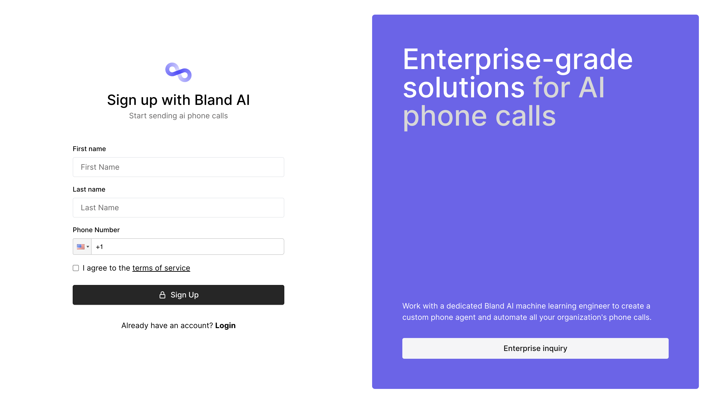
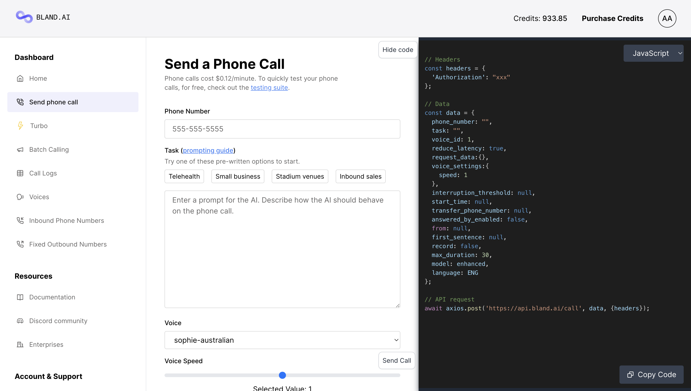

## Creating a developer account

</img>

To get started, sign up on the <a href="https://app.bland.ai">developer portal</a>.

Enter your phone number and verification code. Finally, once your developer portal loads, go to the `Send phone call` page.

## Sending your first phone call

</img>

Although Bland is an API-first platform, the send phone call page provides a simple interface for quickly testing calls. On the left side you can adjust the call options and on the right hand side you can see how the code updates.

Once you're satisfied with a call, copy the code on the right side (in Javascript, Python, or cURL) and add it to your application.

<Steps>
  <Step title="Enter your phone number">In the `Phone Number` field, enter your own phone number.</Step>
  <Step title="Write your prompt">
    For the task box either select one of the example prompts or write your own. For more instrucionts about prompting
    your AI phone agent, read this <a href="https://www.bland.ai/blog/prompting-guide-ai-phone-calls">blog post</a>.
  </Step>
  <Step title="Send the call">
    Scroll to the bottom of the page, and press the `Send call` button. Note, calls are charged at $0.12/minute, billed
    to the exact second.
  </Step>
</Steps>

To send a phone call programatically, read the <a href="/api-v1/post/calls">API reference</a>.

## Testing your phone agent

</img>

Once you've sent your first phone call, the next step is to test and improve the outputs from your phone agent.

One way to test your agent is to send yourself test calls. A faster way, however, is to use the Bland AI testing suite.

<Steps>
  <Step title="Set up the test suite">
    Select the model and language and insert your current prompt into the task box.
  </Step>
  <Step title="Write a message">
    Start messaging your phone agent. Act like you're the person receiving the call, and purposefully ask edge-case
    questions to throw the phone agent off.
  </Step>
  <Step title="Update the prompt">Based on the responses you receive, update the instructions in the prompt.</Step>
</Steps>

## Next steps

You now know how to send and test phone calls, but you've only scratched the surface of Bland's capabilties.

Areas for further exploration:

<CardGroup cols={2}>
  <Card title="API Reference" icon="code" href="/api-v1">
    Read the API reference.
  </Card>
  <Card title="Custom tools" icon="hammer" href="/tutorials/custom-tools">
    Creating custom tools for interacting with external APIs, live, during phone calls.
  </Card>
  <Card title="Prompting guide" icon="file" href="https://www.bland.ai/blog/prompting-guide-ai-phone-calls">
    Learn how to prompt the exact behavior you want from your phone agent.
  </Card>
  <Card title="Join the community" icon="discord" href="https://discord.com/invite/8xGGg2KfH7">
    See what people are building on Bland and get support from other users.
  </Card>
</CardGroup>
