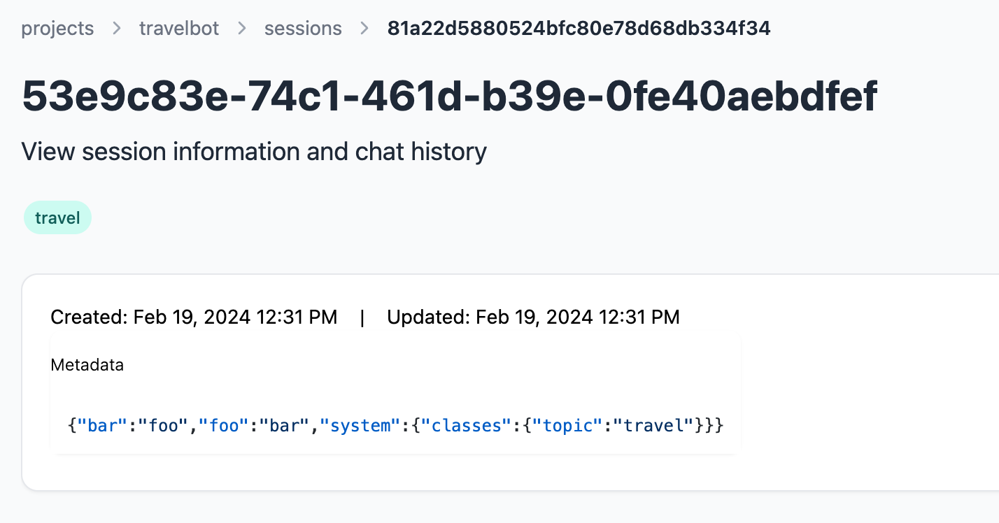

<Card title="Classifying Sessions" icon="tag">
  Zep enables you to classify Sessions into various categories and save these classifications in the Session's metadata.
  This feature is handy for directing Sessions to appropriate agents or for monitoring the kinds of interactions users
  have with your Assistant. Classifications are processed in just a few hundred milliseconds, allowing them to run
  synchronously with the chat loop.
</Card>
## Classifying Sessions

A classification task consists of a topic and a list of classes.
The `topic` is the type of classification you want to perform, and the `classes` are the possible categories you want to classify the Session into.
The `topic` is only used as a name or label for the classification task and does not affect the classification itself.

You may optionally specify the number of previous messages to consider when classifying the Session (default `4`), and whether to persist the classification in the Session's metadata (default `True`).

<Tabs>
  <Tab title="Python">
    ```python classes = ["class1", "class2", ..., "other"] classification = client.memory.classify_session( session_id,
    "topic", classes, last_n=4, persist=True ) ```
  </Tab>
  <Tab title="Typescript">
    ```typescript const classes = ["class1", "class2", ..., "other"] const classification = await
    client.memory.classifySession( session_id, "topic", classes, 4, // lastN true // persist ) ```
  </Tab>
</Tabs>

The returned result will be one of the classes you provided, or "other" if none of the classes are a good fit. The classification result is also stored in the Session's metadata if `persist` is `True`.

```json
{ "system": { "classes": { "topic": "travel" } } }
```

And Sessions viewed in the Zep app will be labeled with the classification result.

<Frame>
  
</Frame>

### Adding Custom Instruction

You may optionally provide a custom instruction to the classification task. This instruction will be injected into the Dialog Classification Prompt.

You may want to use this option if you have specific guidelines that you want to communicate to the LLM in addition to our classification prompt.

<Tabs group="memory">
  <Tab title="Python">
    ```python classes = ["advanced", "beginner", ..., "dojo"] classification = client.memory.classify_session(
    session_id, "experience level", classes, instruction="Classify the user's experience level. You may classify
    experience as 'dojo' only if the user is a black belt." ) ```
  </Tab>
  <Tab title="Typescript">
    ```typescript const classes = ["advanced", "beginner", ..., "dojo"] const classification = await
    client.memory.classifySession( session_id, "experience level", classes, "Classify the user's experience level. You
    may classify experience as 'dojo' only if the user is a black belt." ) ```
  </Tab>
</Tabs>

### Building a Semantic Router with User Intent

Zep's Session Classifier can be used to build a semantic router that routes user sessions to different agents or chains based on the user's intent.

```Text
user: Hello, my phone isn't responding to touch.
```

<Tabs>
    <Tab title="Python">
        ```python
        classes = [
            "sales interest",
            "needs support",
            "has payment question",
            "other"
        ]
        classification = client.memory.classify_session(
            session_id, "intent", classes
        )

        print(classification)
        ```
    </Tab>
    <Tab title="Typescript">
        ```typescript
        const classes = [
            "sales interest",
            "needs support",
            "has payment question",
            "other"
        ]

const classification = await client.memory.classifySession(
session_id, "intent", classes
)

        console.log(classification.class)
        ```
    </Tab>

</Tabs>
```Text
"needs support"
```

### A High-Performance Tool Picker

Using an agent to pick tools can often be slow and inaccurate. Zep's Session Classifier allows you to pick tools at very low latency
and high accuracy. You may then instruct an LLM to use the selected tool and provided Session information.

```Text
user: What is the capital of France?
```

<Tabs>
  <Tab title="Python">
    ```python classes = [ "complete math problems using a calculator", "research topics or find information with a web
    search", "no matching tool", ] classification = client.memory.classify_session( session_id, "tool", classes ) ```
  </Tab>
  <Tab title="Typescript">
    ```typescript const classes = [ "complete math problems using a calculator", "research topics or find information
    with a web search", "no matching tool", ] const classification = await client.memory.classifySession( session_id,
    "tool", classes ) ```
  </Tab>
</Tabs>

```Text
"research topics or find information with a web search"
```

### Classifying Emotions

Zep's Session Classifier can be used to classify user emotions and store these classifications in the Session's metadata.

```Text
AI: We're unfortunately going to reschedule your appointment.
user: Is that entirely necessary? I'm very busy.
```

<Tabs>
  <Tab title="Python">
    ```python classes = [ "happy", "sad", "frustrated", "angry", "other" ] classification =
    client.memory.classify_session( session_id, "emotion", classes ) ```
  </Tab>
  <Tab title="Typescript">
    ```typescript const classes = [ "happy", "sad", "frustrated", "angry", "other" ] classification = await
    client.memory.classifySession( session_id, "emotion", classes ) ```
  </Tab>
</Tabs>

```Text
"frustrated"
```

## Executing Multiple Classifications

Zep supports executing multiple classification tasks against a Session, allowing you to classify a Session into different categories and store these classifications in the Session's metadata.

```json
{
  "system": {
    "classes": {
      "topic": "travel",
      "intent": "needs support",
      "emotion": "frustrated"
    }
  }
}
```

## Best Practices

1. **Use a small number of classes**: The more classes you have, the more difficult it is to classify a Session accurately. Recommendation: no more than 5 or 6 classes.
2. **Ensure your classes are well separated**: If your classes are too similar, the classifier will have a hard time distinguishing between them.
3. **Provide a "none", "other", or "unknown" class**: If none of the classes are a good fit, the classifier should be able to select an option that indicates this.
4. **Limit the number of previous messages**: The more messages you consider, the longer the classification will take. Additionally, the context may change through the conversation. Recommendation: no more than the prior 4 to 6 messages.
5. **Persist the classification**: If you want to use the classification result in the future, you should persist the classification in the Session's metadata. This is the default.
