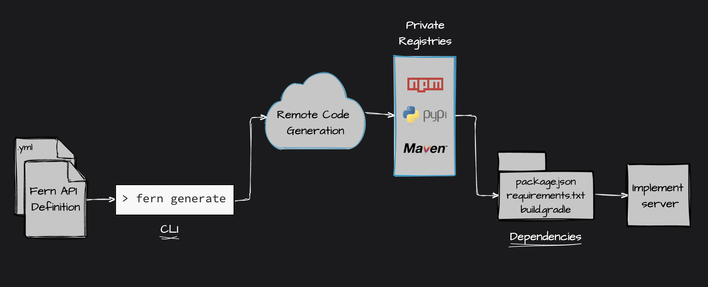

# Fern Generators

Code generators run remotely in the cloud. The input is a of API Definition file (YAML) and the output is auto generated code. Specify the generators you'd like to use in `generators.yml`.

|  **Name**  |                                       **Description**                                        |   **CLI Command**   |                                            **Library**                                             |
| :--------: | :------------------------------------------------------------------------------------------: | :-----------------: | :------------------------------------------------------------------------------------------------: |
|            |                                                                                              |
| TypeScript |               converts a Fern API Definition to a TypeScript client and server               | fern add typescript |       [fern-typescript](https://github.com/fern-api/fern/tree/main/packages/fern-typescript)       |
|            |                                                                                              |
|    Java    |                  converts a Fern API Definition to a Java client and server                  |    fern add java    |                         [fern-java](https://github.com/fern-api/fern-java)                         |
|            |                                                                                              |
|   Python   |                 converts a Fern API Definition to a Python client and server                 |   fern add python   |  <!-- markdown-link-check-disable-line --> [fern-python](https://github.com/fern-api/fern-python)  |
|            |                                                                                              |
|  Postman   | converts a Fern API Definition to a [Postman Collection](https://www.postman.com/collection) |  fern add postman   |                      [fern-postman](https://github.com/fern-api/fern-postman)                      |
|            |                                                                                              |
|  OpenAPI   |   converts a Fern Definition to an [OpenAPI Spec](https://swagger.io/resources/open-api/)    |  fern add openapi   | <!-- markdown-link-check-disable-line --> [fern-openapi](https://github.com/fern-api/fern-openapi) |
|            |                                                                                              |

## How can I automatically update my Postman Collection?

### Get your Postman Workspace ID

Login to Postman and then pick an existing Workspace (or create a new one.) Navigate to the Workspace Overview page. Copy the link to the Workspace and open it in your browser. It should be along the lines of `https://www.postman.com/banana-stand-335770/workspace/fern`. On the left side of the webpage, click on the name of your workspace. Your URL should now show a unique identifier, such as `https://www.postman.com/banana-stand-335770/workspace/d790dd10-gg1a-443k-8p7y-b464move1499/overview`. Copy the Postman Workspace ID, for example `d790dd10-gg1a-443k-8p7y-b464move1499`.

### Get your Postman API Key

Generate a Postman API Key [here](Postman API Keys page).

### Save your variables in your local environment

You'll want to create a local environment variable by running:

```bash
~/.bash_profile
```

and adding:

```bash
POSTMAN_WORKSPACE_ID="Your Workspace ID"
POSTMAN_API_TOKEN="Your API Key"
```

Here's what the Postman Generator configuration could look like:

```yaml
- name: fernapi/fern-postman
  version: 0.0.xx
  generate:
    enabled: true
    output: ./generated-postman.json
  config:
    api-key: ${POSTMAN_API_KEY}
    workspace-id: ${POSTMAN_WORKSPACE_ID}
```

### How does generating clients work?


### How does generating servers work?


