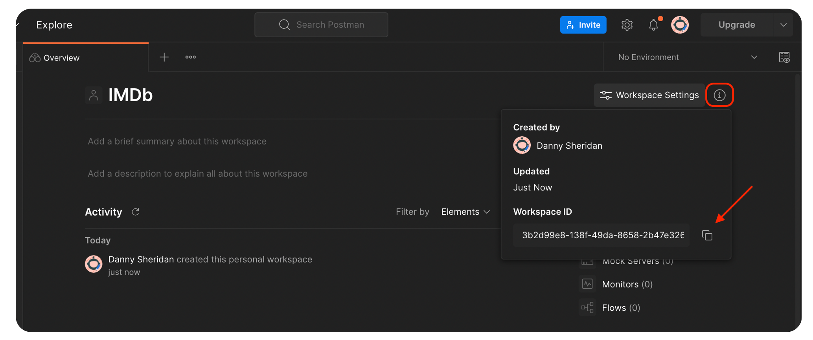

The Fern team uses Postman and, if you're here, you probably do too.

Fern has a first class integration with Postman so that you can automatically update your Postman collection any time you generate code.

## Configure the Postman Integration

Step 1: Login to Postman and then select an existing Workspace, or create a new one.

Step 2: Get your workspace ID. To view the workspace ID, select the information icon Information icon. It will look something like `3b2d99e8-138f-49da-8658-2b47e326g192`. Save this as an environment variable, such as {POSTMAN_WORKSPACE_ID}



Step 3: Generate a Postman API key [here](https://go.postman.co/settings/me/api-keys). Save this as an enviroment variable, such as {POSTMAN_API_KEY}.

Step 4: Add the

```diff title="/fern/api/generators.yml"
draft:
  - name: fernapi/fern-postman
    version: 0.0.xx
    mode: download-files
    output-path: ./generated-postman
+   config:
+     publishing:
+       apiKey: ${POSTMAN_API_KEY}
+       workspaceId: ${POSTMAN_WORKSPACE_ID}
```
