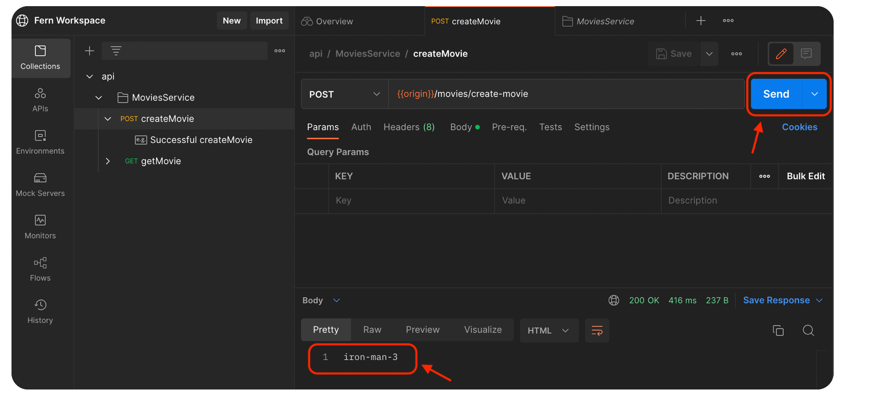

<!-- markdownlint-disable MD033 MD025 MD010 -->

This guide uses an example API for IMDb (the International Movie Database) that introduces you to using Fern. We'll generate a TypeScript server and a Postman Collection to implement and test our API.

## Step 0: Prerequisites

- Install [npm](https://docs.npmjs.com/downloading-and-installing-node-js-and-npm)
- Install [Postman](https://www.postman.com/downloads/)

## Step 1: Set up

Create a new folder for this tutorial and `cd` into it. Let's create a new npm project.

```bash
npm init -y
npm install typescript express @types/express ts-node
```

This will set us up for a new TypeScript backend repo. We'll also install fern:

```bash
npm install -g fern-api
```

## Step 2: Initialize

In the root of your backend repo, run:

```bash
fern init
```

When it asks you for your `organization`, just write `imdb`.

In `api.yml`, let's change the name of our api from `api` to `imdb-api`.

<summary>What happens:</summary>

This adds the following content:

```yml
fern/
└── api
		├── definition
				├── api.yml # Your API's name and the authentication scheme
				└── imdb.yml # An example Fern Definition for IMDb (International Movie Database)
		└── generators.yml # A list of code generators you're using
fern.config.json # Configure your organization name and the version of Fern CLI you're using
```

## Step 3: Add TypeScript server interfaces generator

```bash
fern add typescript-server
```

<summary>What happens:</summary>

`generators.yml` will now list a generator:

```diff
-draft: []
+draft:
+  - name: fernapi/typescript-server
+    version: 0.0.xxx
release:[]
```

## Step 4: Run the generator

```bash
fern generate
```

In the terminal, you'll see `Published @imdb-fern/imdb-api-server@0.0.x` which we'll add as a dependency. By default, Fern publishes dependencies to a private registry.

```bash
# Your version may be different, but this version will also work
npm install @imdb-fern/imdb-api-server@0.0.1
```

## Step 5: Implement the server

We'll create a new file `server.ts` at the root of our project. This will be a simple express server that serves our IMDb API.

```ts
// server.ts
import { GetMovieErrorBody, MovieId } from "@imdb-fern/imdb-api-server/model";
import { MoviesService } from "@imdb-fern/imdb-api-server/services";
import express from "express";

const app = express();

app.use(
  MoviesService.expressMiddleware({
    createMovie: () => {
      return {
        ok: true,
        // We are hardcoding the movie "Iron Man 3" for this demo
        // because we don't have our server wired up to a database.
        body: MovieId.of("iron-man-3"),
      };
    },

    getMovie: () => {
      return {
        ok: false,
        error: GetMovieErrorBody.NotFoundError(),
      };
    },
  })
);

console.log("Listening for requests...");
app.listen(8080);
```

## Step 6: Run the server

```bash
npx ts-node server.ts
```

In the terminal, you should see `Listening for requests...`

## Step 7: Add the Postman generator

In another terminal, let's run:

```bash
fern add postman
fern generate
```

In the `api/` folder you'll see `generated-postman.json` that we'll import to Postman.

## Step 8: Hit the server from Postman

Open Postman and File -> Import `api/generated-postman.json`.

Select the `createMovie` endpoint and hit `Send`. You should get **`iron-man-3`** back from your server.



Select the `getMovie` endpoint and hit `Send`. As expected, we get a 404 response back.


## Step 9: Celebrate 🎉

You've successfully implemented a simple IMDb server using Fern. You're invited to join our [Discord](https://discord.gg/JkkXumPzcG).
