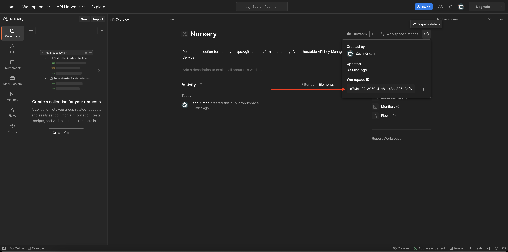

This page details all the generators you can specify in your [`generators.yml`](generate#generators-yml).

All of our generators are [open source](https://github.com/fern-api).

## `fern-typescript-node-sdk`

[Source code](https://github.com/fern-api/fern-typescript)

The TypeScript Node SDK generator outputs a fully functional TypeScript/JavaScript
SDK for server-side usage. It can publish the SDK to npmjs.org (or any other npm repository).

### Config options

- `namespaceExport`: Allows you to control the name of the generated namespace export and client class.

```yaml generators.yml
- name: fernapi/fern-typescript-node-sdk
  version: 0.6.4
  output:
    location: npm
    package-name: "@fern-api/plantstore"
    token: ${NPM_TOKEN}
  config: # optional
    namespaceExport: PlantStore
  github:
    repository: fern-api/plantstore-node
```

## `fern-typescript-browser-sdk`

[Source code](https://github.com/fern-api/fern-typescript)

The TypeScript Node SDK generator outputs a fully functional TypeScript/JavaScript
SDK for usage in the browser. It can publish the SDK to npmjs.org (or any other npm repository).

### Config options

- `namespaceExport`: Allows you to control the name of the generated namespace export and client class.

```yaml generators.yml
- name: fernapi/fern-typescript-browser-sdk
  version: 0.6.4
  output:
    location: npm
    package-name: "@fern-api/plantstore"
    token: ${NPM_TOKEN}
  config: # optional
    namespaceExport: PlantStore
  github:
    repository: fern-api/plantstore-node
```

## `fern-typescript-express`

[Source code](https://github.com/fern-api/express-starter)

The Express generator generates types and networking logic for your Express server. This saves you time
and add compile-time safety that you are serving the exact API that you specified in your Fern Definition.

⚠️ Make sure to enable `allowSyntheticDefaultImports` in your `tsconfig.json` when using this generator.

```yaml generators.yml
- name: fernapi/fern-typescript-express
  version: 0.5.0
  output:
    location: local-file-system
    path: ../../generated/express
```

## `fern-python-sdk`

[Source code](https://github.com/fern-api/fern-python)

The Python SDK generator outputs a fully functional Python
SDK. It can publish the SDK to pypi.org (or any other pypi repository).

```yaml generators.yml
- name: fernapi/fern-python-sdk
  version: 0.3.6
  output:
    location: pypi
    package-name: fern-plantstore
    token: ${PYPI_TOKEN}
  github:
    repository: fern-api/plantstore-python
```

## `fern-java-sdk`

[Source code](https://github.com/fern-api/fern-java)

The Java SDK generator outputs a fully functional Java
SDK. It can publish the SDK to Maven Central (or any other Maven repository).

```yaml generators.yml
- name: fernapi/fern-java-sdk
  version: 0.3.6
  output:
    location: maven
    coordinate: io.github.fern-api:plantstore
    username: ${MAVEN_USERNAME}
    password: ${MAVEN_PASSWORD}
  github:
    repository: fern-api/plantstore-java
```

## `fern-postman`

[Source code](https://github.com/fern-api/fern-postman)

The Postman generator outputs a Postman Collection (in Postman's
`collection.json` format). The generator can sync the collection with your
Postman Workspace.

```yaml generators.yml
- name: fernapi/fern-postman
  version: 0.0.44
  output:
    location: postman
    api-key: ${POSTMAN_API_KEY}
    workspace-id: ${POSTMAN_WORKSPACE_ID}
  github:
    repository: fern-api/plantstore-postman
```

To find your workspace ID, select the ⓘ icon in the top right of the workspace view.



## `fern-fastapi-server`

[Source code](https://github.com/fern-api/fern-python)

The FastAPI generator outputs lots of helpful code for implementing your FastAPI backend:

- Abstract classes that register your endpoints with FastAPI and handle all the networking logic.
- Pydantic models for all the types in your API.
- Exceptions that extend HTTPException that you can throw from wherever. These
  exceptions handle serialization and setting the HTTP status code.

```yaml generators.yml
- name: fernapi/fern-fastapi-server
  version: 0.3.6
  output:
    location: local-file-system
    path: ../../src/venus/generated/server
```

## `fern-pydantic-model`

[Source code](https://github.com/fern-api/fern-python)

The Pydantic Model generator outputs Pydantic Models for all the types in your
API. This saves you time and ensures your backend types align with your SDKs.

```yaml generators.yml
- name: fernapi/fern-pydantic-model
  version: 0.3.6
  output:
    location: local-file-system
    path: ../../src/venus/generated/server
```

## `fern-openapi`

[Source code](https://github.com/fern-api/fern-openapi)

The OpenAPI generator outputs an OpenAPI 3.1 document for your API. You can feed
it into any OpenAPI-compatible tools, like documentation providers.

### Config options

- `format`: Either `"yaml"` or `"json"`. Defaults to `"yaml"`.

```yaml generators.yml
- name: fernapi/fern-openapi
  version: 0.0.27
  config: # optional
    format: yaml
  github:
    repository: fern-api/plantstore-openapi
```
