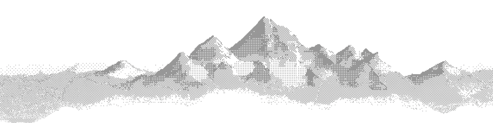

<div className="welcome-hero-tint">
  
  
</div>

## Products

<CardGroup cols={3}>
  <Card title="Payments" icon="duotone credit-card">
    Accept one-time and recurring payments with a simple, unified API
  </Card>
  <Card title="Subscriptions" icon="duotone arrows-repeat">
    Create and manage recurring billing plans with built-in proration and trials
  </Card>
  <Card title="Invoicing" icon="duotone file-invoice-dollar">
    Generate, send, and track invoices automatically
  </Card>
</CardGroup>

## Get started

<Steps>
<Step title="Install the SDK">

One SDK gives you access to Payments, Subscriptions, and Invoicing. 
<CodeBlocks>
  ```bash title="npm"
  npm install @acme/sdk
  ```

  ```bash title="pip"
  pip install acme-sdk
  ```

  ```bash title="go"
  go get github.com/acme/acme-go
  ```
</CodeBlocks>

</Step>
<Step title="Authenticate">

Create an API key from the Acme Dashboard and add it to your environment:

```bash
export ACME_API_KEY="sk_live_..."
```

</Step>
<Step title="Explore the docs">

You're ready to go. Dive deeper into the platform:

- [API reference](/api-reference) — browse all available endpoints
- [Write content](/writing-content) — author pages with MDX and components
- [Edit your docs](/editing-your-docs) — customize content, styling, and structure

</Step>
</Steps>
